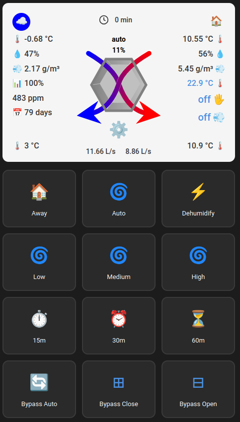
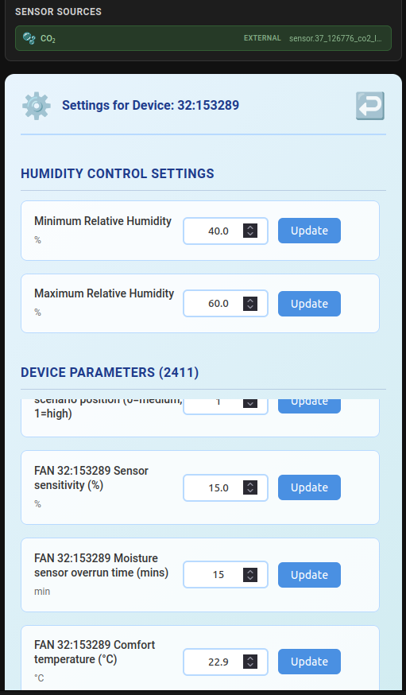
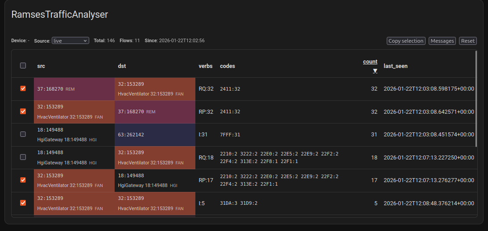
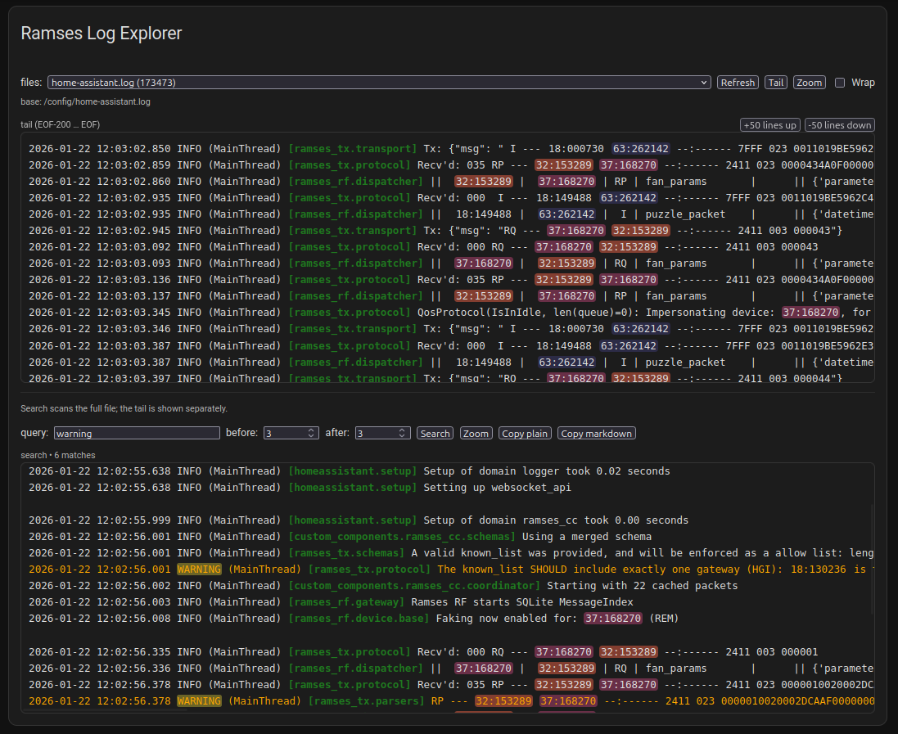
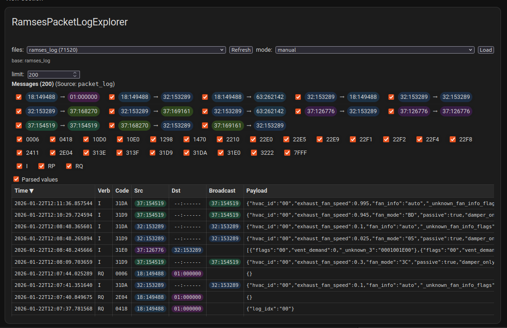

# Ramses Extras

[](https://github.com/wimpie70/ramses_extras/actions/workflows/check-lint.yml)
[](https://github.com/wimpie70/ramses_extras/actions/workflows/check-type.yml)
[](https://github.com/wimpie70/ramses_extras/actions/workflows/tests.yml)
[](https://github.com/wimpie70/ramses_extras/actions/workflows/hassfest.yml)
[](https://github.com/wimpie70/ramses_extras/actions/workflows/hacs-validate.yml)
[](https://github.com/wimpie70/ramses_extras/security/code-scanning)
[](https://codecov.io/gh/wimpie70/ramses_extras)
[](https://python.org)
[](https://home-assistant.io)

## ⚠️ **Disclaimer**

**Use of Ramses Extras is at your own risk.** This integration modifies ventilation system behavior and interacts with hardware devices. While extensively tested, users should:

- Understand their ventilation system before enabling automation
- Monitor system behavior after installation
- Have a basic understanding of Home Assistant configuration
- Keep device firmware updated

The authors are not responsible for any damage to equipment, property, or health effects resulting from the use of this software.

**Ramses Extras** is a Home Assistant integration that extends the Ramses RF ([ramses_cc](https://github.com/ramses-rf/ramses_cc)) integration with additional features, entities, automation, and UI components. Built on a modular framework for easy extension and maintenance.

## 🎯 **What is Ramses Extras?**

Ramses Extras provides additional features, entities, automation, and UI components for the Ramses RF (ramses_cc) integration.

- **Modular Features**: Easy to enable/disable features based on user needs
- **Automatic Cleanup**: Features manage their own entities, cards, and services
- **Custom Cards**: JavaScript cards available as custom card types in dashboards
- **Framework Foundation**: Reusable components for easy feature development

Ramses Extras registers Lovelace cards via a single, versioned bootstrap resource:

- **Lovelace resource URL**: `/local/ramses_extras/helpers/main.js?v={version}`
- **Purpose**: loads card/editor modules on-demand using dynamic imports

If you upgraded from an older version that used `/local/ramses_extras/vX.Y.Z/...`, remove that legacy resource entry from:

- **Settings → Dashboards → Resources**

Then add the new bootstrap resource URL (type: `module`).

Also restart HA and your hard-reload your browser

Frontend cards and editors are **theme-adaptive** and use Home Assistant theme variables (e.g., `--primary-text-color`, `--ha-card-background`, `--divider-color`) instead of hardcoded colors.

## ✨ **Current Features**

note: the following are tested with an Orcon WTW

- **Hello World** - template feature, example to develop new features
- **HVAC Fan Card** – advanced Lovelace card for FAN monitoring and control
- **Humidity Control** – advanced humidity-based automation and entities
- **CO2 Control** – CO2-based ventilation automation with high priority
- **Temp Control** – temperature-based bypass management (free cooling & heating retention)
- **FAN Configuration (Sensor Control)** – central sensor mapping for Humidity Control + CO2 Control + Temp Control + HVAC Fan Card
- **Ramses Debugger** – advanced debugging tools for Ramses RF protocol analysis
- **Default feature** - Common/reusable websockets, entities, etc to be used by other features

### **✅ HVAC Fan Card**

**Advanced Lovelace card for ventilation system control:**

- **Visual Airflow Diagrams**: Real-time system status visualization
- **Control Interface**: Fan speed, timer, and bypass controls
- **Parameter Editing**: Configuration of system parameters
- **Status Display**: Temperature, humidity, efficiency, and CO₂ monitoring
- **Template System**: Modular JavaScript templates for dynamic content
- **Responsive Design**: Works across different device sizes




The card uses `ramses_extras/get_entity_mappings` to resolve entities and
Sensor Control's resolver metadata to populate a **Sensor Sources** panel. When
absolute humidity is configured via Sensor Control, the card marks the indoor
and outdoor absolute humidity metrics as **derived** and shows them alongside
temperature, humidity, and CO₂ sources.

### **✅ Humidity Control**

**Intelligent humidity-based ventilation automation:**

- **Smart Decision Logic**: Analyzes indoor vs outdoor absolute humidity to optimize ventilation
- **Dynamic Fan Control**: Automatically adjusts fan speeds based on moisture conditions
- **Comprehensive Entities**:
  - Absolute humidity sensors (indoor/outdoor)
  - Humidity thresholds (min/max configuration)
  - Dehumidification switches and status indicators
  - Offset adjustments for fine-tuning
- **Bilingual Support**: English and Dutch translations
- **Full Test Coverage**: Comprehensive test suite with validation

### **✅ CO2 Control**

**CO2-based ventilation automation with high priority:**

- **High Priority Control**: Takes precedence over humidity control for air quality
- **Zone-Based Monitoring**: CO2 sensors per zone for targeted ventilation
- **Comprehensive Entities**:
  - CO2 threshold sensors (min/max configuration)
  - CO2 demand indicators and status entities
  - Zone-specific CO2 monitoring
- **Integration with Arbiter**: Publishes demand to shared fan-speed arbiter
- **Flexible Sensor Sources**: Uses FAN Configuration mappings for CO2 inputs

### **✅ Temp Control (Bypass)**

**Temperature-based bypass management for free cooling and heating retention:**

- **Bypass State Machine**: `idle` → `cooling` (bypass open) / `heating_retention` (bypass close) / `idle` (bypass auto), with hysteresis and min-interval stability
- **Free Cooling**: When indoor is too warm and outdoor air is cooler, opens the bypass to bring in fresh cool air
- **Heating Retention**: When indoor is too cold, closes the bypass to retain warmth
- **Multi-Zone Per-Area Comfort**: When sensor_control areas are configured with temperature entities, each area is evaluated independently — cooling has priority; zone demands are published via `ZoneDemandRegistry` so the ZoneCoordinator opens valves for areas that need actuation
- **Per-Area Comfort Temperature**: Each area can have its own `comfort_temperature_entity` (any HA `input_number`/`number`/`sensor`/`climate`), with fallback to the FAN global comfort parameter (param 75)
- **Fan Speed Coordination**: Sets a speed demand via the FanSpeedArbiter during cooling; conflicts with humidity_control / co2_control resolved centrally
- **Manual Override Safety Net** (3 layers):
  1. Card button handlers turn off temp_control before sending manual commands
  2. Arbiter `is_manual_override_active` — temp_control skips processing; pressing Auto resumes
  3. State-based: detects external bypass changes and turns off temp_control
- **HVAC Fan Card Integration**: New "Temp control" button in the bypass row, top-right status indicator (Off/On/Cooling/Heating retention)
- **Config Flow**: Per-device enable + threshold/hysteresis parameters + default desired speed selector

### **✅ FAN Configuration (Sensor Control)**

**Central sensor source management and override system:**

- **Flexible Source Selection**: Configure external entities for any sensor metric
- **Supported Metrics**: Indoor/outdoor temperature, humidity, CO₂, and absolute humidity
- **Fail-Closed Behavior**: Invalid external entities safely disable rather than fallback
- **Source Types**: Internal (default), external entities, derived (absolute humidity), or disabled
- **Visual Indicators**: HVAC fan card shows sensor source status with color-coded indicators
- **WebSocket Integration**: Real-time sensor mapping updates via `ramses_extras/get_entity_mappings`
- **Automation Integration**: Humidity Control and CO2 Control automatically use effective sensor mappings
- **Per-Device Configuration**: Different sensor sources for each FAN/CO2 device
- **FAN Map Card**: Visual observability and configuration card included in FAN Configuration for monitoring and testing zone configurations

For **absolute humidity**, Sensor Control does not expose a direct entity itself.
Instead it drives the default feature's resolver-aware sensors:

- `sensor.indoor_absolute_humidity_{device_id}`
- `sensor.outdoor_absolute_humidity_{device_id}`

These sensors are calculated as follows:

- If `abs_humidity_inputs` are configured for a device/side, the sensor derives
  absolute humidity either from:
  - an external temperature + relative humidity pair, or
  - a direct external absolute humidity sensor.
- If no `abs_humidity_inputs` are configured, they fall back to the internal
  ramses_cc temperature/humidity values.

This makes the default absolute humidity sensors the **single source of truth**
for:

- the Humidity Control automation logic,
- the CO2 Control automation logic, and
- the HVAC Fan Card graphs and status.

FAN Configuration itself does not create new sensors. Instead, it rewires _which_
entities other features use for each metric:

- Humidity Control reads indoor/outdoor temperature and humidity via
  `SensorControlResolver`, so changing mappings in the FAN Configuration UI
  immediately affects the automation inputs.
- CO2 Control reads CO2 sensor mappings via the same resolver.
- The HVAC Fan Card resolves entities through the same resolver and shows the
  effective source (internal vs external vs derived vs disabled) using
  color-coded indicators.

The FAN Configuration configuration flow provides:

- A **global overview** page that summarizes only non-internal mappings per
  device, including absolute humidity inputs, so you can quickly see which
  metrics are overridden.
- A **per-device group menu** that shows the current non-internal mappings for
  the selected device before you dive into a specific group (indoor, outdoor,
  CO₂, absolute humidity).
- A **Finish** option in the per-device menu that saves all changes as you go
  and returns to the main Ramses Extras options menu.

CO₂ support today focuses on using a dedicated CO₂ device as an external input
for a FAN. The CO₂ device has a preview-only configuration screen; the real
mappings are configured on the FAN device under the **CO₂** group.

This is especially useful when you have multiple FANs with different hardware
capabilities:

- One FAN may have a full set of built-in sensors.
- Another FAN may be missing one or more sensors, or its internal sensors may
  not represent the rooms you actually care about.

With FAN Configuration you can still give **both** FANs the same
features/automations and UI:

- The first FAN uses its internal sensors.
- The second FAN can point individual metrics to external HA sensors located in
  better positions (or on other devices).

CO2 Control uses these mappings to provide high-priority air quality control,
taking precedence over humidity control when CO2 levels exceed configured
thresholds.

### **✅ Ramses Debugger**

This feature works best with a dedicated dashboard page.

**Advanced debugging tools for Ramses RF protocol analysis:**

- **Traffic Analyzer**: Real-time monitoring and analysis of Ramses RF message traffic
- **Log Explorer**: Search and analyze Home Assistant and packet logs with advanced filtering
- **Packet Log Explorer**: Deep dive into packet-level communication details
- **Cross-Filtering**: Navigate between traffic data and log entries seamlessly
- **Message Viewer**: Unified view of messages from multiple sources with filtering and sorting





The debugger provides comprehensive tools for troubleshooting Ramses RF communication:

- Real-time traffic monitoring with device pair filtering
- Advanced log search with context extraction and traceback highlighting
- Packet-level analysis with parsed payload display
- Cross-referencing between traffic events and log entries

### **🏛️ Framework Foundation**

**Reusable architecture for easy feature development:**

- **Feature-Centric Architecture**: Each feature is self-contained and modular
- **Base Classes**: Common functionality for entities, automation, and services
- **Template Systems**: Multiple template approaches (JavaScript, Python, Entity, Translation)
- **Validation Framework**: Type safety and consistency checking
- **Entity Registry**: Centralized entity management and naming

## 📋 **Quick Start**

### **Installation**

#### **HACS (Recommended)**

1. Add this repository to HACS as a custom repository
2. Search for "Ramses Extras" and install
3. Restart Home Assistant
4. Configure through **Settings → Devices & Services → Ramses Extras**

#### **Manual Installation**

1. Copy the `custom_components/ramses_extras` directory to your Home Assistant `config/custom_components` directory
2. Restart Home Assistant
3. Configure through **Settings → Devices & Services**

### **Configuration**

#### **⚠️ IMPORTANT: Ramses CC Configuration Required**

For full functionality of Ramses Extras features (especially the HVAC Fan Card), you must configure these settings in **ramses_cc**:

1. **Enable Message Events** (required for real-time updates):
   - Go to **Settings → Devices & Services → Ramses CC**
   - Click **Configure** → **Advanced Features**
   - Enable **Message Events**
   - Set **Message Events Regex** to: `31DA|10D0`
   - This enables real-time 31DA (HVAC data) and 10D0 (filter info) messages

2. **Enable Send Packet Service** (required for fan control commands):
   - In the same **Advanced Features** section
   - Enable **Send Packet Service**

> **Why this matters**: Without these settings, the HVAC Fan Card will only show static entity states and won't receive real-time updates or allow control commands.

#### **Ramses RF - bound REM**

When using FAN related features, make sure Ramses RF has the 'bound' trait defined for your FAN.
example:

```
"37:168270":
  class: REM
"32:153289":
  bound: "37:168270"
  class: FAN
```

#### **Ramses Extras**

1. Go to **Settings → Devices & Services**
2. Click **"Add Integration"**
3. Search for **"Ramses Extras"**
4. Select which features to enable:
   - ✅ **Humidity Control** (works together with the hvac Fan Card)
   - ✅ **CO2 Control** (high priority air quality control)
   - ✅ **Temp Control** (temperature-based bypass management)
   - ✅ **FAN Configuration (Sensor Control)** (shared sensor mapping for Humidity Control + CO2 Control + Temp Control + HVAC Fan Card)
   - ✅ **Ramses Debugger** (advanced debugging tools for protocol analysis)
   - 🟡 **HVAC Fan Card**

### **Basic Usage**

After enabling a feature Ramses Extras will automatically create the associated tools, depending on the device type.

- **New Entities**: Sensors, switches, numbers, input boolean, ... eg: `sensor.indoor_absolute_humidity_{device_id}`
- **New Automations**: For now, only hardcoded python scripts are supported. (more control than the yaml automations)
- **New Cards**: javascript cards, available as a card type when edititing a dashboard
- **New Services**: extra service calls, to send commands
- **New Websocket**: For use by javascript to get info from Ramses Extras (or Ramses RF) like `get_bound_rem`

## 🏗️ **Architecture**

Ramses Extras uses a **feature-centric architecture** built on a **framework foundation**. For detailed architecture information, see the [Wiki](https://github.com/wimpie70/ramses_extras/wiki).

## 🔧 **Requirements**

- **Home Assistant**: >=2026.3.0 or later
- **Ramses RF** (ramses_cc): v0.52.1 (pre-release) or later: https://github.com/ramses-rf/ramses_cc
- **Python**: 3.14

## 🤝 **Contributing**

We welcome contributions! Please see [CONTRIBUTING.md](CONTRIBUTING.md) for guidelines and the [Wiki](https://github.com/wimpie70/ramses_extras/wiki) for detailed development patterns.

### **Quick Start**

- 📖 Read the [Wiki Architecture Guide](https://github.com/wimpie70/ramses_extras/wiki)
- 🛠️ Write your code
- 🧪 Write tests for new features
- 🧪 For ha-sim end-to-end testing, see [docs/HA_SIM_TEST_TOOL.md](docs/HA_SIM_TEST_TOOL.md)

## 📜 **License**

This project is licensed under the MIT License. See the [LICENSE](LICENSE) file for details.

## 🙏 **Acknowledgments**

- **Ramses RF Community**: For the RF library
- **Home Assistant**: For the fantastic automation platform
- **Contributors**: Everyone who has contributed to this project

## 🆘 **Support & Issues**

- 🐛 **Bug Reports**: [GitHub Issues](https://github.com/wimpie70/ramses_extras/issues)
- 💬 **Feature Requests**: [GitHub Discussions](https://github.com/wimpie70/ramses_extras/discussions)
- 📚 **Troubleshooting**: See [Wiki Troubleshooting Guide](https://github.com/wimpie70/ramses_extras/wiki)

---
