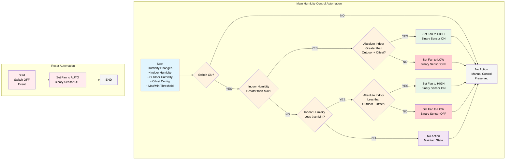
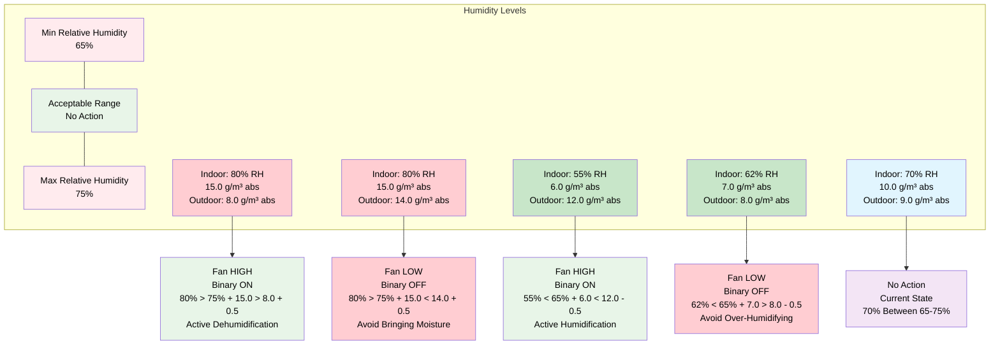

# Humidity Control Decision Flow Diagram
# Split into two separate automations to prevent interference with manual control

## System Overview (Mermaid)

## State Transitions

| Current State | Condition | New State | Binary Sensor |
|---------------|-----------|-----------|---------------|
| **Main Humidity Control Automation** (Switch ON only) |
| Fan LOW/AUTO | Indoor RH > Max% + Indoor abs > Outdoor abs + Offset | Fan HIGH | ON |
| Fan LOW/AUTO | Indoor RH > Max% + Indoor abs <= Outdoor abs + Offset | Fan LOW | OFF |
| Fan HIGH/AUTO | Indoor RH < Min% + Indoor abs < Outdoor abs - Offset | Fan HIGH | ON |
| Fan HIGH/AUTO | Indoor RH < Min% + Indoor abs >= Outdoor abs - Offset | Fan LOW | OFF |
| Fan HIGH/LOW | Indoor RH Between Min/Max% | No Change | No Change |
| **Reset Automation** (Separate) |
| Any | Switch OFF Event | Fan AUTO | OFF |
| **Manual Control Preservation** |
| Any (Switch OFF) | Any Humidity Change | No Change | No Change |

## Key Entities Monitored

### Main Humidity Control Automation
- **Triggers:**
  - `sensor.indoor_relative_humidity_{device}` - Primary trigger for threshold comparisons (%)
  - `sensor.indoor_absolute_humidity_{device}` - For absolute humidity comparison logic (g/m³)
  - `sensor.outdoor_absolute_humidity_{device}` - For absolute humidity comparison logic (g/m³)
  - `number.absolute_humidity_offset_{device}` - Absolute offset value (g/m³)
  - `number.max_humidity_{device}` - Max relative humidity threshold (%)
  - `number.min_humidity_{device}` - Min relative humidity threshold (%)

- **Conditions:**
  - `switch.dehumidify_{device}` - Only runs when switch is ON

### Reset Automation (Separate)
- **Triggers:**
  - `switch.dehumidify_{device}` - Only triggers when switch is turned OFF (`to: "off"`)

- **Actions:**
  - Sets fan to AUTO when humidity control is disabled

- **Outputs (Not Triggers):**
  - `sensor.fan_speed_{device}` - Result of automation actions
  - `binary_sensor.dehumidifying_active_{device}` - Reflects current system state

- **Actions:**
  - `ramses_cc.send_command` - Control fan speed
  - Binary sensor state updates automatically

## Threshold Visualization (Mermaid)

This flow ensures:
1. **Energy Efficiency**: Only activates when necessary
2. **User Control**: Manual override capability
3. **Smart Operation**: No unnecessary changes within acceptable ranges
4. **Clear Feedback**: Binary sensor shows actual dehumidification status
