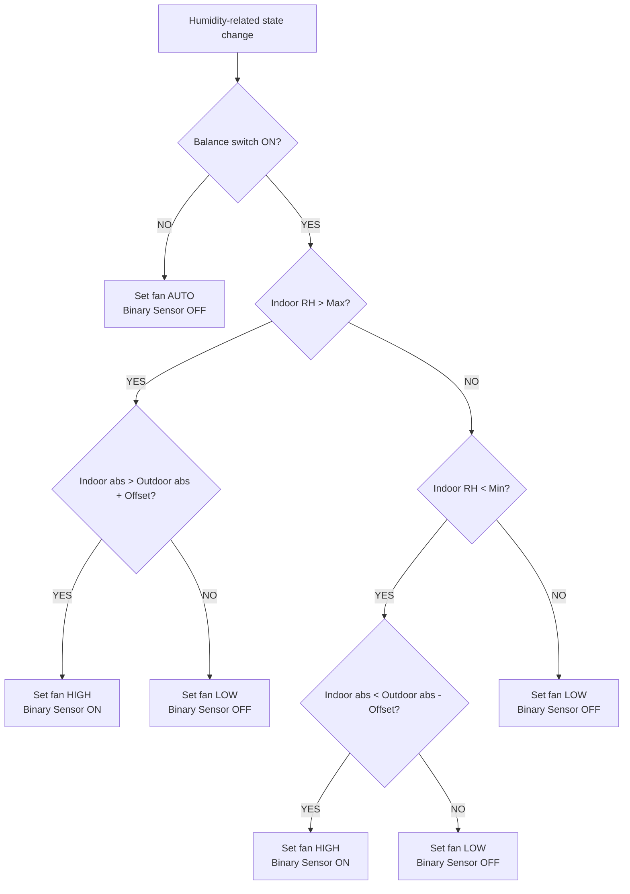

# Humidity Control Decision Flow Diagram

## Current Intent

This feature is a humidity-balancing automation for ventilation fans.

- **If indoor air is too humid**
  - use `fan_high` only when outdoor absolute humidity is lower than indoor by the configured offset

- **If indoor air is too dry**
  - use `fan_high` only when outdoor absolute humidity is higher than indoor by the configured offset

- **If indoor humidity is within range**
  - keep the automation enabled, but stop active balancing by setting the fan back to `fan_low`

- **If the user turns the control switch off**
  - stop balancing immediately and set the fan to `fan_auto`

The entity ID remains `switch.dehumidify_{device}` for compatibility, but the user-facing label should be treated as **Balance**.

## System Overview

## Runtime Responsibilities

- **Automation**
  - owns the humidity decision logic
  - sends the actual RAMSES fan commands
  - updates the `binary_sensor.dehumidifying_active_{device}` status

- **Switch**
  - acts as the user enable/disable gate
  - does not send direct fan commands itself

- **Binary sensor**
  - is a status/output entity only
  - should not be used as a normal trigger for the automation

## Trigger Inputs

- `sensor.*_indoor_humidity`
- `sensor.indoor_absolute_humidity_{device}`
- `sensor.outdoor_absolute_humidity_{device}`
- `number.relative_humidity_minimum_{device}`
- `number.relative_humidity_maximum_{device}`
- `number.absolute_humidity_offset_{device}`
- `switch.dehumidify_{device}`

## Outputs

- `ramses_cc.send_command` for `fan_high`, `fan_low`, and `fan_auto`
- `binary_sensor.dehumidifying_active_{device}`

## State Transitions

| Switch | Condition | Fan command | Binary sensor |
| --- | --- | --- | --- |
| OFF | Any | `fan_auto` | OFF |
| ON | Indoor RH > Max and indoor abs > outdoor abs + offset | `fan_high` | ON |
| ON | Indoor RH > Max and indoor abs <= outdoor abs + offset | `fan_low` | OFF |
| ON | Indoor RH < Min and indoor abs < outdoor abs - offset | `fan_high` | ON |
| ON | Indoor RH < Min and indoor abs >= outdoor abs - offset | `fan_low` | OFF |
| ON | Indoor RH within min/max range | `fan_low` | OFF |

## Notes

- **High fan speed is used for both directions**
  - drying when indoor air is too humid
  - bringing in moister air when indoor air is too dry

- **The short card label should be `Balance`**
  - this better matches the dual-purpose behavior than `Dehumidify`

- **The binary sensor is for frontend/status display**
  - it can be used by the UI to show when balancing is active
  - it should not drive the control loop itself
