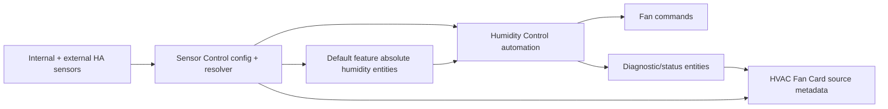
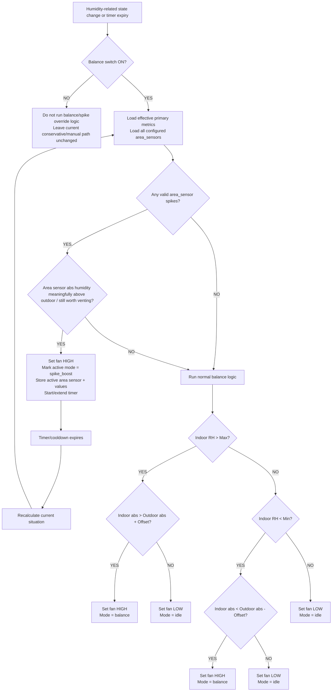
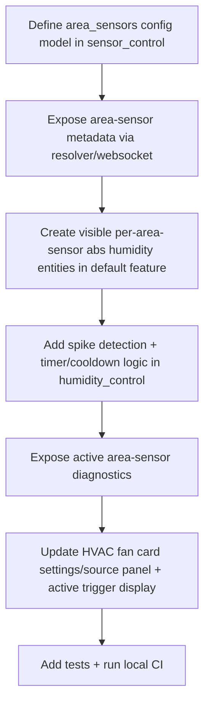

# Humidity Control Spike + Zone Flow Diagram

## Intent

Extend humidity control beyond whole-house balancing so that additional configured
`area_sensors` can trigger temporary high ventilation on sudden local moisture
spikes such as showers.

This design keeps the existing feature boundaries:

- **`sensor_control`** keeps the existing primary indoor/outdoor mappings and
  adds additional `area_sensors` for local spike detection
- **default feature** creates and exposes derived absolute humidity sensors
- **`humidity_control`** makes automation decisions and sends fan commands
- **HVAC fan card** displays the effective sources and active trigger reason

## Key decisions

- spike triggering uses **absolute humidity only**
- an `area_sensor` must provide either:
  - temperature + relative humidity for derivation
  - or a direct absolute humidity entity
- no RH-only fallback path
- when spike timeout/cooldown expires, the automation **recalculates current conditions**
  instead of restoring a cached previous fan state
- when **Balance** is enabled, additional configured `area_sensors` may trigger `fan_high`
- manual-mode overrule logic is deferred for future work
- visibility is included from the start: active area sensor and values should be visible
- future real ventilation zones must remain possible without reworking the model

## High-level data flow

## Source model

Each FAN may have:

- **primary balance inputs**
  - indoor absolute humidity
  - outdoor absolute humidity
  - indoor RH

- **additional `area_sensors`**
  - bathroom
  - shower room
  - utility room
  - future true ventilation zone

Each `area_sensor` must be able to expose an **absolute humidity** value.

The primary indoor/outdoor absolute humidity replacement remains separate and
continues to use the existing `abs_humidity_inputs` config model.

## Runtime decision overview

## Responsibilities by feature

### `sensor_control`

- keeps the existing primary indoor/outdoor effective humidity mappings
- defines additional `area_sensors` for a FAN device
- stores area-sensor metadata such as label/type
- may optionally store a future real `zone_id` link
- stores which entities supply:
  - temperature
  - humidity
  - or direct absolute humidity
- exposes these through resolver/websocket output
- does **not** run timing or automation

### default feature

- creates visible absolute humidity entities for configured `area_sensors` when
  temp+RH inputs are used
- uses a direct abs entity as-is when an `area_sensor` already provides one
- derives abs humidity from temp + RH where needed
- acts as the entity-level source of truth for those values

### `humidity_control`

- evaluates normal balance conditions
- evaluates `area_sensor` moisture spikes
- decides when `fan_high` is required
- maintains timer/cooldown state
- recalculates at timeout instead of restoring previous state
- exposes active area sensor, mode, and values for diagnostics/UI

### HVAC fan card

- does not list every area sensor on the main card by default
- shows active trigger area sensor + relevant values when spike control is active
- in settings / Sensor Sources panel, lists all configured sensor-control
  `area_sensors`
- shows whether each area sensor is direct-abs or derived

## Proposed observable outputs

When spike control is active, the backend/UI should make it obvious why.

Suggested observable state:

- active control mode:
  - `idle`
  - `balance`
  - `spike_boost`
- active area-sensor label / id
- active area-sensor absolute humidity
- area-sensor delta / rise summary
- outdoor absolute humidity used in comparison
- timer/cooldown remaining

## Future zone support

The current `area_sensors` model should be treated as compatible with future
real zone support.

That means:

- an `area_sensor` may later map to a real ventilation zone
- area-sensor metadata should allow future `zone_id`
- automation should already think in terms of "area sensor requiring action"
  rather than hardcoding only indoor/outdoor logic

## Suggested implementation sequence

## Notes

- The current `switch.dehumidify_{device}` entity should continue to be treated as **Balance**.
- The first implementation should stay conservative about manual fan overrides when Balance is off.
- Recalculation on timeout is preferred over state restore because the environment may have changed during the boost window.
