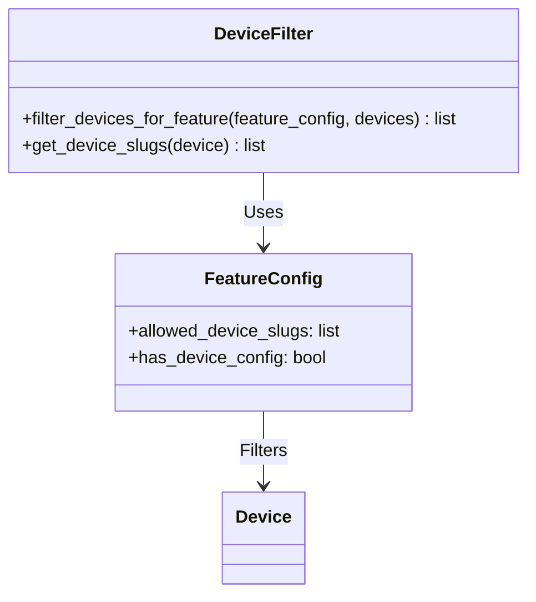
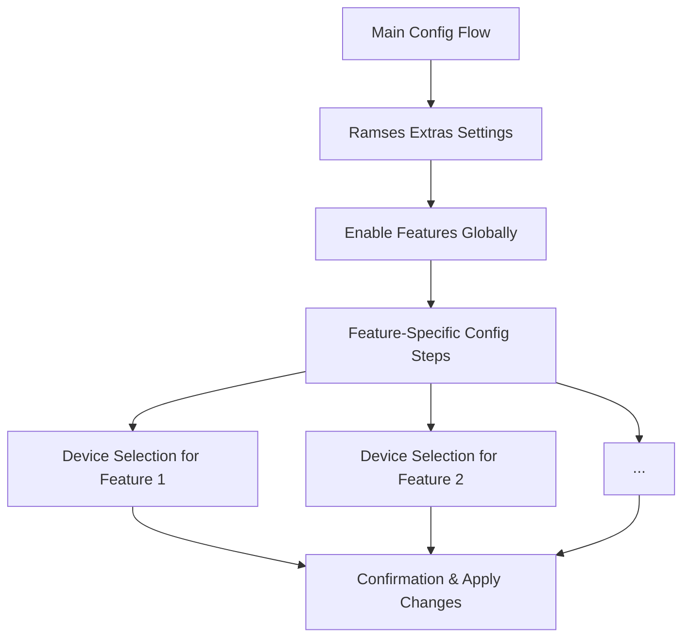
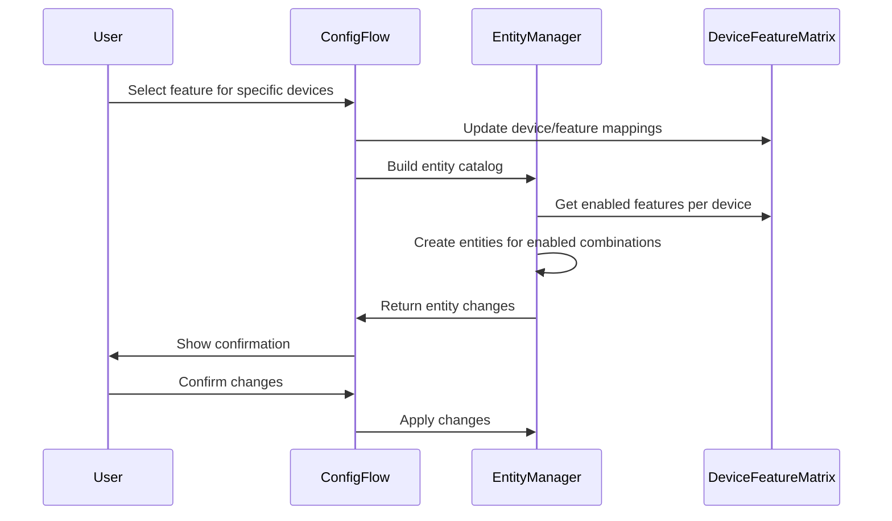
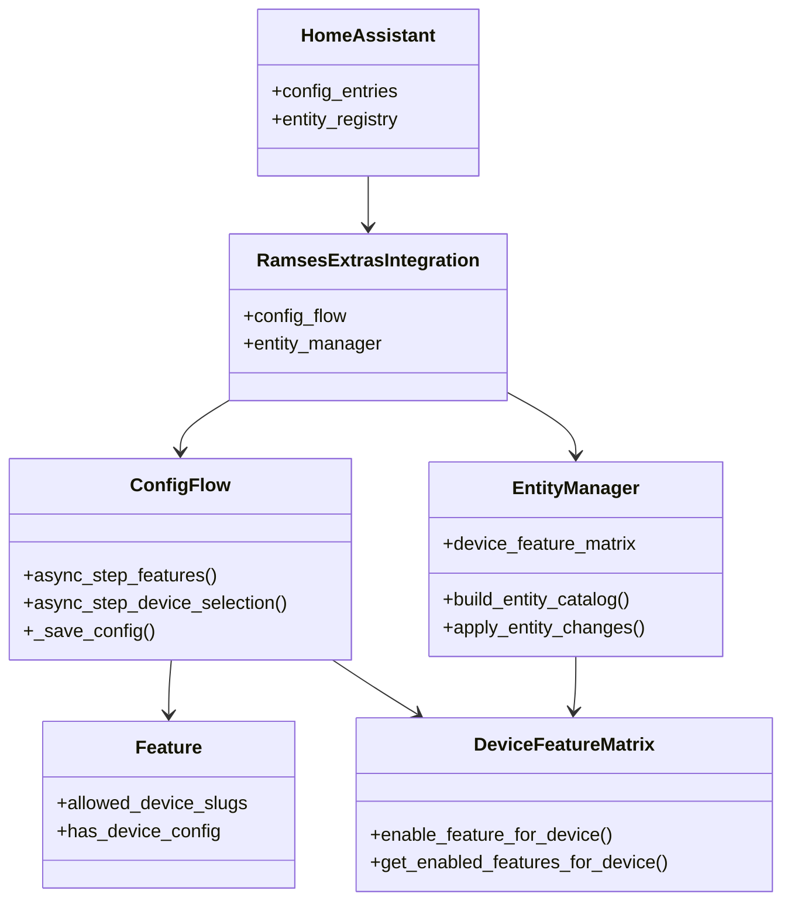
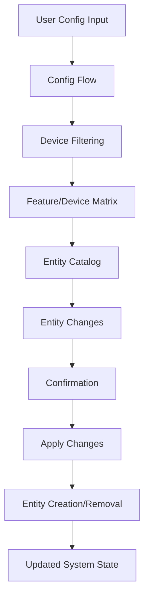

# Ramses Extras Architecture Update: Config Flow Extension

## Overview

This document updates the Ramses Extras architecture to include the new config flow extension with feature-specific device filtering and per-device feature enablement.

## New Architecture Components

### 1. Enhanced Feature Configuration

#### Updated AVAILABLE_FEATURES Structure

```python
# New fields added to feature configuration
AVAILABLE_FEATURES = {
    "feature_id": {
        "name": "Feature Name",
        "description": "Feature description",
        "feature_module": "features.feature_id",
        "handler": "handle_device_type",
        "default_enabled": False,
        # NEW FIELDS:
        "allowed_device_slugs": ["FAN", "REM"],  # Device filtering
        "has_device_config": True,              # Has per-device configuration
        "config_steps": ["device_selection"],  # Additional config steps
        "device_default_enabled": True,        # Per-device default
    }
}
```

#### Device Slug Filtering



### 2. Multi-Step Config Flow



### 3. Per-Device Feature Tracking

#### DeviceFeatureMatrix Class

```python
class DeviceFeatureMatrix:
    """Track which features are enabled for which devices."""

    def __init__(self):
        self.matrix = {}  # {device_id: {feature_id: enabled}}

    def enable_feature_for_device(self, device_id, feature_id):
        """Enable a feature for a specific device."""
        if device_id not in self.matrix:
            self.matrix[device_id] = {}
        self.matrix[device_id][feature_id] = True

    def get_enabled_features_for_device(self, device_id):
        """Get all enabled features for a device."""
        return self.matrix.get(device_id, {})
```

#### Entity Creation Logic

```python
async def create_entities_for_device(device_id, enabled_features):
    """Create entities only for enabled features on this device."""
    for feature_id, feature_config in enabled_features.items():
        if feature_config.get("enabled", False):
            # Create entities for this feature/device combination
            await create_feature_entities(feature_id, device_id)
```

### 4. Enhanced Entity Management

#### Entity Lifecycle with Device Tracking



## Integration with Existing Architecture

### Updated System Architecture Diagram



### Data Flow



## Migration Strategy

### From Global to Per-Device Configuration

```python
async def migrate_global_to_per_device(old_config):
    """Migrate from global feature enablement to per-device."""
    new_config = {}

    # For each globally enabled feature
    for feature_id, enabled in old_config.get("enabled_features", {}).items():
        if not enabled or feature_id == "default":
            continue

        # Find all devices that support this feature
        feature_config = AVAILABLE_FEATURES.get(feature_id, {})
        devices = await find_devices_for_feature(feature_id)

        # Enable feature for all supported devices
        for device in devices:
            device_id = device.id
            if device_id not in new_config:
                new_config[device_id] = {}
            new_config[device_id][feature_id] = True

    return new_config
```

### Backward Compatibility Layer

```python
class BackwardCompatibility:
    """Handle backward compatibility during transition."""

    def __init__(self, config):
        self.config = config
        self.version = config.get("version", 1)

    def get_enabled_features(self):
        """Get enabled features in appropriate format."""
        if self.version == 1:
            # Old global format
            return self.config.get("enabled_features", {})
        else:
            # New per-device format
            return self._convert_to_global_format()

    def _convert_to_global_format(self):
        """Convert per-device format to global for compatibility."""
        global_features = {"default": True}

        for device_features in self.config.get("device_feature_matrix", {}).values():
            for feature_id, enabled in device_features.items():
                if enabled:
                    global_features[feature_id] = True

        return global_features
```

## Performance Considerations

### Caching Strategy

```python
class FeatureDeviceCache:
    """Cache feature/device relationships for performance."""

    def __init__(self):
        self.cache = {}
        self.cache_valid = False
        self.last_update = 0

    async def get_devices_for_feature(self, feature_id):
        """Get cached devices for feature."""
        if not self.cache_valid or feature_id not in self.cache:
            devices = await self._discover_devices_for_feature(feature_id)
            self.cache[feature_id] = devices
            self.cache_valid = True
            self.last_update = time.time()
        return self.cache[feature_id]

    def invalidate_cache(self):
        """Invalidate cache when devices change."""
        self.cache_valid = False
```

### Bulk Operations

```python
async def apply_entity_changes_bulk(self):
    """Apply entity changes using bulk operations."""
    # Group operations by type
    operations = self._group_operations_by_type()

    # Execute in parallel where possible
    await asyncio.gather(
        self._execute_removals(operations["removals"]),
        self._execute_creations(operations["creations"]),
        self._execute_updates(operations["updates"])
    )
```

## Error Handling & Recovery

### Comprehensive Error Handling

```python
class ConfigFlowErrorHandler:
    """Handle errors in config flow operations."""

    ERROR_RECOVERY_STRATEGIES = {
        DeviceDiscoveryError: "use_entity_registry_fallback",
        EntityRegistryError: "retry_with_delay",
        ConfigValidationError: "show_user_friendly_message",
        MigrationError: "fallback_to_legacy_mode"
    }

    async def handle_error(self, error, context):
        """Handle error with appropriate recovery strategy."""
        error_type = type(error)
        strategy = self.ERROR_RECOVERY_STRATEGIES.get(error_type, "log_and_continue")

        if strategy == "use_entity_registry_fallback":
            return await self._entity_registry_fallback(context)
        elif strategy == "retry_with_delay":
            return await self._retry_operation(context, delay=2.0)
        elif strategy == "show_user_friendly_message":
            return self._show_user_message(error, context)
        elif strategy == "fallback_to_legacy_mode":
            return self._enable_legacy_mode(context)
        else:
            return self._log_and_continue(error, context)
```

## Documentation Updates

### Updated Architecture Sections

#### New Section: Feature-Specific Configuration

```markdown
## 4.5 Feature-Specific Configuration

Ramses Extras now supports feature-specific configuration steps that allow users to enable features for specific devices only.

### Device Filtering

Each feature can specify which device types it supports using `allowed_device_slugs`:

```python
AVAILABLE_FEATURES = {
    "humidity_control": {
        "allowed_device_slugs": ["FAN"],  # Only works with FAN devices
        # ... other config
    },
    "universal_feature": {
        "allowed_device_slugs": ["*"],   # Works with any device
        # ... other config
    }
}
```

### Per-Device Feature Enablement

Users can now enable features for specific devices through the config flow:

1. **Select Features**: Choose which features to configure
2. **Device Selection**: For each feature, select which devices to enable it for
3. **Confirmation**: Review entity changes before applying
4. **Application**: System creates entities only for selected device/feature combinations
```

#### Updated Entity Management Section

```markdown
## 6.2 Enhanced Entity Management

The entity management system has been enhanced to support per-device feature tracking.

### DeviceFeatureMatrix

The `DeviceFeatureMatrix` class tracks which features are enabled for which devices:

```python
matrix = DeviceFeatureMatrix()
matrix.enable_feature_for_device("fan_device_1", "humidity_control")
matrix.enable_feature_for_device("fan_device_2", "hvac_fan_card")

# Get features enabled for a device
features = matrix.get_enabled_features_for_device("fan_device_1")
# Returns: {"humidity_control": True}
```

### Entity Creation Logic

Entities are now created based on the device/feature matrix:

```python
for device_id, device_features in matrix.matrix.items():
    for feature_id, enabled in device_features.items():
        if enabled:
            create_feature_entities(feature_id, device_id)
```

## Implementation Summary

### Key Changes

1. **Enhanced Feature Configuration**: Added device filtering and per-device config support
2. **Multi-Step Config Flow**: Feature-specific configuration steps with device selection
3. **Per-Device Tracking**: DeviceFeatureMatrix for tracking feature/device combinations
4. **Migration System**: Backward compatibility with global-to-per-device migration
5. **Performance Optimizations**: Caching and bulk operations for scalability

### Benefits

- **Granular Control**: Users can enable features per-device
- **Device Filtering**: Features specify supported device types
- **Clean Architecture**: Modular design with clear interfaces
- **Backward Compatibility**: Smooth migration path
- **Performance**: Optimized for many devices and features

This architecture update provides the foundation for the enhanced config flow system while maintaining compatibility with existing installations.
