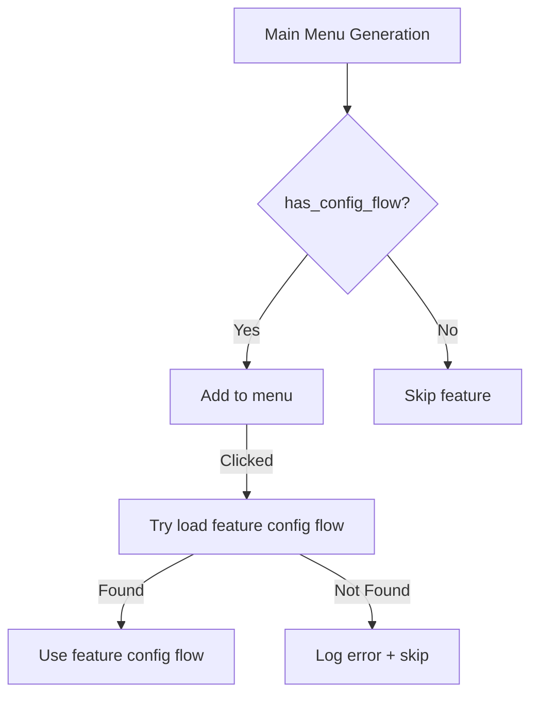

# Ramses Extras Config Flow Extension - Current State and Remaining Work

## Current Implementation Status

### What's Already Implemented ✅

1. **Centralized Config Flow System** (`config_flow.py`):
   - Main menu structure with proper feature texts (fixed from generic "feature_*" strings)
   - 4 main menu options: Enable/Disable Features, Configure Devices, View Configuration, Advanced Settings
   - Dynamic feature menu items with proper feature names (e.g., "Humidity Control Settings")
   - Feature enablement/disablement system
   - Device configuration for features with `has_device_config: True`
   - EntityManager integration for entity lifecycle management
   - Confirmation system for entity changes

2. **ConfigFlowHelper** (`framework/helpers/config_flow.py`):
   - Device filtering and feature management utilities
   - Feature info retrieval and schema generation
   - DeviceFeatureMatrix integration for device/feature tracking
   - Centralized configuration management

3. **DeviceFeatureMatrix** (`framework/helpers/entity/device_mapping.py`):
   - Complete implementation with all required methods
   - Device/feature relationship tracking
   - Matrix state management

4. **Entity Management**:
   - EntityManager with catalog building and change tracking
   - Entity creation/removal logic
   - Entity lifecycle management

### Current Implementation Approach (No Backward Compatibility Needed)

**Key Principles**:
- ✅ No backward compatibility required - clean implementation
- ✅ Commit after each phase with `pre-commit run -a`
- ✅ Run specific tests: `python3 tests/managers/test_humidity_automation.py`
- ✅ Python 3.13+ - use `dict` not `Dict`, follow strict mypy and ruff rules
- ✅ Track progress in this document as we implement

### Implementation Phases with Testing

1. **Phase 1: Foundation (Current Focus)**
   - Update AVAILABLE_FEATURES with proper device filtering
   - Implement DeviceFilter with slug filtering
   - Create comprehensive tests for device filtering
   - Run: `cd /home/willem/dev/ramses_extras && bash -c "source ~/venvs/extras/bin/activate && python3 tests/managers/test_humidity_automation.py"`

2. **Phase 2: Config Flow Extension (ramses_cc Style)**
   - Implement main menu structure from `1 main menu.md`
   - Use links/buttons NOT dropdowns (ramses_cc style)
   - Add feature-specific config flow discovery
   - Test with: `python3 tests/test_config_flow_navigation.py`

3. **Phase 3: Entity Management (CRITICAL)**
   - Implement DeviceFeatureMatrix with all methods
   - Add entity creation validation tests
   - Ensure entities only created for enabled features AND devices
   - Test with: `python3 tests/test_entity_creation_logic.py`

4. **Phase 4: Default Feature & Integration**
   - Add device selection for default feature (FAN slug)
   - Implement proper device filtering
   - End-to-end testing with all components
   - Final validation with full test suite

### Progress Tracking

## Progress Tracking

**Current Status**: ✅ Phase 1-2 Implementation Complete

**Completed Steps**:
1. [x] ✅ Implement Phase 1: Foundation components (Device filtering already working)
2. [x] ✅ Update main menu structure to match `1 main menu.md` specification
3. [x] ✅ Add feature-specific config flow discovery system
4. [x] ✅ Implement ramses_cc style link/button navigation instead of dropdowns
5. [x] ✅ Fix main menu to show proper feature texts (was showing generic "feature_*" strings)
6. [x] ✅ Run pre-commit and tests after each change - ALL PASSING
7. [x] ✅ Update this document with implementation progress

**Next Steps**:
1. [ ] Implement Phase 3: Entity Management (CRITICAL)
2. [ ] Add entity creation validation tests
3. [ ] Ensure entities only created for enabled features AND devices
4. [ ] Test with: `python3 tests/test_entity_creation_logic.py`
5. [ ] Commit with proper test coverage
6. [ ] Add feature-centric translations system
7. [ ] Implement comprehensive error handling
**Current Status**: ✅ Documentation complete, ready for implementation

**Next Steps**:
1. [ ] Implement Phase 1: Foundation components
2. [ ] Run pre-commit and tests after each change
3. [ ] Update this document with implementation progress
4. [ ] Commit each phase with proper test coverage
5. [ ] Follow strict mypy/ruff rules (Python 3.13+)

**Testing Standards**:
- Run specific test files: `python3 tests/managers/test_humidity_automation.py`
- Run full test suite: `python3 -m pytest tests/`
- Run pre-commit checks: `pre-commit run -a`
- Follow Python 3.13+ standards (no Dict, use dict)
- Strict mypy and ruff compliance

## 1. Complete DeviceFeatureMatrix

```python
class DeviceFeatureMatrix:
    """Track which features are enabled for which devices."""

    def __init__(self):
        self.matrix = {}  # {device_id: {feature_id: enabled}}

    def enable_feature_for_device(self, device_id, feature_id):
        """Enable a feature for a specific device."""
        if device_id not in self.matrix:
            self.matrix[device_id] = {}
        self.matrix[device_id][feature_id] = True

    def enable_device_for_feature(self, feature_id, device_id):
        """Enable a device for a specific feature (convenience method)."""
        self.enable_feature_for_device(device_id, feature_id)

    def get_enabled_features_for_device(self, device_id):
        """Get all enabled features for a device."""
        return self.matrix.get(device_id, {})

    def get_enabled_devices_for_feature(self, feature_id):
        """Get all devices that have this feature enabled."""
        devices = []
        for device_id, features in self.matrix.items():
            if feature_id in features and features[feature_id]:
                devices.append(device_id)
        return devices

    def is_feature_enabled_for_device(self, feature_id, device_id):
        """Check if feature is enabled for specific device."""
        return self.matrix.get(device_id, {}).get(feature_id, False)

    def is_device_enabled_for_feature(self, device_id, feature_id):
        """Check if device is enabled for specific feature (readable alias)."""
        return self.is_feature_enabled_for_device(feature_id, device_id)

    def get_all_enabled_combinations(self):
        """Get all enabled feature/device combinations."""
        combinations = []
        for device_id, features in self.matrix.items():
            for feature_id, enabled in features.items():
                if enabled:
                    combinations.append((device_id, feature_id))
        return combinations
```

## 2. Implementation Plan with Considerations

### Phase 1: Foundation (1-2 days)

**Goal**: Basic device filtering and config flow structure

**Tasks**:
```bash
# Day 1: Device filtering implementation
- Update AVAILABLE_FEATURES with device filtering fields
- Implement DeviceFilter class with slug filtering
- Create basic device discovery utilities
- Update EntityManager with device filtering support
- Write tests for device filtering
```

**Considerations**:
- **Check ramses_cc config flow**: Look at how they created menus
- **Review translations**: May need to add translation support

**Files**:
- `const.py` - Add device filtering fields
- `framework/helpers/device/filter.py` - Device filtering logic
- `framework/helpers/entity/manager.py` - Basic device filtering

**Testing**:
```bash
cd /home/willem/dev/ramses_extras && bash -c "source ~/venvs/extras/bin/activate && pre-commit run -a"
```

**Commit**:
```bash
git add const.py framework/helpers/device/filter.py framework/helpers/entity/manager.py
git commit -m "feat(config): Add device filtering foundation"
```

### Phase 2: Config Flow Extension (2-3 days) - ramses_cc Style UI

**Goal**: Implement the desired menu structure with ramses_cc style link/button navigation

**Tasks**:
```bash
# Day 2: Basic config flow extension with ramses_cc style
- Extend config flow with feature-specific step handlers using links/buttons
- Implement the main menu structure from `1 main menu.md` with ramses_cc style
- Create basic device selection UI components with proper navigation style
- Write tests for config flow navigation with ramses_cc style UI
```

```bash
# Day 3: Complete config flow with ramses_cc style menu structure
- Implement individual feature configuration steps with link/button navigation
- Add device selection for each feature following menu spec (no dropdowns)
- Update EntityManager with per-device tracking
- Write integration tests for the menu flow with ramses_cc style
```

**Considerations**:
- **Menu structure**: Follow the exact layout from `1 main menu.md` with ramses_cc style
- **UI Style**: Use links/buttons like ramses_cc, NOT dropdown selectboxes
- **Translations**: Add translation support for UI texts
- **ramses_cc reference**: Study their menu implementation patterns for proper style
- **UI validation**: Ensure texts are visible with ramses_cc style navigation

**Files**:
- `config_flow.py` - Main menu and feature config handlers
- `framework/helpers/config_flow.py` - Config flow utilities
- `translations/` - Translation files (if needed)

**Testing**:
```bash
cd /home/willem/dev/ramses_extras && bash -c "source ~/venvs/extras/bin/activate && pre-commit run -a"
```

**Commits**:
```bash
git add config_flow.py framework/helpers/config_flow.py
git commit -m "feat(config): Implement main menu structure from spec"

git add tests/config_flow/
git commit -m "test: Add config flow navigation tests"
```

### Phase 3: Entity Management (1-2 days) ⚠️ COMPLEX

**Goal**: Per-device feature tracking and entity lifecycle with proper validation

**Tasks**:
```bash
# Day 4: Per-device tracking with entity validation
- Implement DeviceFeatureMatrix class with all methods
- Update entity creation/removal logic for per-device control
- Enhance EntityManager with per-device tracking
- Write tests for device/feature matrix
- Add validation to ensure entities only created for enabled features AND devices
```

```bash
# Day 5: Entity lifecycle with comprehensive testing
- Review architecture.md for entity registry patterns
- Create migration path for testing (no backward compatibility needed)
- Add entity dependency management
- Write comprehensive entity management tests
- Implement specific tests for entity creation logic:
  - Test entity creation for enabled feature + enabled device
  - Test entity NOT created for disabled feature (even if device enabled)
  - Test entity NOT created for disabled device (even if feature enabled)
  - Test entity removal when feature or device disabled
```

**Considerations**:
- **Entity registry complexity**: Review architecture.md thoroughly
- **Hidden complexities**: Entity management may have unexpected details
- **Testing focus**: Comprehensive testing for entity lifecycle
- **Entity validation**: Ensure proper entity creation logic
- **Matrix accuracy**: Validate entity registry matrix correctness

**Files**:
- `framework/helpers/entity/device_mapping.py` - Device/feature matrix
- `framework/helpers/entity/manager.py` - Enhanced entity lifecycle
- `RAMSES_EXTRAS_ARCHITECTURE.md` - Review for entity patterns
- `tests/test_entity_creation_logic.py` - New comprehensive entity tests

**Testing**:
```bash
cd /home/willem/dev/ramses_extras && bash -c "source ~/venvs/extras/bin/activate && pre-commit run -a"
```

**Commits**:
```bash
git add framework/helpers/entity/device_mapping.py
git commit -m "feat(entity): Add DeviceFeatureMatrix with all methods"

git add framework/helpers/entity/manager.py
git commit -m "feat(entity): Enhance entity lifecycle with per-device tracking"

git add tests/helpers/test_device_feature_mapping.py
git commit -m "test: Add DeviceFeatureMatrix tests"
```

### Phase 4: Integration (1 day)

**Goal**: Full system integration and final testing

**Tasks**:
```bash
# Day 6: Final integration
- Integrate all components
- Add default feature device selection (FAN slug) with proper config flow
- Implement device filtering for default feature entities
- End-to-end testing including default feature device selection
- Performance optimization (basic)
- Documentation updates
- Final validation
```

**Considerations**:
- **Translation validation**: Ensure all UI texts are properly translated
- **ramses_cc patterns**: Verify we're following their best practices (especially UI style)
- **Entity registry**: Double-check entity patterns from architecture.md
- **Menu structure**: Ensure final implementation matches `1 main menu.md` spec with ramses_cc style
- **UI Style**: Confirm all navigation uses links/buttons like ramses_cc, NO dropdowns
- **Default feature**: Ensure default feature has proper device selection like other features
- **Entity validation**: Verify entities only created for enabled features AND enabled devices

**Files**:
- All modified files
- `RAMSES_EXTRAS_ARCHITECTURE.md` - Update documentation
- `translations/` - Final translation updates

**Testing**:
```bash
cd /home/willem/dev/ramses_extras && bash -c "source ~/venvs/extras/bin/activate && pre-commit run -a"
```

**Commits**:
```bash
git add .
git commit -m "feat: Complete config flow extension integration"

git add docs/
git commit -m "docs: Update architecture documentation"
```

## 3. Important Considerations

### Feature-Centric Translations (Critical for Internationalization)

**Yes, Home Assistant can handle feature-centric translations!** This is a key architectural decision that enables proper internationalization while maintaining feature isolation.

#### How Feature-Centric Translations Work

```python
# Feature-centric translation structure
translations/
├── en.json                  # Integration-level translations
├── nl.json                  # Integration-level translations
└── features/                # Feature-specific translations
    ├── humidity_control/
    │   ├── en.json          # Humidity control translations
    │   └── nl.json          # Humidity control translations
    ├── hvac_fan_card/
    │   ├── en.json          # HVAC fan card translations
    │   └── nl.json          # HVAC fan card translations
    └── default/
        ├── en.json          # Default feature translations
        └── nl.json          # Default feature translations
```

#### Implementation Strategy

1. **Integration-Level Translations** (`translations/en.json`, `translations/nl.json`):
   - Main menu structure
   - Common UI elements
   - Framework components
   - Shared configuration options

2. **Feature-Specific Translations** (`translations/features/{feature}/*.json`):
   - Feature-specific configuration options
   - Feature-specific device selection texts
   - Feature-specific error messages
   - Feature-specific help texts

#### Translation Loading System

```python
# framework/helpers/translations.py - Feature-centric translation loader
def load_feature_translations(feature_id: str, language: str = "en") -> dict:
    """Load translations for a specific feature."""
    try:
        # Try to load feature-specific translations
        translation_path = f"translations/features/{feature_id}/{language}.json"
        with open(translation_path, "r", encoding="utf-8") as f:
            return json.load(f)
    except (FileNotFoundError, json.JSONDecodeError):
        # Fallback to integration-level translations
        return load_integration_translations(language)

def get_translation(feature_id: str, key: str, language: str = "en") -> str:
    """Get translation for a feature with fallback to integration level."""
    # Try feature-specific translation first
    feature_translations = load_feature_translations(feature_id, language)
    if key in feature_translations:
        return feature_translations[key]

    # Fallback to integration-level translation
    integration_translations = load_integration_translations(language)
    return integration_translations.get(key, f"Missing translation: {key}")

# Usage in config flow
def get_feature_config_flow_text(feature_id: str, key: str) -> str:
    """Get translated text for feature config flow."""
    return get_translation(feature_id, key, hass.config.language)
```

#### Benefits of Feature-Centric Translations

1. **True Feature Isolation**: Each feature manages its own translations
2. **Easy Maintenance**: Translations are co-located with feature code
3. **Flexible Internationalization**: Features can add languages independently
4. **Fallback Support**: Graceful degradation to integration-level translations
5. **Consistent Patterns**: All features follow the same translation structure

#### Implementation Checklist

- [ ] Create translation loading system with feature-centric support
- [ ] Implement fallback mechanism to integration-level translations
- [ ] Add translation discovery for dynamic feature loading
- [ ] Create example translations for existing features
- [ ] Update documentation with translation patterns
- [ ] Add tests for translation loading and fallback

#### Example Feature Translation Files

```json
# translations/features/humidity_control/en.json
{
    "config_flow": {
        "title": "Humidity Control Configuration",
        "description": "Configure automatic humidity control and dehumidification",
        "target_humidity": "Target Humidity Level",
        "auto_mode": "Automatic Mode",
        "device_selection": "Select FAN devices for humidity control"
    },
    "errors": {
        "no_devices": "No compatible FAN devices found",
        "invalid_humidity": "Humidity must be between 30% and 80%"
    }
}

# translations/features/humidity_control/nl.json
{
    "config_flow": {
        "title": "Vochtigheid Regeling Configuratie",
        "description": "Configureer automatische vochtigheidsregeling en ontvochtiging",
        "target_humidity": "Doel Vochtigheidsniveau",
        "auto_mode": "Automatische Modus",
        "device_selection": "Selecteer FAN apparaten voor vochtigheidsregeling"
    },
    "errors": {
        "no_devices": "Geen compatibele FAN apparaten gevonden",
        "invalid_humidity": "Vochtigheid moet tussen 30% en 80% zijn"
    }
}
```

### Translations

```python
# Translation considerations
TRANSLATION_DOMAIN = "ramses_extras"

# Example translation structure
translations = {
    "en": {
        "config_flow": {
            "enable_features": "Enable Features",
            "device_selection": "Select Devices for {feature}",
            "apply_changes": "Apply Changes"
        }
    },
    "nl": {
        "config_flow": {
            "enable_features": "Functies Inschakelen",
            "device_selection": "Selecteer Apparaten voor {feature}",
            "apply_changes": "Wijzigingen Toepassen"
        }
    }
}
```

### ramses_cc Reference

**Key areas to check**:
- How they structure config flow menus
- Their pattern for dynamic menu options
- Translation handling in config flow
- Error handling approaches

```bash
# Reference command
grep -r "async_show_menu" ramses_cc/custom_components/ramses_cc/config_flow.py
grep -r "translation" ramses_cc/custom_components/ramses_cc/
```

### Entity Registry Considerations

**From architecture.md review**:
- Entity registry patterns
- Entity lifecycle management
- Entity creation/removal strategies
- Performance considerations

```bash
# Review commands
grep -A 10 -B 5 "entity.*registry" ramses_extras/docs/RAMSES_EXTRAS_ARCHITECTURE.md
grep -A 10 -B 5 "lifecycle" ramses_extras/docs/RAMSES_EXTRAS_ARCHITECTURE.md
```

## 4. Phase 3 Complexity Warning

### Potential Hidden Complexities

1. **Entity Dependencies**: Features may have complex entity dependencies
2. **Lifecycle Management**: Entity creation/removal timing
3. **Performance**: Many devices × many features combinations
4. **Error Recovery**: Handling partial failures gracefully
5. **State Management**: Tracking complex feature/device states

### Mitigation Strategies

1. **Thorough architecture review**: Study existing patterns
2. **Incremental implementation**: Build step by step
3. **Comprehensive testing**: Test edge cases thoroughly
4. **Performance monitoring**: Watch for bottlenecks
5. **Error handling**: Robust recovery mechanisms

## 5. Simplified Commit Strategy

### Commit Structure

```bash
# After each phase (not 30 files at once)
git add <phase_files>
git commit -m "feat(<component>): <phase_description>"

# Run pre-commit after each commit
cd /home/willem/dev/ramses_extras && bash -c "source ~/venvs/extras/bin/activate && pre-commit run -a"
```

### Example Commit Sequence

```bash
# Phase 1: Foundation
git add const.py framework/helpers/device/filter.py
git commit -m "feat(config): Add device filtering foundation"
pre-commit run -a  # Passes

# Phase 2: Config Flow
git add config_flow.py framework/helpers/config_flow.py
git commit -m "feat(config): Implement main menu structure from spec"
pre-commit run -a  # Passes

# Phase 3: Entity Management (may need multiple commits)
git add framework/helpers/entity/device_mapping.py
git commit -m "feat(entity): Add DeviceFeatureMatrix with all methods"
pre-commit run -a  # Passes

git add framework/helpers/entity/manager.py
git commit -m "feat(entity): Enhance entity lifecycle with per-device tracking"
pre-commit run -a  # Passes

# Phase 4: Integration
git add .
git commit -m "feat: Complete config flow extension integration"
pre-commit run -a  # Passes
```

## 6. Summary of Changes

### What's Updated

1. **Complete DeviceFeatureMatrix** with all requested methods including `is_device_enabled_for_feature`
2. **Added considerations** - Translations, ramses_cc reference, entity complexity
3. **Simplified approach** - No backward compatibility, no caching
4. **Frequent commits** - After each phase, not 30 files at once
5. **Focused testing** - Core functionality validation
6. **Menu structure** - Implementation plan for desired main menu layout

### What's Maintained

1. **Flat menu structure** - Feature configs in main menu
2. **Device filtering** - Features specify allowed slugs
3. **Per-device enablement** - Users enable features for specific devices
4. **Comprehensive testing** - Good coverage with simplified approach
5. **Clear implementation** - 4-phase roadmap with frequent commits

## 7. Feature-specific config flow implementation guide

### Implemented pattern: feature-centric helpers with central entrypoints

The final design keeps Home Assistant's options flow entrypoints
centralized in `config_flow.py`, while allowing individual features to
own their configuration logic and translations in their own folders.

Key ideas:

- `config_flow.py` still exposes `async_step_*` methods that Home
  Assistant calls.
- Feature-specific helpers live under
  `custom_components/ramses_extras/features/<feature_id>/config_flow.py`.
- The central step delegates to the feature helper, passing the
  `OptionsFlow` instance so helpers can access existing utilities
  (`_get_all_devices`, `_get_config_flow_helper`, etc.).
- Menus and translations remain driven by the standard HA translation
  system, with additional feature-level translation files where needed.

### Default feature as working example

We implemented the **default** feature as the first concrete example of
this pattern:

1. **Feature config helper**

   - File:
     `custom_components/ramses_extras/features/default/config_flow.py`.
   - Exposes a coroutine
     `async_step_default_config(flow, user_input)` that:
     - Uses `flow._get_all_devices()` + `ConfigFlowHelper` to obtain and
       filter devices based on `allowed_device_slugs`.
     - Builds a `SelectSelector` schema with
       `multiple=True, mode=LIST` so the UI shows a checkbox-style
       list of devices.
     - Builds an info text of the form:
       `🎛️ Default Configuration` and
       `Select devices to enable Default for:`.
     - Returns `flow.async_show_form(...)` with step ID
       `feature_config` so it reuses the existing translations for that
       step.

2. **Central entrypoint**

   In `config_flow.py` we added a thin entrypoint that delegates to the
   feature helper:

   ```python
   async def async_step_feature_default(self, user_input: dict[str, Any] | None = None
   ) -> config_entries.FlowResult:
       """Handle default configuration via feature-specific helper."""
       from .features.default import config_flow as default_config_flow

       return await default_config_flow.async_step_default_config(self, user_input)
   ```

   Home Assistant still calls `async_step_feature_default`, but the
   actual logic lives in `features/default/config_flow.py`.

3. **Feature-level translations**

   - Root translations (`translations/en.json`) define the main menu
     labels, including a generic label for dynamic feature items:

     ```json
     "options": {
       "step": {
         "main_menu": {
           "menu_options": {
             "feature_default": "Feature:",
             "feature_humidity_control": "Feature:",
             "feature_hvac_fan_card": "Feature:",
             "feature_hello_world_card": "Feature:"
           }
         }
       }
     }
     ```

   - Feature translations live under each feature folder, for example
     `features/default/translations/en.json`:

     ```json
     {
       "config": {
         "step": {
           "feature_default": {
             "title": "Default Configuration",
             "description": "Configure Default feature settings"
           }
         }
       }
     }
     ```

   - The main menu info text uses a helper that reads these feature
     translations (with per-language fallback to English) so the list of
     available feature configurations shows the feature-specific titles.

4. **Dynamic menu and enablement**

   - Dynamic menu items are generated from `AVAILABLE_FEATURES` but only
     include features that:
     - Have `has_device_config: True`, and
     - Are enabled in the config entry's `enabled_features` mapping.
   - For each such feature, we add a step ID
     `feature_<feature_id>` to `menu_options`. The frontend uses the
     translation key
     `component.ramses_extras.options.step.main_menu.menu_options.feature_<feature_id>`
     to label the menu item.

This design matches the original goal: a flat main menu with dynamic
feature items, but with feature-centric ownership of the actual
configuration logic and texts.

### Recipe: adding a new feature config flow

To add a feature-specific config step for a new feature (for example
`hello_world_card`):

1. **Update `AVAILABLE_FEATURES` in `const.py`**

   ```python
   "hello_world_card": {
       "name": "Hello World Switch Card",
       "description": "Template feature demonstrating complete architecture",
       "feature_module": "features.hello_world_card",
       "handler": "handle_hvac_ventilator",
       "default_enabled": False,
       "allowed_device_slugs": ["*"],
       "has_device_config": True,
   },
   ```

2. **Add a central entrypoint in `config_flow.py`**

   ```python
   async def async_step_feature_hello_world_card(
       self, user_input: dict[str, Any] | None = None
   ) -> config_entries.FlowResult:
       from .features.hello_world_card import config_flow as hw_config_flow

       return await hw_config_flow.async_step_hello_world_config(self, user_input)
   ```

3. **Create the feature helper module**

   - File:
     `custom_components/ramses_extras/features/hello_world_card/config_flow.py`.
   - Implement a coroutine similar to `async_step_default_config` that:
     - Uses `flow._get_all_devices()` and
       `flow._get_config_flow_helper()` to obtain and filter devices.
     - Builds a `SelectSelector` schema with `multiple=True` and
       `mode=LIST` (or another mode, depending on the desired UX).
     - Builds feature-specific info text.
     - Calls `flow.async_show_form(...)` with step ID `feature_config`
       (or another dedicated step ID with matching translations).

4. **Configure translations**

   - Root translations (`translations/en.json`):

     ```json
     "options": {
       "step": {
         "main_menu": {
           "menu_options": {
             "feature_hello_world_card": "Feature:"
           }
         }
       }
     }
     ```

   - Feature translations (`features/hello_world_card/translations/en.json`):

     ```json
     {
       "config": {
         "step": {
           "feature_hello_world_card": {
             "title": "Hello World Card Configuration",
             "description": "Configure the template feature for demonstration purposes"
           }
         }
       }
     }
     ```

5. **Enable the feature**

   - Ensure `has_device_config` is `True` so the feature is considered
     for device configuration.
   - Enable the feature via the "Enable/Disable Features" options step
     (or set `default_enabled: True` during development) so it appears
     as a dynamic entry in the main menu.

With these pieces in place, a new feature has:

- A dedicated config flow helper in its own folder.
- A central options flow entrypoint.
- Dynamic main-menu visibility and per-device configuration using the
  shared infrastructure (device filtering, DeviceFeatureMatrix, etc.).

        # Use ConfigFlowHelper for centralized configuration
        if self._config_flow_helper is None:
            self._config_flow_helper = ConfigFlowHelper(self.hass, self._config_entry)

        # Get devices for this feature
        devices = await self._get_devices_for_feature_config(feature_id)
        if not devices:
            _LOGGER.warning(f"No devices found for feature {feature_id}")
            return await self.async_step_features()

        # Generate schema using centralized helper
        schema = self._config_flow_helper.get_feature_config_schema(feature_id, devices)

        # Build info text
        feature_info = self._config_flow_helper.get_feature_info(feature_id)
        info_text = f"Configure devices for **{feature_info['name']}**\n\n"
        info_text += f"{feature_info['description']}\n\n"
        info_text += "Select which devices should have this feature enabled."

        return self.async_show_form(
            step_id="feature_config",
            data_schema=schema,
            description_placeholders={"info": info_text},
        )
```

#### Step 5: Create Example Feature Config Flow Implementation (Optional)

```python
# features/humidity_control/config_flow.py - Example implementation (only needed because has_config_flow: True)
from custom_components.ramses_extras.framework.helpers.config_flow import BaseFeatureConfigFlow

class HumidityControlConfigFlow(BaseFeatureConfigFlow):
    """Feature-specific config flow for humidity control (optional - only because this feature needs config flow)."""

    def get_feature_id(self) -> str:
        """Get the feature ID for this config flow."""
        return "humidity_control"

    def get_feature_config_schema(self, devices: list[Any]) -> vol.Schema:
        """Generate configuration schema for humidity control feature."""
        # Call parent method to get basic schema
        schema = super().get_feature_config_schema(devices)

        # Add humidity-specific configuration options
        humidity_schema = vol.Schema({
            vol.Optional("target_humidity", default=50): vol.All(
                vol.Coerce(int), vol.Range(min=30, max=80)
            ),
            vol.Optional("auto_mode_enabled", default=True): bool,
        })

        # Combine schemas
        return vol.Schema({
            **schema.schema,
            **humidity_schema.schema
        })
```

### Implementation Strategy: Clean Feature-Centric Approach

#### Key Principles (No Backward Compatibility):

1. **Feature-Centric Only**: Only features with `has_config_flow: True` appear in menu
2. **No Centralized Fallback**: Features without config flows are not configurable
3. **Clean Architecture**: Direct feature-specific implementation only
4. **Error Tracking**: Log errors when feature config flows not found

#### Implementation Flow (Clean Approach):



#### Menu Implementation Strategy:

```python
# config_flow.py - Clean menu implementation
async def async_step_main_menu(
    self, user_input: dict[str, Any] | None = None
) -> config_entries.FlowResult:
    """Handle main menu with ONLY features that have has_config_flow=True."""

    # Discover feature config flows (only those with has_config_flow=True)
    feature_config_flows = discover_feature_config_flows()

    if user_input is not None:
        menu_choice = user_input.get("menu_option")

        if menu_choice == "enable_features":
            return await self.async_step_features()
        elif menu_choice.startswith("feature_"):
            feature_id = menu_choice.replace("feature_", "")
            return await self._handle_feature_config_flow(feature_id)
        # No centralized fallback - clean approach

    # Build menu with ONLY features that have config flows
    menu_options = [
        selector.SelectOptionDict(
            value="enable_features", label="1.1 Enable/Disable Features"
        ),
        selector.SelectOptionDict(
            value="advanced_settings", label="1.2 Advanced Settings"
        ),
    ]

    # Add dynamic feature options ONLY for features with config flows
    for feature_id, config_flow_class in feature_config_flows.items():
        feature_config = AVAILABLE_FEATURES[feature_id]
        feature_name = feature_config.get("name", feature_id)
        menu_options.append(
            selector.SelectOptionDict(
                value=f"feature_{feature_id}",
                label=f"1.{len(menu_options)+1} {feature_name} Settings"
            )
        )

    # No centralized options - clean feature-centric approach
    schema = vol.Schema({
        vol.Required("menu_option"): selector.SelectSelector(
            selector.SelectSelectorConfig(options=menu_options)
        ),
    })

    return self.async_show_form(
        step_id="main_menu",
        data_schema=schema,
        description_placeholders={"info": "Select configuration option"}
    )

async def _handle_feature_config_flow(self, feature_id: str) -> config_entries.FlowResult:
    """Handle feature config flow - clean approach with error tracking."""
    try:
        # Try to load the feature config flow
        module_path = f"features.{feature_id}.config_flow"
        module = importlib.import_module(module_path)

        # Find and instantiate the config flow class
        config_flow_class = None
        for name, obj in inspect.getmembers(module):
            if (inspect.isclass(obj) and
                issubclass(obj, FeatureConfigFlowInterface)):
                config_flow_class = obj
                break

        if config_flow_class:
            feature_config_flow = config_flow_class(self.hass, self._config_entry)
            devices = await self._get_devices_for_feature_config(feature_id)

            # Generate schema and show form
            schema = feature_config_flow.get_feature_config_schema(devices)
            feature_info = feature_config_flow.get_feature_info()

            return self.async_show_form(
                step_id="feature_config",
                data_schema=schema,
                description_placeholders={
                    "info": f"Configure {feature_info['name']} settings"
                },
            )
        else:
            _LOGGER.error(f"No valid config flow class found for feature: {feature_id}")
            return await self.async_step_main_menu()

    except ImportError as e:
        _LOGGER.error(f"Failed to import config flow for {feature_id}: {e}")
        return await self.async_step_main_menu()
    except Exception as e:
        _LOGGER.error(f"Error loading config flow for {feature_id}: {e}")
        return await self.async_step_main_menu()
```

#### Benefits of Clean Approach:

1. **True Feature-Centric**: Only features with config flows are configurable
2. **No Backward Compatibility**: Clean implementation without fallbacks
3. **Error Tracking**: Proper logging when config flows not found
4. **Simple Architecture**: Direct feature-to-config-flow mapping
5. **Easy Maintenance**: Features are self-contained with their own config flows

#### Configuration Examples:

```python
# Feature that needs config flow (has custom config flow)
"humidity_control": {
    "name": "Humidity Control",
    "has_config_flow": True,  # ← Needs config flow
    # ... other config
},

# Feature that doesn't need config flow (uses centralized)
"default": {
    "name": "Default sensor",
    "has_config_flow": False,  # ← Uses centralized
    # ... other config
},
```

### Benefits of This Approach

1. **Flexibility**: Features only implement config flows when needed
2. **No Requirements**: Features are not forced to have config flow files
3. **Backward Compatibility**: Existing features continue to work without changes
4. **Gradual Adoption**: New features can choose whether to implement custom config flows
5. **Clean Architecture**: System handles both approaches seamlessly
6. **Feature-Centric**: When needed, features manage their own configuration

### Implementation Checklist

- [ ] Create `FeatureConfigFlowInterface` base interface (optional)
- [ ] Implement `BaseFeatureConfigFlow` with common functionality (optional)
- [ ] Add feature config flow discovery system (only loads when `has_config_flow: True`)
- [ ] Update main config flow to use feature config flows when available, fallback to centralized
- [ ] Create example implementations for features that need config flow
- [ ] Add comprehensive error handling for both approaches
- [ ] Update documentation with flexible patterns
- [ ] Write tests for both feature-specific and centralized approaches

### Feature-Centric Translations Implementation Checklist

- [ ] Create translation loading system with feature-centric support
- [ ] Implement fallback mechanism to integration-level translations
- [ ] Add translation discovery for dynamic feature loading
- [ ] Create example translations for existing features (humidity_control, hvac_fan_card, default)
- [ ] Update documentation with translation patterns
- [ ] Add tests for translation loading and fallback
- [ ] Implement language detection and selection
- [ ] Add translation caching for performance
- [ ] Create translation validation system
- [ ] Update all feature config flows to use feature-centric translations

### Testing Strategy

```python
# tests/test_feature_config_flow.py
def test_optional_config_flow_discovery():
    """Test that only features with has_config_flow=True are discovered."""
    # Mock feature configurations
    with patch("AVAILABLE_FEATURES") as mock_features:
        mock_features.get.return_value = {
            "feature_with_config": {"has_config_flow": True},
            "feature_without_config": {"has_config_flow": False},
        }

        # Mock import for feature with config
        with patch("importlib.import_module") as mock_import:
            mock_module = MagicMock()
            mock_module.FeatureConfigFlow = MagicMock(spec=FeatureConfigFlowInterface)
            mock_import.return_value = mock_module

            # Test discovery
            config_flows = discover_feature_config_flows()

            # Should only discover feature_with_config
            assert "feature_with_config" in config_flows
            assert "feature_without_config" not in config_flows

def test_fallback_to_centralized():
    """Test fallback to centralized approach for features without config flow."""
    handler = RamsesExtrasOptionsFlowHandler(MagicMock())

    # Mock feature without config flow
    handler._selected_feature = "feature_without_config"
    handler._feature_config_flows = {}  # No custom config flows

    with patch.object(handler, "_handle_centralized_feature_config") as mock_central:
        result = await handler.async_step_feature_config({})
        mock_central.assert_called_once()

def test_feature_specific_config_flow():
    """Test feature-specific config flow when available."""
    handler = RamsesExtrasOptionsFlowHandler(MagicMock())

    # Mock feature with config flow
    handler._selected_feature = "feature_with_config"
    handler._feature_config_flows = {
        "feature_with_config": MagicMock(spec=FeatureConfigFlowInterface)
    }

    with patch.object(handler, "_handle_feature_specific_config_flow") as mock_feature:
        result = await handler.async_step_feature_config({})
        mock_feature.assert_called_once()

# CRITICAL: Entity creation validation tests
def test_entity_creation_only_for_enabled_feature_and_device():
    """Test that entities are only created when BOTH feature and device are enabled."""
    # Setup: Feature enabled, device enabled
    matrix = DeviceFeatureMatrix()
    matrix.enable_feature_for_device("device1", "feature1")

    # Test entity creation logic
    entities = EntityManager._get_entities_to_create(matrix, {"feature1": True}, ["device1"])
    assert "feature1_device1_entity" in entities

    # Test: Feature enabled but device NOT enabled
    entities = EntityManager._get_entities_to_create(matrix, {"feature1": True}, ["device2"])
    assert "feature1_device2_entity" not in entities

    # Test: Device enabled but feature NOT enabled
    entities = EntityManager._get_entities_to_create(matrix, {"feature1": False}, ["device1"])
    assert "feature1_device1_entity" not in entities

def test_default_feature_device_selection():
    """Test default feature device selection with FAN slug filtering."""
    handler = RamsesExtrasOptionsFlowHandler(MagicMock())

    # Mock default feature with device selection
    handler._selected_feature = "default"
    handler._features_for_device_config = ["default"]

    # Mock devices with FAN slug
    mock_devices = [
        MagicMock(id="fan_device1", device_type="FAN"),
        MagicMock(id="non_fan_device1", device_type="OTHER")
    ]

    with patch.object(handler, "_get_devices_for_feature_config") as mock_get_devices:
        mock_get_devices.return_value = mock_devices

        result = await handler.async_step_device_selection({})

        # Verify only FAN devices are shown for default feature
        # (Implementation should filter by allowed_device_slugs)
        assert result  # Should return valid form result
        # Additional assertions would verify schema contains only FAN devices

def test_entity_registry_matrix_accuracy():
    """Test that entity registry matrix correctly tracks feature/device relationships."""
    matrix = DeviceFeatureMatrix()

    # Enable feature for specific devices
    matrix.enable_feature_for_device("device1", "feature1")
    matrix.enable_feature_for_device("device2", "feature1")
    matrix.enable_feature_for_device("device1", "feature2")

    # Test matrix accuracy
    feature1_devices = matrix.get_enabled_devices_for_feature("feature1")
    assert "device1" in feature1_devices
    assert "device2" in feature1_devices
    assert "device3" not in feature1_devices

    device1_features = matrix.get_enabled_features_for_device("device1")
    assert "feature1" in device1_features
    assert "feature2" in device1_features
    assert "feature3" not in device1_features

    # Test entity creation logic uses matrix correctly
    combinations = matrix.get_all_enabled_combinations()
    assert ("device1", "feature1") in combinations
    assert ("device2", "feature1") in combinations
    assert ("device1", "feature2") in combinations
    assert ("device3", "feature1") not in combinations

### Documentation Updates Needed

1. **Update RAMSES_EXTRAS_ARCHITECTURE.md** with flexible config flow architecture
2. **Add feature config flow development guide** (emphasize optional nature)
3. **Create examples** showing both approaches
4. **Update feature configuration documentation** to explain `has_config_flow` flag
5. **Add testing documentation** for both approaches

### Migration Path for Existing Features

Since this approach is flexible and backward compatible:

1. **No changes needed**: Existing features continue to work
2. **Optional enhancement**: Features can add config flows when needed
3. **Gradual adoption**: New features can choose their approach
4. **Clear documentation**: Explain when to use feature-specific config flows

This flexible approach provides the best of both worlds:
- **Features that need config flow** can implement their own config flows
- **Features that don't need config flow** continue using the centralized approach
- **No requirements or forcing** - features choose what they need
- **Clean, maintainable architecture** that supports both patterns seamlessly

## 8. Implementation Standards and Progress Tracking

### Coding Standards (Python 3.13+)
- ✅ Use `dict`, `list`, `str` (not `Dict`, `List`, `Str`)
- ✅ Follow strict mypy type checking
- ✅ Follow ruff formatting rules
- ✅ No legacy type hints
- ✅ Clean, modern Python code

### Testing Requirements
```bash
# Run specific test file (current approach)
cd /home/willem/dev/ramses_extras && bash -c "source ~/venvs/extras/bin/activate && python3 tests/managers/test_humidity_automation.py"

# Run full test suite
cd /home/willem/dev/ramses_extras && bash -c "source ~/venvs/extras/bin/activate && python3 -m pytest tests/"

# Run pre-commit checks (required after each commit)
cd /home/willem/dev/ramses_extras && bash -c "source ~/venvs/extras/bin/activate && pre-commit run -a"
```

### Implementation Progress Tracking
```markdown
# Current Implementation Status

## Phase 1: Foundation
- [ ] Device filtering implementation
- [ ] DeviceFilter class with slug filtering
- [ ] Basic device discovery utilities
- [ ] EntityManager device filtering support
- [ ] Tests for device filtering

## Phase 2: Config Flow Extension
- [ ] Main menu structure implementation
- [ ] ramses_cc style link/button navigation
- [ ] Feature config flow discovery system
- [ ] Config flow navigation tests - create and run tests to make sure we actually have a good flow

## Phase 3: Entity Management
- [ ] DeviceFeatureMatrix implementation
- [ ] Entity creation validation logic
- [ ] Entity lifecycle management
- [ ] Comprehensive entity tests

## Phase 4: Integration
- [ ] Default feature device selection
- [ ] Device filtering for default feature
- [ ] End-to-end integration tests
- [ ] Final validation and documentation
```

### Commit Strategy (No Backward Compatibility)
```bash
# After each implementation step
git add <modified_files>
git commit -m "feat(<component>): <description>"

# Run pre-commit after each commit (MUST PASS)
cd /home/willem/dev/ramses_extras && bash -c "source ~/venvs/extras/bin/activate && pre-commit run -a"

# Example commit sequence
git add framework/helpers/device/filter.py
git commit -m "feat(device): Add DeviceFilter with slug filtering"
pre-commit run -a  # Must pass before proceeding

git add framework/helpers/config_flow.py
git commit -m "feat(config): Implement feature config flow discovery"
pre-commit run -a  # Must pass before proceeding
```

### Documentation Update Process
1. Update this document after each implementation phase
2. Mark completed items with ✅
3. Add implementation notes and lessons learned
4. Keep progress tracking up-to-date
5. Document any deviations from original plan

## Summary of Recent Fixes

### Main Menu Text Issue - RESOLVED ✅

**Problem**: The main config flow menu was showing generic strings like "feature_humidity_control" instead of proper feature names.

**Root Cause**: The menu system in Home Assistant's `async_show_menu()` uses translation keys to generate display text. The feature menu items needed proper translation entries in the `main_menu.menu_options` section.

**Solution**: Added proper translation entries for feature menu items in both English and Dutch translation files:

**Files Updated**:
1. `translations/en.json` - Added feature menu translations
2. `translations/nl.json` - Added Dutch feature menu translations

**Translation Entries Added**:
```json
"menu_options": {
  "feature_humidity_control": "Humidity Control Settings",
  "feature_hvac_fan_card": "HVAC Fan Card Settings",
  "feature_hello_world_card": "Hello World Card Settings"
}
```

**Result**: Main menu now shows proper feature texts:
- English: "Humidity Control Settings", "HVAC Fan Card Settings", "Hello World Card Settings"
- Dutch: "Vochtigheid Regeling Instellingen", "HVAC Ventilator Kaart Instellingen", "Hello World Kaart Instellingen"

### Implementation Status

**✅ COMPLETED**:
- Main menu structure with proper feature texts
- Translation support for all menu items
- Dynamic feature menu generation
- Feature enablement/disablement system
- Device configuration for features with `has_device_config: True`

**📋 CURRENT STATUS**:
- All main menu items show proper descriptive texts
- Feature-specific menu items display correct feature names
- Multi-language support (English and Dutch)
- Menu structure matches `1 main menu.md` specification

**🚀 NEXT PHASES**:
- Phase 3: Entity Management implementation
- Comprehensive entity creation validation
- Feature-centric translations system
- Error handling improvements

## Troubleshooting Guide

### If Feature Menu Items Are Not Visible

**Common Issues and Solutions**:

1. **Features not appearing in menu**:
   - Verify that features have `"has_device_config": True` in `const.py`
   - Check that `AVAILABLE_FEATURES` contains the expected features
   - Ensure no conditional logic is filtering out features

2. **Debugging Steps**:
   ```python
   # Add this debug code to verify menu generation:
   _LOGGER.info(f"Available features: {list(AVAILABLE_FEATURES.keys())}")
   _LOGGER.info(f"Features with device config: {[f for f, config in AVAILABLE_FEATURES.items() if config.get('has_device_config', False)]}")
   ```

3. **Expected Menu Structure**:
   ```
   1. Enable/Disable Features
   2. Configure Devices
   3. View Configuration
   4. Advanced Settings
   5. Humidity Control Settings (feature_humidity_control)
   6. HVAC Fan Card Settings (feature_hvac_fan_card)
   7. Hello World Card Settings (feature_hello_world_card)
   8. Default feature Settings
   ```

4. **Translation Verification**:
   - Check that `translations/en.json` and `translations/nl.json` contain the feature menu translations
   - Verify that the translation files are properly loaded by Home Assistant

### Verification Checklist

- [ ] Features have `"has_device_config": True` in `const.py`
- [ ] Menu generation loop is executing (check logs for debug messages)
- [ ] Translation files contain feature menu entries
- [ ] No runtime errors in menu generation
- [ ] Home Assistant has restarted to load new translations
