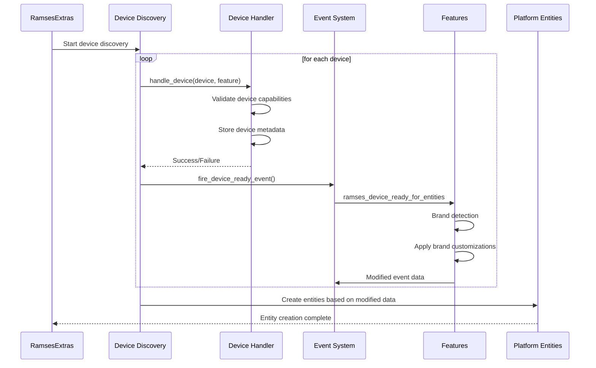
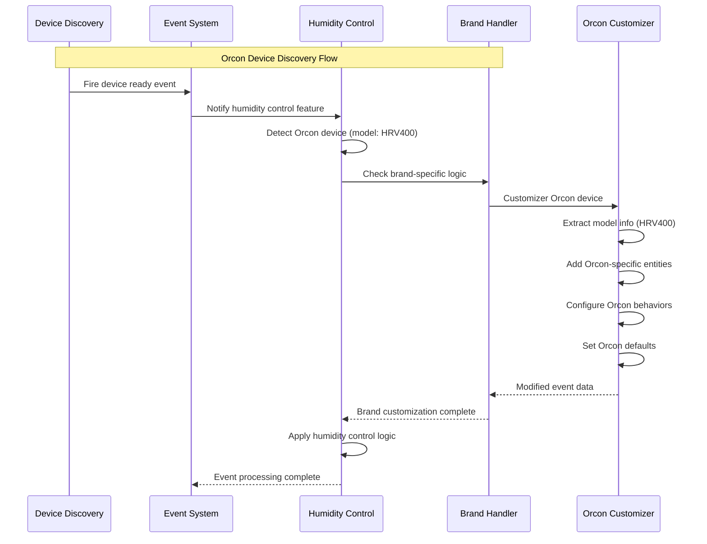
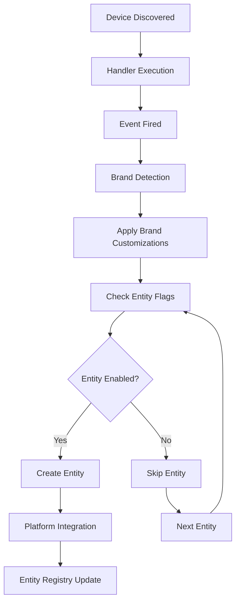
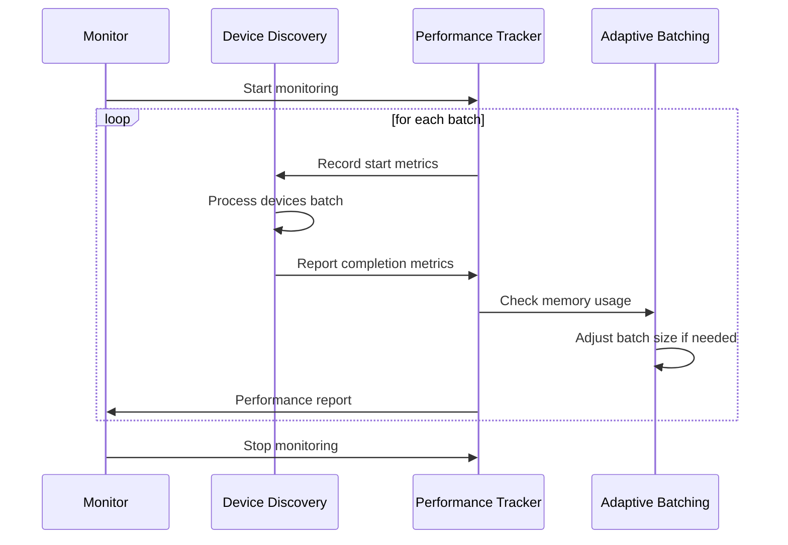

# Enhanced Device Discovery Architecture

## Overview

This document outlines the planned enhancement to the Ramses Extras device discovery and entity management system. The new architecture will provide better separation of concerns, enable brand-specific entity management, and improve extensibility for future device types.

## Current Architecture Analysis

### Current Flow

1. **Device Discovery**: Loop through `AVAILABLE_FEATURES` to find matching device type
2. **Feature Handler**: Call handler from feature configuration (currently all features use same handler)
3. **Entity Check**: Use EntityRegistry to determine if device should have entities
4. **Entity Creation**: Store device IDs, create entities during platform setup

### Current Limitations

- Handler duplication across features supporting same device type
- No post-discovery entity modification capabilities
- No brand-specific logic or customization
- Complex feature dependency on handler configuration

## Enhanced Architecture

### 1. Device Type Handler Mapping

**Framework Level**: Create central mapping from device types to handlers

```python
# Framework mapping (const.py)
DEVICE_TYPE_HANDLERS = {
    "HvacVentilator": "handle_hvac_ventilator",
    "HvacController": "handle_hvac_controller",  # Future device type
    "Thermostat": "handle_thermostat",           # Future device type
}
```

**Benefits:**

- Single source of truth for device handling
- Easy to add new device types
- No handler duplication
- Clear separation between device handling and feature logic

### 2. Event System

**Event Name**: `ramses_device_ready_for_entities`

**Timing**: After device handler completes but BEFORE entity creation

**Event Data**:

```python
{
    "device_id": "32:153289",
    "device_type": "HvacVentilator",
    "device_object": device,  # Full device object for inspection
    "entity_ids": ["sensor.indoor_absolute_humidity_32_153289", ...],  # Entities that will be created
    "handled_by": "humidity_control"  # Which feature called the handler
}
```

**Benefits:**

- Features can respond to device discovery
- Access to full device object for brand/model inspection
- Timing allows entity list modification before creation
- Event-based extensibility

### 3. Double Evaluation System

**Phase 1 - Discovery**:

- Discover devices that should have entities
- Fire event for each discovered device
- Listeners can modify EntityRegistry or set flags

**Phase 2 - Creation**:

- Platform setup creates entities
- Check entity-specific flags before creation
- Apply any modifications from event listeners

### 4. Entity Configuration Enhancement

**New Flag**: `default_enabled` in all entity configurations

**Example**:

```python
# Feature const.py files
HUMIDITY_SWITCH_CONFIGS = {
    "dehumidify": {
        "name_template": "Dehumidify {device_id}",
        "default_enabled": True,  # NEW: defaults to True for existing entities
        "entity_template": "dehumidify_{device_id}",
        # ... other config
    }
}
```

**Benefits**:

- Runtime entity filtering
- Brand-specific entity enable/disable
- Safe default behavior (True maintains current behavior)

### 5. Event Listener Pattern

**Example Implementation**:

```python
# Feature event listener
async def on_device_ready_for_entities(event_data):
    """Handle device discovery for brand-specific logic."""
    device = event_data["device_object"]

    # Log device discovery (proof of concept)
    _LOGGER.info(f"Device {device.id} ({device.model}) ready for entity creation")

    # Brand-specific logic (future implementation)
    if "orcon" in device.model.lower():
        # Enable brand-specific features
        # Modify entity configurations
        # Set default values
        pass
```

## Implementation Plan

### Phase 1: Framework Changes

1. Add `DEVICE_TYPE_HANDLERS` mapping in `const.py`
2. Update `_handle_device` to use device type mapping
3. Add event firing after successful device handling
4. Test framework changes

### Phase 2: Entity Configuration Updates

1. Add `default_enabled: True` to all existing entity configurations
2. Update EntityRegistry to include flag in configuration data
3. Verify existing entities maintain current behavior

### Phase 3: Platform Integration

1. Update platform entity creation to check `default_enabled` flag
2. Ensure entities respect configuration flags
3. Test entity filtering functionality

### Phase 4: Event Listeners

1. Create proof-of-concept event listener in humidity_control feature
2. Log device discovery information
3. Test brand-specific logic framework

### Phase 5: Testing & Validation

1. Test single event per device discovery
2. Verify entity filtering with disabled flags
3. Validate performance impact
4. Test brand-specific entity modification

## Benefits Summary

### Technical Benefits

- **Cleaner Architecture**: Separation of device handling and feature logic
- **Reduced Duplication**: Single handler per device type
- **Runtime Flexibility**: Entity list modification before creation
- **Extensibility**: Easy addition of new device types and brands

### Feature Benefits

- **Brand-Specific Logic**: Device model detection and customization
- **Configurable Entities**: Runtime enable/disable based on device capabilities
- **Enhanced Automation**: Brand-specific automation patterns
- **Better User Experience**: Optimized entity sets per device brand

### Maintenance Benefits

- **Single Source of Truth**: Device type mappings in one place
- **Event-Based Notifications**: Easy debugging and monitoring
- **Safe Defaults**: Backward compatibility maintained
- **Gradual Migration**: Can implement incrementally

## Implementation Examples

### Device Type Handler Implementation

```python
# In custom_components/ramses_extras/const.py
from typing import Callable, Dict

DEVICE_TYPE_HANDLERS: Dict[str, Callable] = {}

def register_device_handler(device_type: str):
    """Decorator to register device type handlers."""
    def decorator(handler: Callable):
        DEVICE_TYPE_HANDLERS[device_type] = handler
        return handler
    return decorator

@register_device_handler("HvacVentilator")
async def handle_hvac_ventilator(device, feature_name: str) -> bool:
    """Handle HVAC Ventilator device discovery."""
    try:
        # Validate device capabilities
        if not hasattr(device, 'humidity_sensor'):
            _LOGGER.warning(f"Device {device.id} missing humidity_sensor capability")
            return False

        # Process device-specific configuration
        device_config = await device.get_configuration()

        # Store device metadata for entity creation
        if not hasattr(device, '_entity_metadata'):
            device._entity_metadata = {}

        device._entity_metadata.update({
            'feature': feature_name,
            'capabilities': ['humidity_sensing', 'dehumidification'],
            'model_family': _extract_model_family(device.model)
        })

        return True

    except Exception as ex:
        _LOGGER.error(f"Failed to handle HVAC Ventilator {device.id}: {ex}")
        return False
```

### Event System Implementation

```python
# In custom_components/ramses_extras/__init__.py
import asyncio
from homeassistant.core import HomeAssistant
from homeassistant.helpers.dispatcher import async_dispatcher_send

EVENT_DEVICE_READY_FOR_ENTITIES = "ramses_device_ready_for_entities"

async def fire_device_ready_event(
    hass: HomeAssistant,
    device_id: str,
    device_type: str,
    device,
    entity_ids: list,
    handled_by: str
) -> None:
    """Fire event after device handling but before entity creation."""

    event_data = {
        "device_id": device_id,
        "device_type": device_type,
        "device_object": device,  # Full device object for inspection
        "entity_ids": entity_ids,  # Entities that will be created
        "handled_by": handled_by,  # Which feature called the handler
        "timestamp": time.time()
    }

    # Fire event for listeners
    async_dispatcher_send(hass, EVENT_DEVICE_READY_FOR_ENTITIES, event_data)

    # Also fire Home Assistant event for external listeners
    hass.bus.async_fire(EVENT_DEVICE_READY_FOR_ENTITIES, event_data)
```

### Event Listener Implementation

```python
# In custom_components/ramses_extras/features/humidity_control/__init__.py
from homeassistant.core import HomeAssistant
from homeassistant.helpers.dispatcher import async_dispatcher_connect

class HumidityControlFeature:
    def __init__(self, hass: HomeAssistant):
        self.hass = hass
        self._entity_modifications = {}

    async def async_setup(self):
        """Setup event listeners for device discovery."""
        # Listen to device ready events
        async_dispatcher_connect(
            self.hass,
            EVENT_DEVICE_READY_FOR_ENTITIES,
            self._on_device_ready_for_entities
        )

    async def _on_device_ready_for_entities(self, event_data):
        """Handle device discovery event."""
        device = event_data["device_object"]
        device_id = event_data["device_id"]

        # Brand-specific logic for Orcon devices
        if self._is_orcon_device(device):
            await self._handle_orcon_device(event_data)

        # Generic brand detection and customization
        brand_info = self._detect_device_brand(device)
        if brand_info:
            await self._apply_brand_customization(event_data, brand_info)

    def _is_orcon_device(self, device) -> bool:
        """Check if device is an Orcon brand device."""
        model_lower = device.model.lower() if device.model else ""
        return any(brand in model_lower for brand in ['orcon', 'soler & palau'])

    async def _handle_orcon_device(self, event_data):
        """Apply Orcon-specific customizations."""
        device = event_data["device_object"]

        # Orcon devices have specific humidity control capabilities
        if hasattr(device, 'dehumidification_modes'):
            # Enable advanced humidity control entities
            event_data["entity_ids"].extend([
                f"sensor.orcon_humidity_mode_{device.id}",
                f"select.dehumidification_level_{device.id}"
            ])

        # Set brand-specific defaults
        self._entity_modifications[device.id] = {
            "default_humidity_target": 55,
            "enable_smart_modes": True,
            "preferred_fan_speeds": [1, 3, 5]
        }
```

## API Specifications

### Entity Configuration Schema

```python
# Enhanced entity configuration with full schema
from dataclasses import dataclass
from typing import Optional, List, Dict, Any
from enum import Enum

class EntityType(Enum):
    SENSOR = "sensor"
    SWITCH = "switch"
    NUMBER = "number"
    SELECT = "select"
    BINARY_SENSOR = "binary_sensor"

@dataclass
class EntityConfiguration:
    # Basic configuration
    name_template: str
    entity_template: str
    entity_type: EntityType

    # Discovery and filtering
    device_types: List[str]  # Device types this entity applies to
    default_enabled: bool = True

    # Brand and capability filtering
    required_capabilities: Optional[List[str]] = None
    excluded_brands: Optional[List[str]] = None
    included_brands: Optional[List[str]] = None

    # Entity-specific configuration
    unit_of_measurement: Optional[str] = None
    device_class: Optional[str] = None
    icon: Optional[str] = None

    # Advanced configuration
    update_interval: Optional[int] = None  # Seconds
    value_template: Optional[str] = None
    attributes: Optional[Dict[str, Any]] = None

    # Validation
    validation_rules: Optional[Dict[str, Any]] = None

    def should_create_for_device(self, device) -> bool:
        """Determine if entity should be created for this device."""
        # Check brand filtering
        if self.excluded_brands and self._matches_brands(device, self.excluded_brands, exclude=True):
            return False
        if self.included_brands and not self._matches_brands(device, self.included_brands):
            return False

        # Check capabilities
        if self.required_capabilities:
            device_capabilities = getattr(device, 'capabilities', [])
            if not all(cap in device_capabilities for cap in self.required_capabilities):
                return False

        return True

    def _matches_brands(self, device, brands: List[str], exclude: bool = False) -> bool:
        """Check if device matches brand criteria."""
        model_lower = device.model.lower() if device.model else ""
        matches = any(brand.lower() in model_lower for brand in brands)
        return (exclude and not matches) or (not exclude and matches)
```

### Event Data Schema

```python
# Complete event data specification
from dataclasses import dataclass, asdict
from typing import List, Dict, Any, Optional
import time

@dataclass
class DeviceReadyEvent:
    device_id: str
    device_type: str
    device_object: Any  # Device instance
    entity_ids: List[str]
    handled_by: str
    timestamp: float

    # Extended metadata
    device_info: Optional[Dict[str, Any]] = None
    entity_configurations: Optional[List[Dict[str, Any]]] = None
    brand_info: Optional[Dict[str, str]] = None

    def to_dict(self) -> Dict[str, Any]:
        """Convert to dictionary for event firing."""
        data = asdict(self)
        # Don't serialize device_object directly
        data['device_object'] = None
        data['device_object_id'] = self.device_object.id if hasattr(self.device_object, 'id') else None
        return data
```

## Error Handling and Debugging

### Comprehensive Error Handling

```python
# Enhanced error handling in device discovery
import logging
from homeassistant.exceptions import HomeAssistantError

_LOGGER = logging.getLogger(__name__)

class DeviceDiscoveryError(HomeAssistantError):
    """Base exception for device discovery errors."""
    pass

class DeviceHandlingError(DeviceDiscoveryError):
    """Raised when device handler fails."""
    pass

class EntityConfigurationError(DeviceDiscoveryError):
    """Raised when entity configuration is invalid."""
    pass

async def safe_handle_device_discovery(
    device,
    device_type: str,
    feature_name: str
) -> Dict[str, Any]:
    """Safely handle device discovery with comprehensive error handling."""
    device_id = getattr(device, 'id', 'unknown')

    try:
        # Validate device type mapping
        if device_type not in DEVICE_TYPE_HANDLERS:
            raise DeviceHandlingError(f"No handler registered for device type: {device_type}")

        handler = DEVICE_TYPE_HANDLERS[device_type]

        # Execute handler with timeout
        try:
            result = await asyncio.wait_for(
                handler(device, feature_name),
                timeout=30.0
            )
        except asyncio.TimeoutError:
            raise DeviceHandlingError(f"Handler timeout for device {device_id}")

        if not result:
            _LOGGER.warning(
                f"Handler returned False for device {device_id} "
                f"(type: {device_type}, feature: {feature_name})"
            )
            return {"success": False, "reason": "handler_returned_false"}

        # Validate device state after handling
        validation_result = await _validate_device_state(device)
        if not validation_result["valid"]:
            _LOGGER.error(
                f"Device validation failed for {device_id}: "
                f"{validation_result['errors']}"
            )
            return {"success": False, "reason": "validation_failed"}

        return {"success": True, "device": device}

    except DeviceHandlingError:
        raise
    except Exception as ex:
        _LOGGER.error(
            f"Unexpected error handling device {device_id}: {ex}",
            exc_info=True
        )
        return {"success": False, "reason": "unexpected_error", "error": str(ex)}

async def _validate_device_state(device) -> Dict[str, Any]:
    """Validate device state after discovery handling."""
    errors = []

    try:
        # Basic connectivity check
        if not hasattr(device, 'id'):
            errors.append("Device missing ID")

        # Type-specific validation
        if hasattr(device, 'device_type'):
            if device.device_type not in VALID_DEVICE_TYPES:
                errors.append(f"Invalid device type: {device.device_type}")

        # Capability validation
        required_capabilities = getattr(device, 'required_capabilities', [])
        device_capabilities = getattr(device, 'capabilities', [])

        missing_caps = set(required_capabilities) - set(device_capabilities)
        if missing_caps:
            errors.append(f"Missing capabilities: {missing_caps}")

    except Exception as ex:
        errors.append(f"Validation error: {ex}")

    return {
        "valid": len(errors) == 0,
        "errors": errors
    }
```

### Debugging Support

```python
# Debug utilities for device discovery
import json
from typing import Any, Dict

def log_device_discovery_event(event_data: Dict[str, Any], level: str = "info") -> None:
    """Log device discovery event with structured data."""

    log_data = {
        "event": "device_ready_for_entities",
        "device_id": event_data.get("device_id"),
        "device_type": event_data.get("device_type"),
        "handled_by": event_data.get("handled_by"),
        "entity_count": len(event_data.get("entity_ids", [])),
        "timestamp": event_data.get("timestamp")
    }

    # Add device info if available
    device = event_data.get("device_object")
    if device:
        log_data.update({
            "device_model": getattr(device, "model", None),
            "device_firmware": getattr(device, "firmware_version", None),
            "device_capabilities": list(getattr(device, "capabilities", []))
        })

    log_message = f"Device Discovery Event: {json.dumps(log_data)}"

    if level == "debug":
        _LOGGER.debug(log_message)
    elif level == "info":
        _LOGGER.info(log_message)
    elif level == "warning":
        _LOGGER.warning(log_message)
    else:
        _LOGGER.error(log_message)

def create_debug_report(devices: List[Any]) -> Dict[str, Any]:
    """Create comprehensive debug report of discovered devices."""

    report = {
        "total_devices": len(devices),
        "device_types": {},
        "brand_distribution": {},
        "capability_summary": {},
        "timestamp": time.time()
    }

    for device in devices:
        # Device type distribution
        device_type = getattr(device, "device_type", "unknown")
        report["device_types"][device_type] = report["device_types"].get(device_type, 0) + 1

        # Brand distribution
        model = getattr(device, "model", "")
        brand = _extract_brand(model)
        report["brand_distribution"][brand] = report["brand_distribution"].get(brand, 0) + 1

        # Capability summary
        capabilities = getattr(device, "capabilities", [])
        for cap in capabilities:
            report["capability_summary"][cap] = report["capability_summary"].get(cap, 0) + 1

    return report
```

## Testing Strategies

### Unit Testing Framework

```python
# tests/test_device_discovery.py
import pytest
from unittest.mock import AsyncMock, MagicMock, patch
from homeassistant.core import HomeAssistant
from custom_components.ramses_extras.device_discovery import (
    safe_handle_device_discovery,
    DEVICE_TYPE_HANDLERS
)

@pytest.fixture
def mock_device():
    """Create mock device for testing."""
    device = MagicMock()
    device.id = "test_device_123"
    device.model = "Orcon HRV400"
    device.device_type = "HvacVentilator"
    device.capabilities = ["humidity_sensing", "dehumidification"]
    device.humidity_sensor = MagicMock()
    return device

@pytest.fixture
def mock_hass():
    """Create mock Home Assistant instance."""
    hass = MagicMock()
    hass.bus.async_fire = AsyncMock()
    return hass

class TestDeviceTypeHandlers:
    """Test device type handler registration and execution."""

    def test_handler_registration(self):
        """Test device handler registration."""
        @register_device_handler("TestDevice")
        async def test_handler(device, feature_name):
            return True

        assert "TestDevice" in DEVICE_TYPE_HANDLERS
        assert DEVICE_TYPE_HANDLERS["TestDevice"] == test_handler

    @pytest.mark.asyncio
    async def test_hvac_ventilator_handler_success(self, mock_device):
        """Test successful HVAC Ventilator handler execution."""
        handler = DEVICE_TYPE_HANDLERS["HvacVentilator"]
        result = await handler(mock_device, "humidity_control")

        assert result is True
        assert hasattr(mock_device, '_entity_metadata')

    @pytest.mark.asyncio
    async def test_handler_timeout(self, mock_device):
        """Test handler timeout handling."""
        with patch('asyncio.wait_for', side_effect=asyncio.TimeoutError):
            result = await safe_handle_device_discovery(
                mock_device,
                "HvacVentilator",
                "humidity_control"
            )

            assert result["success"] is False
            assert result["reason"] == "handler_timeout"

class TestEventSystem:
    """Test event firing and listening."""

    @pytest.mark.asyncio
    async def test_device_ready_event_firing(self, mock_hass, mock_device):
        """Test device ready event is fired correctly."""
        entity_ids = [
            f"sensor.humidity_{mock_device.id}",
            f"switch.dehumidify_{mock_device.id}"
        ]

        await fire_device_ready_event(
            mock_hass,
            mock_device.id,
            "HvacVentilator",
            mock_device,
            entity_ids,
            "humidity_control"
        )

        # Verify event was fired
        mock_hass.bus.async_fire.assert_called_once()
        event_type, event_data = mock_hass.bus.async_fire.call_args[0]

        assert event_type == EVENT_DEVICE_READY_FOR_ENTITIES
        assert event_data["device_id"] == mock_device.id
        assert event_data["device_type"] == "HvacVentilator"
        assert event_data["handled_by"] == "humidity_control"
        assert len(event_data["entity_ids"]) == 2

class TestBrandSpecificLogic:
    """Test brand detection and customization."""

    def test_orcon_device_detection(self):
        """Test Orcon device detection logic."""
        # Test various Orcon model names
        orcon_models = [
            "Orcon HRV400",
            "ORCON HRV300",
            "Soler & Palau Orcon 200",
            "orcon-vent-100"
        ]

        for model in orcon_models:
            device = MagicMock()
            device.model = model
            assert _is_orcon_device(device) is True

    def test_non_orcon_device_detection(self):
        """Test non-Orcon device detection."""
        non_orcon_models = [
            "Zehnder ComfoAir Q350",
            "Philips AC1214",
            "Unknown Brand 123"
        ]

        for model in non_orcon_models:
            device = MagicMock()
            device.model = model
            assert _is_orcon_device(device) is False
```

### Integration Testing

```python
# tests/integration/test_device_discovery_integration.py
import pytest
from homeassistant.setup import async_setup_component

@pytest.fixture
async def setup_ramses_extras(hass):
    """Setup Ramses Extras integration for testing."""
    config = {
        "ramses_extras": {
            "discovery": {
                "humidity_control": True,
                "enhanced_discovery": True
            }
        }
    }

    # Mock ramses_rf integration
    with patch('custom_components.ramses_extras.ramses_rf'):
        assert await async_setup_component(hass, "ramses_extras", config)

    await hass.async_block_till_done()
    return hass

@pytest.mark.asyncio
async def test_enhanced_discovery_flow(setup_ramses_extras):
    """Test complete enhanced discovery flow."""
    hass = setup_ramses_extras

    # Mock device discovery
    mock_devices = [
        create_mock_orcon_device("orcon_001", "Orcon HRV400"),
        create_mock_standard_device("standard_001", "Generic Ventilator")
    ]

    # Trigger device discovery
    discovery_manager = hass.data["ramses_extras"]["discovery"]
    await discovery_manager.async_discover_devices(mock_devices)

    # Verify event firing
    events = []
    hass.bus.async_listen_once(
        EVENT_DEVICE_READY_FOR_ENTITIES,
        lambda event: events.append(event.data)
    )

    # Wait for discovery completion
    await hass.async_block_till_done()

    # Verify events
    assert len(events) == 2
    orcon_event = next((e for e in events if "orcon" in e["device_id"]), None)
    assert orcon_event is not None
    assert orcon_event["brand_info"]["brand"] == "orcon"

    # Verify entity creation
    entity_registry = hass.data["entity_registry"]
    expected_entities = {
        "sensor.humidity_orcon_001",
        "sensor.indoor_humidity_orcon_001",
        "switch.dehumidify_orcon_001"
    }

    for entity_id in expected_entities:
        assert entity_registry.entities.get(entity_id) is not None
```

## Database Schema Considerations

### Entity Registry Enhancements

```sql
-- Enhanced entity registry schema for brand-specific configuration
ALTER TABLE entity_registry ADD COLUMN device_brand VARCHAR(100);
ALTER TABLE entity_registry ADD COLUMN device_model VARCHAR(100);
ALTER TABLE entity_registry ADD COLUMN default_enabled BOOLEAN DEFAULT TRUE;
ALTER TABLE entity_registry ADD COLUMN discovery_feature VARCHAR(50);
ALTER TABLE entity_registry ADD COLUMN capabilities JSON;

-- Create index for brand-based queries
CREATE INDEX idx_entity_registry_device_brand ON entity_registry(device_brand);
CREATE INDEX idx_entity_registry_discovery_feature ON entity_registry(discovery_feature);

-- Store device capability information
CREATE TABLE device_capabilities (
    device_id VARCHAR(50) PRIMARY KEY,
    device_type VARCHAR(50) NOT NULL,
    capabilities JSON NOT NULL,
    brand_info JSON,
    discovery_metadata JSON,
    created_at TIMESTAMP DEFAULT CURRENT_TIMESTAMP,
    updated_at TIMESTAMP DEFAULT CURRENT_TIMESTAMP ON UPDATE CURRENT_TIMESTAMP
);

-- Create index for capability-based queries
CREATE INDEX idx_device_capabilities_type ON device_capabilities(device_type);
CREATE INDEX idx_device_capabilities_brand ON device_capabilities(JSON_EXTRACT(brand_info, '$.brand'));
```

## Performance and Scalability Analysis

### Performance Metrics

```python
# Performance monitoring for device discovery
import time
import psutil
from contextlib import contextmanager
from typing import Dict, Any, List

@contextmanager
def monitor_device_discovery_performance(operation_name: str):
    """Monitor performance of device discovery operations."""
    start_time = time.time()
    start_memory = psutil.Process().memory_info().rss / 1024 / 1024  # MB

    try:
        yield
    finally:
        end_time = time.time()
        end_memory = psutil.Process().memory_info().rss / 1024 / 1024  # MB

        duration = end_time - start_time
        memory_delta = end_memory - start_memory

        _LOGGER.info(
            f"Device Discovery Performance - {operation_name}: "
            f"{duration:.3f}s, Memory: {memory_delta:.2f}MB"
        )

# Performance benchmarks
PERFORMANCE_BENCHMARKS = {
    "device_discovery": {
        "max_duration_seconds": 5.0,  # Complete discovery of 100 devices
        "max_memory_mb": 50.0,        # Memory usage should not exceed 50MB
        "max_events_per_second": 100  # Event firing rate
    },
    "event_processing": {
        "max_duration_seconds": 0.1,  # Single event processing time
        "max_concurrent_listeners": 10 # Maximum event listeners
    },
    "entity_creation": {
        "max_duration_seconds": 2.0,  # Create entities for single device
        "max_entities_per_second": 50  # Entity creation rate
    }
}

def validate_performance_metrics(
    operation: str,
    duration: float,
    memory_mb: float
) -> Dict[str, Any]:
    """Validate operation against performance benchmarks."""
    benchmark = PERFORMANCE_BENCHMARKS.get(operation, {})

    issues = []

    if duration > benchmark.get("max_duration_seconds", float('inf')):
        issues.append(f"Duration {duration:.3f}s exceeds limit {benchmark['max_duration_seconds']}s")

    if memory_mb > benchmark.get("max_memory_mb", float('inf')):
        issues.append(f"Memory {memory_mb:.2f}MB exceeds limit {benchmark['max_memory_mb']}MB")

    return {
        "performance_acceptable": len(issues) == 0,
        "issues": issues,
        "metrics": {
            "duration": duration,
            "memory_mb": memory_mb
        }
    }
```

### Scalability Considerations

```python
# Scalability patterns for large device installations
import asyncio
from asyncio import Semaphore
from typing import AsyncGenerator, List

class ScalableDeviceDiscovery:
    """Scalable device discovery with concurrency control."""

    def __init__(self, max_concurrent_discovery: int = 10):
        self.max_concurrent_discovery = max_concurrent_discovery
        self.discovery_semaphore = Semaphore(max_concurrent_discovery)

    async def discover_devices_batch(
        self,
        devices: List[Any],
        batch_size: int = 25
    ) -> AsyncGenerator[List[Any], None]:
        """Discover devices in batches to manage memory and performance."""

        for i in range(0, len(devices), batch_size):
            batch = devices[i:i + batch_size]
            _LOGGER.info(f"Processing device batch {i//batch_size + 1}/{(len(devices)-1)//batch_size + 1}")

            # Process batch with concurrency limit
            batch_results = await self._process_device_batch(batch)

            yield batch_results

            # Allow garbage collection between batches
            await asyncio.sleep(0.1)

    async def _process_device_batch(self, devices: List[Any]) -> List[Dict[str, Any]]:
        """Process a batch of devices with concurrency control."""

        async def process_single_device(device):
            async with self.discovery_semaphore:
                return await safe_handle_device_discovery(
                    device,
                    getattr(device, 'device_type', 'Unknown'),
                    'bulk_discovery'
                )

        # Limit concurrent processing
        tasks = [process_single_device(device) for device in devices]
        results = await asyncio.gather(*tasks, return_exceptions=True)

        return [
            result if not isinstance(result, Exception)
            else {"success": False, "error": str(result)}
            for result in results
        ]

# Memory management for long-running discovery
class DeviceDiscoveryMemoryManager:
    """Manage memory usage during extended discovery operations."""

    def __init__(self, memory_threshold_mb: int = 100):
        self.memory_threshold_mb = memory_threshold_mb
        self._processed_devices = 0

    def check_memory_usage(self) -> bool:
        """Check if memory usage is within acceptable limits."""
        current_memory = psutil.Process().memory_info().rss / 1024 / 1024
        return current_memory < self.memory_threshold_mb

    async def adaptive_batch_size(self, base_batch_size: int) -> int:
        """Adapt batch size based on current memory usage."""
        current_memory = psutil.Process().memory_info().rss / 1024 / 1024

        if current_memory > self.memory_threshold_mb * 0.8:
            # Reduce batch size if memory usage is high
            return max(base_batch_size // 2, 5)
        elif current_memory < self.memory_threshold_mb * 0.3:
            # Increase batch size if memory usage is low
            return min(base_batch_size * 2, 50)
        else:
            return base_batch_size
```

## Configuration Management

### Enhanced Configuration Options

```python
# Enhanced configuration schema
from pydantic import BaseModel, Field
from typing import Optional, List, Dict, Any

class DeviceDiscoveryConfig(BaseModel):
    """Configuration for enhanced device discovery."""

    # Core discovery settings
    enabled: bool = Field(default=True, description="Enable enhanced device discovery")
    max_concurrent_devices: int = Field(default=10, ge=1, le=100)
    discovery_timeout: float = Field(default=30.0, ge=1.0, le=300.0)

    # Brand-specific settings
    brand_detection_enabled: bool = Field(default=True)
    brand_configurations: Dict[str, Dict[str, Any]] = Field(default_factory=dict)

    # Entity filtering
    entity_filtering_enabled: bool = Field(default=False)
    default_entity_enabled: bool = Field(default=True)
    global_entity_exclusions: List[str] = Field(default_factory=list)

    # Performance settings
    batch_size: int = Field(default=25, ge=5, le=100)
    memory_threshold_mb: int = Field(default=100, ge=50, le=500)

    # Debug settings
    debug_logging: bool = Field(default=False)
    performance_monitoring: bool = Field(default=True)
    detailed_events: bool = Field(default=False)

    class Config:
        """Pydantic configuration."""
        use_enum_values = True
        validate_assignment = True

# Configuration validation
def validate_discovery_config(config_data: Dict[str, Any]) -> DeviceDiscoveryConfig:
    """Validate and return device discovery configuration."""
    try:
        config = DeviceDiscoveryConfig(**config_data)
        return config
    except ValidationError as ex:
        _LOGGER.error(f"Invalid device discovery configuration: {ex}")
        raise
```

### User Preferences Integration

````python
# User preference handling for entity customization
from homeassistant.helpers.storage import Store
from homeassistant.core import HomeAssistant
import json

class UserEntityPreferences:
    """Manage user preferences for entity creation and configuration."""

    def __init__(self, hass: HomeAssistant, storage_key: str = "ramses_extras_entity_prefs"):
        self.hass = hass
        self.store = Store(hass, 1, storage_key)
        self._preferences = {}

    async def async_load(self):
        """Load preferences from storage."""
        data = await self.store.async_load()
        self._preferences = data or {}

    async def async_save(self):
        """Save preferences to storage."""
        await self.store.async_save(self._preferences)

    def get_device_entity_preferences(
        self,
        device_id: str,
        brand: Optional[str] = None
    ) -> Dict[str, bool]:
        """Get entity preferences for a specific device."""
        device_key = f"{device_id}:{brand or 'generic'}"
        return self._preferences.get(device_key, {})

    def set_device_entity_preference(
        self,
        device_id: str,
        entity_id: str,
        enabled: bool,
        brand: Optional[str] = None
    ) -> None:
        """Set preference for specific entity on device."""
        device_key = f"{device_id}:{brand or 'generic'}"

        if device_key not in self._preferences:
            self._preferences[device_key] = {}

        self._preferences[device_key][entity_id] = enabled

    def should_create_entity(
        self,
        device_id: str,
        entity_id: str,
        default_enabled: bool = True,
        brand: Optional[str] = None
    ) -> bool:
        """Determine if entity should be created based on user preferences."""
        preferences = self.get_device_entity_preferences(device_id, brand)

        # Check if user has explicitly set preference
        if entity_id in preferences:
            return preferences[entity_id]

        # Fall back to default
        return default_enabled

    async def async_export_preferences(self) -> Dict[str, Any]:
        """Export all preferences for backup/restore."""
        return {
            "version": 1,
            "preferences": self._preferences,
            "exported_at": time.time()
        }

    async def async_import_preferences(self, import_data: Dict[str, Any]) -> bool:
        """Import preferences from backup."""
        try:
            if import_data.get("version") != 1:
                _LOGGER.warning(f"Unsupported preferences version: {import_data.get('version')}")
                return False

            self._preferences = import_data.get("preferences", {})
            await self.async_save()
            return True

        except Exception as ex:
            _LOGGER.error(f"Failed to import preferences: {ex}")
            return False
## Complete Brand-Specific Implementation Examples

### Orcon Device Implementation

```python
# In custom_components/ramses_extras/brands/orcon.py
"""Orcon-specific device handling and customization."""

import logging
from typing import Dict, List, Any, Optional
from homeassistant.core import HomeAssistant

_LOGGER = logging.getLogger(__name__)

ORCON_DEVICE_MODELS = {
    "HRV400": {
        "max_fan_speed": 5,
        "humidity_range": (30, 80),
        "supported_modes": ["auto", "boost", "eco", "night"],
        "special_entities": ["filter_timer", "boost_timer", "eco_mode"]
    },
    "HRV300": {
        "max_fan_speed": 4,
        "humidity_range": (35, 75),
        "supported_modes": ["auto", "boost", "eco"],
        "special_entities": ["filter_timer", "boost_timer"]
    },
    "HRV200": {
        "max_fan_speed": 3,
        "humidity_range": (40, 70),
        "supported_modes": ["auto", "boost"],
        "special_entities": ["filter_timer"]
    }
}

class OrconDeviceCustomizer:
    """Handle Orcon-specific device customizations."""

    def __init__(self, hass: HomeAssistant):
        self.hass = hass
        self.detected_devices = {}

    async def customize_orcon_device(
        self,
        device,
        event_data: Dict[str, Any]
    ) -> Dict[str, Any]:
        """Apply Orcon-specific customizations to device."""

        # Extract device model specifics
        model_info = self._extract_orcon_model_info(device.model)

        if not model_info:
            _LOGGER.warning(f"Unknown Orcon model: {device.model}")
            return event_data

        # Apply model-specific configuration
        event_data["model_config"] = model_info

        # Add Orcon-specific entities
        await self._add_orcon_entities(device, event_data, model_info)

        # Configure Orcon-specific behaviors
        await self._configure_orcon_behaviors(device, event_data, model_info)

        # Set Orcon-specific defaults
        await self._set_orcon_defaults(event_data, model_info)

        return event_data

    def _extract_orcon_model_info(self, model: str) -> Optional[Dict[str, Any]]:
        """Extract configuration from Orcon model string."""
        if not model:
            return None

        model_upper = model.upper()

        # Match against known models
        for model_key, config in ORCON_DEVICE_MODELS.items():
            if model_key in model_upper:
                return {
                    "model_key": model_key,
                    "model_string": model,
                    **config
                }

        # Fallback for unknown models
        _LOGGER.warning(f"Unknown Orcon model variant: {model}")
        return {
            "model_key": "unknown",
            "model_string": model,
            "max_fan_speed": 3,
            "humidity_range": (35, 75),
            "supported_modes": ["auto", "boost"],
            "special_entities": ["filter_timer"]
        }

    async def _add_orcon_entities(
        self,
        device,
        event_data: Dict[str, Any],
        model_info: Dict[str, Any]
    ) -> None:
        """Add Orcon-specific entities to the event data."""

        device_id = device.id
        entities = event_data["entity_ids"]

        # Standard Orcon entities
        standard_entities = [
            f"sensor.orcon_filter_usage_{device_id}",
            f"sensor.orcon_operating_hours_{device_id}",
            f"select.orcon_operation_mode_{device_id}",
            f"number.orcon_target_humidity_{device_id}"
        ]

        entities.extend(standard_entities)

        # Model-specific entities
        special_entities = model_info.get("special_entities", [])
        for special_entity in special_entities:
            if special_entity == "filter_timer":
                entities.append(f"number.orcon_filter_timer_{device_id}")
            elif special_entity == "boost_timer":
                entities.append(f"number.orcon_boost_timer_{device_id}")
            elif special_entity == "eco_mode":
                entities.append(f"switch.orcon_eco_mode_{device_id}")

        # High-end model entities
        if model_info["model_key"] in ["HRV400", "HRV300"]:
            entities.extend([
                f"sensor.orcon_air_quality_index_{device_id}",
                f"number.orcon_fan_speed_override_{device_id}",
                f"switch.orcon_smart_boost_{device_id}"
            ])

        _LOGGER.info(f"Added {len(entities)} entities for Orcon device {device_id}")

    async def _configure_orcon_behaviors(
        self,
        device,
        event_data: Dict[str, Any],
        model_info: Dict[str, Any]
    ) -> None:
        """Configure Orcon-specific behavior settings."""

        event_data["orcon_config"] = {
            "auto_mode_hysteresis": 5,  # % humidity difference
            "boost_trigger_humidity": 70,  # % humidity to trigger boost
            "eco_mode_target_reduction": 10,  # % target reduction in eco mode
            "filter_replacement_interval": 8760,  # hours (1 year)
            "max_boost_duration": 120,  # minutes
            "smart_boost_enabled": model_info["model_key"] in ["HRV400", "HRV300"]
        }

        # Fan speed configuration
        max_speed = model_info["max_fan_speed"]
        event_data["orcon_config"]["fan_speed_levels"] = list(range(1, max_speed + 1))

        # Mode-specific settings
        supported_modes = model_info["supported_modes"]
        mode_configs = {}

        for mode in supported_modes:
            mode_configs[mode] = {
                "default_fan_speed": 2 if mode == "auto" else max_speed,
                "humidity_target_offset": 0 if mode == "auto" else -5 if mode == "eco" else +10,
                "duration_minutes": 0 if mode == "auto" else 30 if mode == "boost" else 60
            }

        event_data["orcon_config"]["mode_configs"] = mode_configs

    async def _set_orcon_defaults(
        self,
        event_data: Dict[str, Any],
        model_info: Dict[str, Any]
    ) -> None:
        """Set Orcon-specific default values."""

        humidity_range = model_info["humidity_range"]
        target_humidity = (humidity_range[0] + humidity_range[1]) // 2

        event_data["orcon_defaults"] = {
            "target_humidity": target_humidity,
            "auto_mode_enabled": True,
            "filter_monitoring_enabled": True,
            "boost_timer_default": 30,  # minutes
            "eco_mode_humidity_offset": -5,
            "night_mode_enabled": model_info["model_key"] == "HRV400",
            "preheat_enabled": True,
            "frost_protection_enabled": True
        }

        # Brand-specific entity enablement
        event_data["default_enabled_entities"] = {
            f"switch.orcon_eco_mode_{event_data['device_id']}": model_info["model_key"] != "HRV200",
            f"select.orcon_operation_mode_{event_data['device_id']}": True,
            f"number.orcon_target_humidity_{event_data['device_id']}": True,
            f"sensor.orcon_air_quality_index_{event_data['device_id']}": model_info["model_key"] == "HRV400"
        }

# Usage example in event listener
orcon_customizer = OrconDeviceCustomizer(hass)

async def _on_device_ready_for_entities(self, event_data):
    """Enhanced event listener with Orcon customization."""
    device = event_data["device_object"]

    # Check if this is an Orcon device
    if self._is_orcon_device(device):
        # Apply Orcon-specific customizations
        await orcon_customizer.customize_orcon_device(device, event_data)

        _LOGGER.info(
            f"Applied Orcon customizations for {device.id} "
            f"(model: {device.model})"
        )
````

### Zehnder Device Implementation

```python
# In custom_components/ramses_extras/brands/zehnder.py
"""Zehnder-specific device handling and customization."""

import logging
from typing import Dict, List, Any, Optional

_LOGGER = logging.getLogger(__name__)

ZEHNDER_DEVICE_MODELS = {
    "ComfoAir Q350": {
        "device_class": "premium",
        "max_fan_speed": 5,
        "filter_type": "G4",
        "supported_sensors": ["co2", "voc", "humidity", "temperature"],
        "special_features": ["heat_recovery", "summer_bypass", "frost_protection"]
    },
    "ComfoAir Q450": {
        "device_class": "premium",
        "max_fan_speed": 6,
        "filter_type": "G4/F7",
        "supported_sensors": ["co2", "voc", "humidity", "temperature", "pm25"],
        "special_features": ["heat_recovery", "summer_bypass", "frost_protection", "extra_boost"]
    },
    "ComfoAir Q250": {
        "device_class": "standard",
        "max_fan_speed": 3,
        "filter_type": "G4",
        "supported_sensors": ["humidity", "temperature"],
        "special_features": ["heat_recovery", "frost_protection"]
    }
}

class ZehnderDeviceCustomizer:
    """Handle Zehnder-specific device customizations."""

    def __init__(self, hass: HomeAssistant):
        self.hass = hass

    async def customize_zehnder_device(
        self,
        device,
        event_data: Dict[str, Any]
    ) -> Dict[str, Any]:
        """Apply Zehnder-specific customizations to device."""

        model_info = self._extract_zehnder_model_info(device.model)

        if not model_info:
            _LOGGER.warning(f"Unknown Zehnder model: {device.model}")
            return event_data

        # Apply Zehnder-specific entities
        await self._add_zehnder_entities(device, event_data, model_info)

        # Configure ComfoConnect behavior
        await self._configure_comfoconnect_behavior(device, event_data, model_info)

        # Set up Zehnder-specific automation hooks
        await self._setup_automation_hooks(event_data, model_info)

        return event_data

    def _extract_zehnder_model_info(self, model: str) -> Optional[Dict[str, Any]]:
        """Extract configuration from Zehnder model string."""
        if not model:
            return None

        model_clean = model.replace(" ", "").lower()

        for model_key, config in ZEHNDER_DEVICE_MODELS.items():
            if model_key.replace(" ", "").lower() in model_clean:
                return {
                    "model_key": model_key,
                    "model_string": model,
                    **config
                }

        return None

    async def _add_zehnder_entities(
        self,
        device,
        event_data: Dict[str, Any],
        model_info: Dict[str, Any]
    ) -> None:
        """Add Zehnder-specific entities."""

        device_id = device.id
        entities = event_data["entity_ids"]

        # Standard Zehnder entities
        standard_entities = [
            f"sensor.zehnder_filter_status_{device_id}",
            f"sensor.zehnder_operating_hours_{device_id}",
            f"switch.zehnder_boost_mode_{device_id}",
            f"number.zehnder_boost_timer_{device_id}"
        ]

        entities.extend(standard_entities)

        # Sensor-specific entities
        supported_sensors = model_info.get("supported_sensors", [])
        sensor_mapping = {
            "co2": f"sensor.zehnder_co2_level_{device_id}",
            "voc": f"sensor.zehnder_voc_level_{device_id}",
            "pm25": f"sensor.zehnder_pm25_level_{device_id}",
            "humidity": f"sensor.zehnder_humidity_level_{device_id}",
            "temperature": f"sensor.zehnder_temperature_{device_id}"
        }

        for sensor_type in supported_sensors:
            if sensor_type in sensor_mapping:
                entities.append(sensor_mapping[sensor_type])

        # Premium features for higher-end models
        if model_info["device_class"] == "premium":
            entities.extend([
                f"switch.zehnder_summer_bypass_{device_id}",
                f"switch.zehnder_frost_protection_{device_id}",
                f"number.zehnder_target_temperature_{device_id}",
                f"select.zehnder_operation_profile_{device_id}"
            ])

        _LOGGER.info(f"Added {len(entities)} entities for Zehnder device {device_id}")

    async def _configure_comfoconnect_behavior(
        self,
        device,
        event_data: Dict[str, Any],
        model_info: Dict[str, Any]
    ) -> None:
        """Configure ComfoConnect-specific behavior."""

        event_data["zehnder_config"] = {
            "connection_type": "comfoconnect",
            "api_version": "v1",
            "poll_interval": 30,  # seconds
            "data_retention_days": 30,
            "supported_profiles": model_info.get("supported_modes", ["auto", "manual", "boost"]),
            "filter_monitoring": True,
            "temperature_compensation": True
        }

        # Set up profile configurations
        profile_configs = {
            "auto": {
                "description": "Automatic temperature and humidity control",
                "fan_speed_range": (30, 80),
                "temperature_range": (18, 24)
            },
            "manual": {
                "description": "Manual fan speed control",
                "fan_speed_fixed": 50,
                "temperature_control": False
            },
            "boost": {
                "description": "High-performance mode",
                "fan_speed_fixed": model_info["max_fan_speed"] * 100,
                "duration_minutes": 15
            }
        }

        event_data["zehnder_config"]["profile_configs"] = profile_configs

    async def _setup_automation_hooks(
        self,
        event_data: Dict[str, Any],
        model_info: Dict[str, Any]
    ) -> None:
        """Set up automation hooks for Zehnder devices."""

        event_data["automation_hooks"] = {
            "trigger_conditions": {
                "high_humidity": {"threshold": 70, "duration_minutes": 10},
                "low_co2": {"threshold": 600, "duration_minutes": 5},
                "high_pm25": {"threshold": 35, "duration_minutes": 15}
            },
            "automation_actions": {
                "boost_activation": {
                    "action": "set_boost_mode",
                    "duration_minutes": 30,
                    "conditions": ["high_humidity", "high_pm25"]
                },
                "filter_change_notification": {
                    "action": "send_notification",
                    "condition": "filter_replacement_due"
                }
            },
            "sensor_integration": {
                "external_sensors": model_info.get("supported_sensors", []),
                "integration_methods": ["comfoconnect", "modbus", "analog"]
            }
        }
```

## Visual Sequence Diagrams

### Device Discovery Flow



### Enhanced Discovery with Brand Customization



### Entity Filtering and Configuration



### Performance Monitoring Flow



## Migration Examples

### Gradual Migration Example

```python
# Phase 1: Basic Framework Migration
# Old approach
async def old_discover_devices():
    """Original device discovery method."""
    for feature in AVAILABLE_FEATURES:
        for device in devices:
            if should_create_entities_for_device(device, feature):
                await feature.create_entities(device)

# Enhanced approach - Phase 1
async def enhanced_discover_devices_phase1():
    """Phase 1: Add framework with backward compatibility."""

    # Initialize new framework components
    DEVICE_TYPE_HANDLERS = await initialize_device_handlers()
    entity_flags = {}

    for device in devices:
        # Use new handler framework
        device_type = detect_device_type(device)

        if device_type in DEVICE_TYPE_HANDLERS:
            handler = DEVICE_TYPE_HANDLERS[device_type]
            result = await handler(device, "legacy_mode")

            if result:
                # Fire event (listeners will be added later)
                if len(get_event_listeners(EVENT_DEVICE_READY_FOR_ENTITIES)) == 0:
                    # No listeners yet, use old logic
                    await legacy_create_entities(device, entity_flags.get(device.id, {}))
                else:
                    # New event system available
                    await fire_device_ready_event(
                        device, device_type, [], "legacy_mode"
                    )
```

### Database Migration Script

```python
# Migration script for existing installations
async def migrate_to_enhanced_discovery():
    """Migrate existing entities to support new discovery architecture."""

    # 1. Backup existing entity registry
    await backup_entity_registry()

    # 2. Add new columns to entity registry
    await add_entity_registry_columns()

    # 3. Set default values for existing entities
    await set_default_entity_flags()

    # 4. Create device capability records
    await populate_device_capabilities()

    # 5. Validate migration
    await validate_migration()

async def add_entity_registry_columns():
    """Add new columns to entity registry for enhanced discovery."""

    # This would be executed as part of Home Assistant's migration system
    schema_changes = [
        "ALTER TABLE entity_registry ADD COLUMN device_brand VARCHAR(100)",
        "ALTER TABLE entity_registry ADD COLUMN device_model VARCHAR(100)",
        "ALTER TABLE entity_registry ADD COLUMN default_enabled BOOLEAN DEFAULT TRUE",
        "ALTER TABLE entity_registry ADD COLUMN discovery_feature VARCHAR(50)",
        "ALTER TABLE entity_registry ADD COLUMN capabilities JSON"
    ]

    for change in schema_changes:
        await execute_sql(change)

async def set_default_entity_flags():
    """Set default enabled flags for existing entities."""

    # All existing entities default to enabled for backward compatibility
    update_sql = """
        UPDATE entity_registry
        SET default_enabled = TRUE,
            discovery_feature = 'legacy',
            capabilities = '["basic"]'::json
        WHERE default_enabled IS NULL
    """

    await execute_sql(update_sql)

async def populate_device_capabilities():
    """Populate device capabilities table from existing discovery data."""

    # Extract device info from existing entities
    extract_sql = """
        INSERT INTO device_capabilities (device_id, device_type, capabilities, brand_info)
        SELECT DISTINCT
            SUBSTRING(entity_id FROM 1 FOR POSITION('_' IN entity_id) - 1) as device_id,
            device_type,
            '["legacy_capabilities"]'::json as capabilities,
            '{"source": "migration"}'::json as brand_info
        FROM entity_registry
        WHERE device_id NOT IN (SELECT device_id FROM device_capabilities)
    """

    await execute_sql(extract_sql)
```

### Configuration Migration Example

```yaml
# Old configuration format (humidity_control.yaml)
humidity_control:
  enabled: true
  sensors:
    - indoor_absolute_humidity
  switches:
    - dehumidify
    - boost_mode
  target_humidity: 55

# New enhanced configuration format
ramses_extras:
  discovery:
    enhanced_discovery: true
    brand_detection: true
    entity_filtering: false

  humidity_control:
    enabled: true
    entities:
      indoor_absolute_humidity:
        default_enabled: true
        brand_specific:
          orcon:
            enhanced: true
          zehnder:
            sensors: ['co2', 'voc']

      dehumidify:
        default_enabled: true
        brand_exclusions: ['generic']

      boost_mode:
        default_enabled: true
        model_requirements: ['HRV300', 'HRV400', 'ComfoAir Q350']

  brand_configurations:
    orcon:
      auto_mode_hysteresis: 5
      boost_trigger_humidity: 70
      smart_boost: true

    zehnder:
      connection_type: comfoconnect
      poll_interval: 30
      premium_features: true
```

```

## Technical Considerations

### Performance

- Single event per device discovery (not per feature)
- Efficient flag checking during entity creation
- Batch processing for large device installations
- Memory usage monitoring and adaptive batch sizing
- Timeout protection for individual device handlers

### Compatibility

- `default_enabled: True` maintains current behavior
- Existing features work without modification
- Optional event listeners (features can ignore events)
- Backward-compatible configuration schema
- Graceful degradation when new features unavailable

### Future Extensibility

- Easy addition of new device types via registration
- Plugin pattern for brand-specific logic
- Event system can support multiple listeners
- Configuration-driven entity filtering
- User preference integration for customization
- Performance monitoring and scalability patterns

## Migration Strategy

1. **Start with Framework**: Implement device type mapping and events
2. **Maintain Compatibility**: All existing entities default to enabled
3. **Gradual Enhancement**: Add event listeners incrementally
4. **Brand Logic**: Implement brand-specific features over time

## Conclusion

This enhanced architecture provides a robust foundation for device discovery and entity management while maintaining backward compatibility and enabling powerful new capabilities for brand-specific customization and runtime entity management.

The design emphasizes simplicity, extensibility, and clear separation of concerns, making it easier to maintain and enhance the Ramses Extras integration over time.
```
