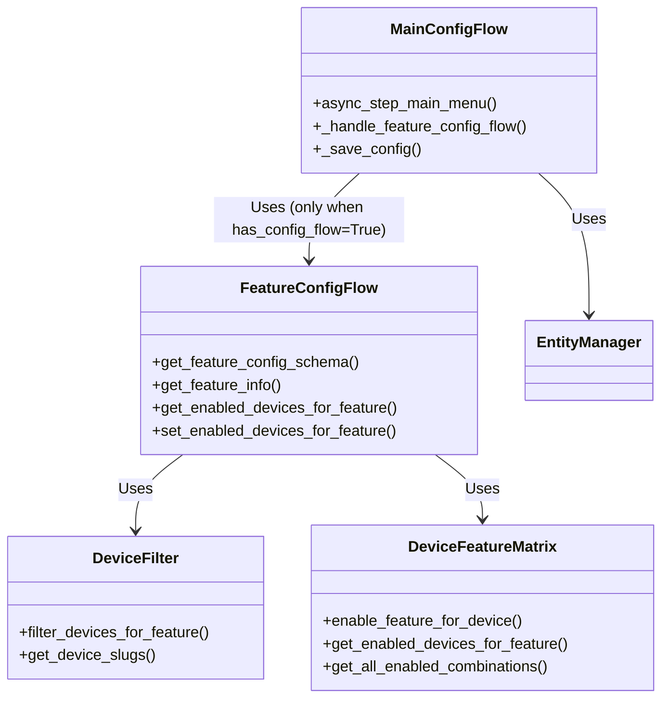
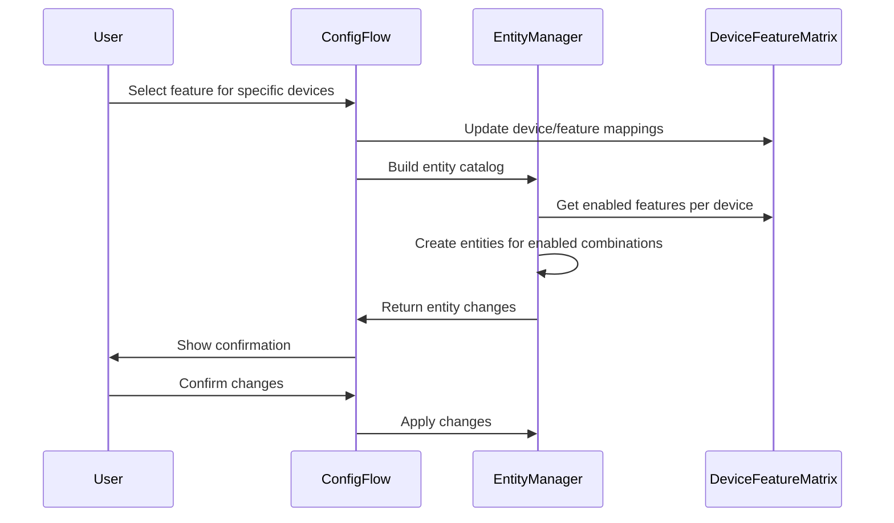
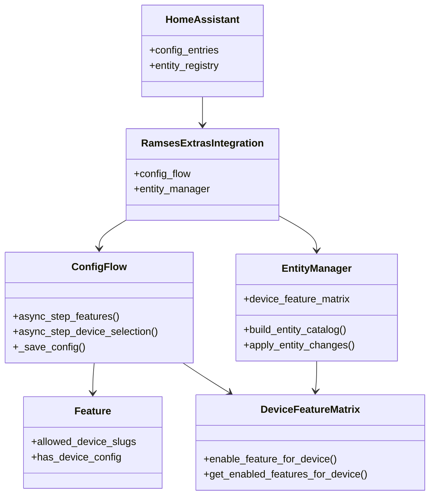
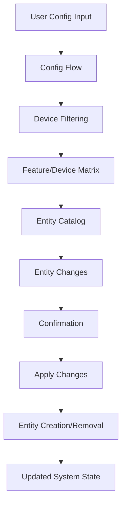

# Ramses Extras Architecture Guide

## 1. Table of Contents
- [1. Table of Contents](#1-table-of-contents)
- [2. Overview \& Quick Start](#2-overview--quick-start)
- [3. System Architecture](#3-system-architecture)
- [4. Feature-Specific Configuration](#4-feature-specific-configuration)
- [This clean architecture ensures that only features that explicitly need configuration flows implement them, with no centralized fallback or backward compatibility requirements.](#this-clean-architecture-ensures-that-only-features-that-explicitly-need-configuration-flows-implement-them-with-no-centralized-fallback-or-backward-compatibility-requirements)
- [5. Feature System](#5-feature-system)
- [6. Enhanced Entity Management with Device Tracking](#6-enhanced-entity-management-with-device-tracking)
- [7. Framework Foundation](#7-framework-foundation)
- [8. Framework Components Reference](#8-framework-components-reference)
- [9. Home Assistant Integration](#9-home-assistant-integration)
- [10. Frontend Architecture](#10-frontend-architecture)
- [11. Development Guide](#11-development-guide)
- [12. Debugging and Troubleshooting Guide](#12-debugging-and-troubleshooting-guide)
- [13. API Reference](#13-api-reference)
- [14. Implementation Details](#14-implementation-details)
- [15. Examples \& Patterns](#15-examples--patterns)
- [16. Deployment \& Configuration](#16-deployment--configuration)
- [17. Contributing](#17-contributing)

---

## 2. Overview & Quick Start

### What is Ramses Extras?

Ramses Extras is a **feature-centric** Home Assistant integration that extends the ramses_cc integration with additional entities, automation, and UI components. It provides a clean, modular architecture that allows for easy extension and customization.

### Core Benefits

- **Feature-Centric Design**: Each feature is self-contained with its own automation, services, entities, and UI
- **Framework Foundation**: Reusable components that all features can use
- **Clean HA Integration**: Standard Home Assistant platform integration with type-safe entities
- **Modular Architecture**: Easy to add new features using established patterns
- **Real-time Updates**: WebSocket APIs and message listeners for immediate UI updates

### Key Concepts

- **Features**: Self-contained modules that provide specific functionality
- **Framework**: Reusable base classes, helpers, and utilities
- **Platforms**: Home Assistant integration layer for entities and services
- **Cards**: JavaScript-based UI components for the Lovelace interface

### Quick Start for Developers

1. **Understand the Structure**: Features → Framework → HA Platforms
2. **Enable Features**: Add features to `AVAILABLE_FEATURES` in `const.py`
3. **Implement Components**: Each feature has automation, entities, services, and platforms
4. **Register Platforms**: Features register their platforms with Home Assistant
5. **Deploy Assets**: JavaScript cards and helpers are deployed to HA config directory

---

## 3. System Architecture

### High-Level Architecture

```
┌────────────────────────────────────────────────────────────┐
│                    Home Assistant                          │
├────────────────────────────────────────────────────────────┤
│  Ramses Extras Integration (Thin HA Wrapper)               │
├────────────────────────────────────────────────────────────┤
│  ┌──────────────┐ ┌──────────────┐ ┌──────────────┐        │
│  │   Feature 1  │ │   Feature 2  │ │   Feature N  │        │
│  │ (Humidity)   │ │ (HVAC Card)  │ │   (Custom)   │        │
│  └──────────────┘ └──────────────┘ └──────────────┘        │
├────────────────────────────────────────────────────────────┤
│  Framework Foundation (Base Classes, Helpers, Managers)    │
├────────────────────────────────────────────────────────────┤
│  ┌──────────────┐ ┌──────────────┐ ┌──────────────┐        │
│  │   Base       │ │   Entity     │ │   Device     │        │
│  │   Classes    │ │   Helpers    │ │   Handlers   │        │
│  └──────────────┘ └──────────────┘ └──────────────┘        │
├────────────────────────────────────────────────────────────┤
│  ramses_cc Integration (Device Communication)              │
└────────────────────────────────────────────────────────────┘
```

### Core Design Principles

#### Feature-Centric Organization
- Each feature is **self-contained** with its own automation, services, entities, and config
- Features are **modular** - only need a small addition to the framework root const.py to be loaded dynamically
- Clear **separation of concerns** within each feature
- A **default feature** provides common/shared functionality

#### Framework Foundation
- **Reusable helpers** that all features can use
- **Base classes** for common functionality
- **Common utilities** for logging, validation, etc.

#### Python-Based Automations (Not YAML)
- **Hardcoded Python Logic**: All automations are implemented as Python classes, not YAML automation rules
- **Event-Driven Architecture**: Automations listen to ramses_cc events and device state changes
- **Full Python Control**: Complete programmatic control over automation logic, conditions, and actions
- **Framework Integration**: Automations use framework base classes for consistent patterns and lifecycle management

#### ramses_cc Integration Hooks
- **Broker Access**: Direct integration with ramses_cc broker for device communication
- **ramses_rf Layer**: Access to underlying ramses_rf protocol layer for low-level device operations
- **Event Subscriptions**: Listen to ramses_cc events for real-time device updates
- **Device Enumeration**: Enhanced device enumeration building on ramses_cc foundation
- **Shared Constants**: Use ramses_cc constants and schemas for device communication
- **Message Handling**: Direct access to ramses_cc message parsing and generation

#### Home Assistant Integration
- Standard HA platform integration (sensor, switch, binary_sensor, number)
- Type-safe entity implementations
- Full compatibility with HA ecosystem

### Directory Structure

```
custom_components/ramses_extras/
├── 🔑 Core Integration (HA Requirements)
│   ├── __init__.py              # Integration entry point
│   ├── config_flow.py           # HA config flow
│   ├── const.py                 # Core constants with AVAILABLE_FEATURES
│   ├── manifest.json            # HA integration manifest
│   └── services.yaml            # HA service definitions
│
├── 🎯 Features (Feature-Centric)
│   ├── humidity_control/        # Humidity control feature
│   │   ├── automation.py        # Feature automation logic
│   │   ├── services.py          # Feature services
│   │   ├── entities.py          # Entity management
│   │   ├── config.py            # Feature configuration
│   │   ├── config_flow.py       # 🆕 Feature-specific config flow
│   │   ├── const.py             # Feature constants
│   │   ├── __init__.py          # Feature factory
│   │   └── platforms/           # HA platform implementations
│   │       ├── sensor.py        # Feature sensor entities
│   │       ├── switch.py        # Feature switch entities
│   │       ├── number.py        # Feature number entities
│   │       └── binary_sensor.py # Feature binary sensor entities
│   │
│   ├── hvac_fan_card/           # HVAC fan card feature
│   │   ├── config_flow.py       # 🆕 Feature-specific config flow
│   │   ├── __init__.py
│   │   ├── const.py
│   │   └── www/                 # Feature-specific web assets
│   │       └── hvac_fan_card/
│   │           ├── hvac-fan-card.js
│   │           ├── hvac-fan-card-editor.js
│   │           ├── message-handlers.js
│   │           └── translations/
│   │
│   │   ├── hello_world_card/         # Hello World template feature
│   │   │   ├── __init__.py
│   │   │   ├── automation.py
│   │   │   ├── config.py
│   │   │   ├── const.py
│   │   │   ├── entities.py
│   │   │   ├── services.py
│   │   │   ├── websocket_commands.py
│   │   │   ├── platforms/
│   │   │   │   ├── __init__.py
│   │   │   │   ├── binary_sensor.py
│   │   │   │   ├── number.py
│   │   │   │   ├── sensor.py
│   │   │   │   └── switch.py
│   │   │   └── www/
│   │   │       └── hello_world_card/
│   │   │           ├── card-styles.js
│   │   │           ├── hello-world-card-editor.js
│   │   │           ├── hello-world-card.js
│   │   │           ├── templates/
│   │   │           └── translations/
│   │   │               ├── en.json
│   │   │               └── nl.json
│   │   │
│   └── default/                 # Default feature scaffold
│       ├── __init__.py
│       └── const.py
│
├── 🏛️ Framework (Reusable Foundation) - ✅ ENHANCED
│   ├── base_classes/            # Base classes for inheritance
│   │   ├── __init__.py
│   │   ├── base_automation.py          # ✅ Existing automation base
│   │   ├── base_entity.py              # ✅ Existing entity base
│   │   └── platform_entities.py        # 🆕 Generic platform entities
│   │
│   ├── helpers/                 # Reusable Python utilities
│   │   ├── __init__.py
│   │   ├── config/                     # 🆕 Configuration management
│   │   │   ├── __init__.py
│   │   │   ├── core.py                 # ExtrasConfigManager
│   │   │   ├── validation.py           # ConfigValidator
│   │   │   ├── schema.py               # ConfigSchema
│   │   │   └── templates.py            # ConfigTemplates
│   │   ├── config_flow.py              # 🆕 Config flow extension helpers
│   │   ├── platform.py                 # ✅ Enhanced with setup framework
│   │   ├── brand_customization/        # 🆕 Brand customization
│   │   │   ├── __init__.py
│   │   │   ├── core.py                 # ExtrasBrandCustomizer
│   │   │   ├── detection.py            # BrandPatterns
│   │   │   ├── models.py               # ModelConfigManager
│   │   │   └── entities.py             # EntityGenerationManager
│   │   ├── entity/                     # ✅ Enhanced entity management
│   │   │   ├── __init__.py
│   │   │   ├── core.py                 # EntityHelpers
│   │   │   ├── manager.py              # EntityManager
│   │   │   ├── lifecycle.py            # EntityLifecycleManager
│   │   │   ├── registry.py             # EntityRegistryManager
│   │   │   └── device_mapping.py      # 🆕 Device-feature mapping
│   │   ├── service/                    # 🆕 Service framework
│   │   │   ├── __init__.py
│   │   │   ├── core.py                 # ExtrasServiceManager
│   │   │   ├── registration.py         # ServiceRegistry
│   │   │   └── validation.py           # ServiceValidator
│   │   ├── automation/                 # ✅ Existing automation helpers
│   │   ├── device/                     # ✅ Enhanced device helpers
│   │   │   ├── __init__.py
│   │   │   ├── core.py                 # Device helpers
│   │   │   └── filter.py              # 🆕 Device filtering for config flow
│   │   └── paths.py                    # ✅ Existing path management
│   │
│   ├── www/                     # Reusable JavaScript utilities
│   │   ├── paths.js             # Environment-aware path constants
│   │   ├── card-commands.js
│   │   ├── card-services.js
│   │   ├── card-translations.js
│   │   ├── card-validation.js
│   │   └── ramses-message-broker.js
│   │
│   └── managers/                # Framework managers
│       └── feature_manager.py   # Feature lifecycle management
│
├── 🌐 Platform (HA Integration)
│   ├── sensor.py                # Root sensor platform
│   ├── switch.py                # Root switch platform
│   ├── binary_sensor.py         # Root binary sensor platform
│   ├── number.py                # Root number platform
│   └── __init__.py
│
└── translations/                # Integration-level translations
    ├── en.json                  # English integration strings
    └── nl.json                  # Dutch integration strings
```

### Integration Flow

**Step 1:** **HA Integration Loads** - `__init__.py` handles integration setup
**Step 2:** **ramses_cc Readiness Check** - Integration waits for ramses_cc to be loaded
**Step 3:** **Device Enumeration** - Access devices already discovered by ramses_cc broker
**Step 4:** **Feature Creation** - Feature factories create feature instances
**Step 5:** **Platform Forwarding** - Root platforms forward to feature platforms
**Step 6:** **Entity Registration** - Entities register with HA via feature platforms
**Step 7:** **Asset Deployment** - JavaScript cards deployed to HA config directory

#### ramses_cc Readiness and Dependency Management

Ramses Extras **waits for ramses_cc to be ready** before initializing. The integration checks if ramses_cc is loaded and waits with retry if necessary:

```python
# Check ramses_cc readiness during platform setup
ramses_cc_loaded = "ramses_cc" in hass.config.components

if ramses_cc_loaded:
    # Proceed with device enumeration and integration setup
    device_ids = await _discover_ramses_devices(hass)
else:
    # Retry in 60 seconds if ramses_cc not ready
    hass.call_later(60.0, hass.async_create_task(delayed_retry))
```

**Why This Matters:**
1. **Dependency Management** - Ramses Extras cannot function without ramses_cc
2. **Robust Initialization** - Handles cases where ramses_cc loads after Ramses Extras
3. **Device Enumeration** - Requires ramses_cc broker access for device enumeration
4. **Event Integration** - Needs ramses_cc event system for real-time updates

### ramses_cc Integration Architecture

Ramses Extras builds upon the ramses_cc integration by providing direct hooks into the underlying communication layer:

#### Broker Access and Device Communication
```python
# Direct broker access for device operations
async def _get_broker_for_entry(hass):
    """Get ramses_cc broker instance for device communication."""
    # Access ramses_cc broker through HA data
    return hass.data["ramses_cc"]["broker"]

# Device discovery and communication
async def _find_device_by_id(broker, device_id):
    """Find device by ID in ramses_cc broker."""
    for device in broker.devices:
        if device.id == device_id:
            return device
    return None
```

#### ramses_rf Layer Integration
- **Protocol Access**: Direct access to ramses_rf protocol layer for low-level operations
- **Message Handling**: Integration with ramses_rf message parsing and generation
- **Device State**: Real-time access to device state through ramses_rf layer
- **Command Sending**: Send commands directly through ramses_rf communication stack

#### Event System Integration
```python
# Listen to ramses_cc events for real-time device updates
self.hass.bus.async_listen("ramses_cc_message", self._on_ramses_message)

# Enhanced device discovery events
self.hass.bus.async_listen("ramses_device_ready_for_entities", self._on_device_ready)
```

#### Shared Constants and Schemas
- **Device Types**: Use ramses_cc device type definitions
- **Parameter Schemas**: Leverage ramses_cc parameter schemas for device configuration
- **Message Codes**: Integrate with ramses_cc message code definitions
- **Error Handling**: Use ramses_cc error patterns and handling

#### Initialization Dependencies

**ramses_cc Readiness Requirement**: Ramses Extras **requires ramses_cc to be loaded and ready** before initialization:

```python
# Check ramses_cc readiness in async_setup_platforms()
ramses_cc_loaded = "ramses_cc" in hass.config.components

if ramses_cc_loaded:
    # Proceed with device discovery and integration setup
    broker = await _get_broker_for_entry(hass)
    device_ids = await _discover_ramses_devices(hass)
else:
    # Retry in 60 seconds if ramses_cc not ready
    hass.call_later(60.0, hass.async_create_task(delayed_retry))
```

#### Integration Points
1. **Device Enumeration**: Building on ramses_cc device discovery with enhanced capabilities
2. **Message Processing**: Intercepting and processing ramses_cc messages for feature logic
3. **State Synchronization**: Real-time state updates from ramses_cc to feature entities
4. **Command Execution**: Direct command execution through ramses_rf layer
5. **Error Handling**: Coordinated error handling between ramses_cc and features
6. **Initialization Coordination**: Waiting for ramses_cc readiness before feature startup

## 4. Feature-Specific Configuration

Ramses Extras now supports feature-specific configuration steps that allow users to enable features for specific devices only.

### Device Filtering

Each feature can specify which device types it supports using `allowed_device_slugs`:

```python
AVAILABLE_FEATURES = {
    "humidity_control": {
        "allowed_device_slugs": ["FAN"],  # Only works with FAN devices
        # ... other config
    },
    "universal_feature": {
        "allowed_device_slugs": ["*"],   # Works with any device
        # ... other config
    }
}
```

### Per-Device Feature Enablement

Users can now enable features for specific devices through the config flow:

1. **Select Features**: Choose which features to configure
2. **Device Selection**: For each feature, select which devices to enable it for
3. **Confirmation**: Review entity changes before applying
4. **Application**: System creates entities only for selected device/feature combinations

### Enhanced Entity Management

The entity management system has been enhanced to support per-device feature tracking.

#### DeviceFeatureMatrix

The `DeviceFeatureMatrix` class tracks which features are enabled for which devices:

```python
matrix = DeviceFeatureMatrix()
matrix.enable_feature_for_device("fan_device_1", "humidity_control")
matrix.enable_feature_for_device("fan_device_2", "hvac_fan_card")

# Get features enabled for a device
features = matrix.get_enabled_features_for_device("fan_device_1")
# Returns: {"humidity_control": True}
```

#### Entity Creation Logic

Entities are now created based on the device/feature matrix:

```python
for device_id, device_features in matrix.matrix.items():
    for feature_id, enabled in device_features.items():
        if enabled:
            create_feature_entities(feature_id, device_id)
```

### Updated Feature Configuration Structure

The AVAILABLE_FEATURES structure has been enhanced with new fields:

```python
# New fields added to feature configuration
AVAILABLE_FEATURES = {
    "feature_id": {
        "name": "Feature Name",
        "description": "Feature description",
        "feature_module": "features.feature_id",
        "handler": "handle_device_type",
        "default_enabled": False,
        # NEW FIELDS:
        "allowed_device_slugs": ["FAN", "REM"],  # Device filtering
        "has_device_config": True,              # Has per-device configuration
        "config_steps": ["device_selection"],  # Additional config steps
        "device_default_enabled": True,        # Per-device default
    }
}
```

### Multi-Step Config Flow

The configuration flow now supports multiple steps:

1. **Main Config Flow**: Ramses Extras Settings
2. **Enable Features Globally**: Select which features to enable
3. **Feature-Specific Config Steps**: Device selection for each feature
4. **Confirmation & Apply Changes**: Review and apply entity changes

### Integration with Existing Architecture

The enhanced config flow integrates seamlessly with the existing architecture:

- **Feature Config Flow Files** (`features/*/config_flow.py`): Feature-specific config flow handlers
- **ConfigFlowHelper** (`framework/helpers/config_flow.py`): Framework utilities for config flow
- **DeviceFilter** (`framework/helpers/device/filter.py`): Filters devices based on feature requirements
- **DeviceFeatureMatrix** (`framework/helpers/entity/device_mapping.py`): Tracks feature/device combinations
- **EntityManager**: Creates entities based on the matrix
- **Backward Compatibility**: Maintains compatibility with existing installations

### Clean Feature-Centric Config Flow Architecture

The config flow follows a **clean feature-centric design** with **no backward compatibility** - only features with `has_config_flow: True` are configurable:



### Clean Config Flow Implementation Pattern

Each feature implements its own config flow handler **only when needed** (when `has_config_flow: True`):

```python
# features/my_feature/config_flow.py - Only needed when has_config_flow=True
class MyFeatureConfigFlow:
    """Feature-specific config flow handler (only for features that need config flow)."""

    def __init__(self, hass: HomeAssistant, config_entry: ConfigEntry):
        self.hass = hass
        self.config_entry = config_entry
        self.device_filter = DeviceFilter()
        self.device_feature_matrix = DeviceFeatureMatrix()

    def get_feature_config_schema(self, devices: list[Any]) -> vol.Schema:
        """Generate configuration schema for this feature."""
        # Filter devices for this feature
        filtered_devices = self.device_filter.filter_devices_for_feature(
            AVAILABLE_FEATURES["my_feature"], devices
        )

        # Create device selection options
        device_options = [
            selector.SelectOptionDict(
                value=device_id, label=self._get_device_label(device)
            )
            for device in filtered_devices
            if (device_id := self._extract_device_id(device))
        ]

        return vol.Schema({
            vol.Required("enabled_devices", default=[]): selector.SelectSelector(
                selector.SelectSelectorConfig(
                    options=device_options,
                    multiple=True,
                )
            ),
        })

    def get_feature_info(self) -> dict[str, Any]:
        """Get information about this feature."""
        feature_config = AVAILABLE_FEATURES["my_feature"]
        return {
            "name": feature_config.get("name", "My Feature"),
            "description": feature_config.get("description", ""),
            "allowed_device_slugs": feature_config.get("allowed_device_slugs", ["*"]),
            "has_device_config": feature_config.get("has_device_config", False),
        }
```

### Benefits of Clean Feature-Centric Config Flow

1. **True Feature-Centric**: Only features with config flows are configurable
2. **No Backward Compatibility**: Clean implementation without fallbacks
3. **Error Tracking**: Proper logging when config flows not found
4. **Simple Architecture**: Direct feature-to-config-flow mapping
5. **Easy Maintenance**: Features are self-contained with their own config flows

This clean architecture ensures that only features that explicitly need configuration flows implement them, with no centralized fallback or backward compatibility requirements.

### Migration Strategy

A migration system handles the transition from global to per-device configuration:

- **Automatic Migration**: Global feature enablement is migrated to per-device
- **Backward Compatibility Layer**: Supports both old and new formats during transition
- **Graceful Degradation**: Continues operation even if migration encounters issues

### Performance Considerations

The system includes optimizations for handling many devices and features:

- **Caching Strategy**: Caches feature/device relationships
- **Bulk Operations**: Groups entity operations for efficiency
- **Error Handling**: Comprehensive error recovery strategies

### Clean Architecture Benefits

- **True Feature-Centric**: Only features with config flows are configurable
- **No Backward Compatibility**: Clean implementation without fallbacks
- **Error Tracking**: Proper logging when config flows not found
- **Simple Architecture**: Direct feature-to-config-flow mapping
- **Easy Maintenance**: Features are self-contained with their own config flows

This clean architecture ensures that only features that explicitly need configuration flows implement them, with no centralized fallback or backward compatibility requirements.
---

## 5. Feature System

### How Features Work

Each feature is a self-contained module that provides specific functionality. Features follow a consistent pattern and can be enabled/disabled independently.

### Feature Lifecycle

1. **Registration**: Feature added to `AVAILABLE_FEATURES` in main `const.py`
2. **Discovery**: Config flow discovers available features
3. **Activation**: User enables/disables features via HA config
4. **Creation**: Feature factory creates feature instance
5. **Registration**: Feature registers its platforms with Home Assistant
6. **Operation**: Feature operates independently with its own entities and automations

### Current Features

#### ✅ Humidity Control
- **Purpose**: Advanced humidity-based ventilation control
- **Entities**: Humidity sensors, control switches, number inputs
- **Automation**: Python-based automatic fan speed adjustment (no YAML automation rules)
- **Services**: Manual humidity control and configuration
- **Platforms**: sensor, switch, number, binary_sensor

#### ✅ HVAC Fan Card
- **Purpose**: Real-time HVAC system monitoring and control card
- **UI Components**: JavaScript Lovelace card with real-time updates
- **Data Source**: WebSocket APIs and message listeners
- **Features**: Temperature display, fan speed control, mode selection
- **Platforms**: No direct entities (UI-focused feature)

#### 📋 Planned Features
- **Humidity Control Card**: Dedicated UI for humidity management
- **Custom Features**: Framework supports any number of additional features

#### 🆕 Hello World Template Feature
- **Purpose**: Serves as a comprehensive template for creating new features
- **Components**: Includes all standard feature components (automation, config, entities, services, platforms, www)
- **Usage**: Can be copied and modified to create new features following established patterns
- **Location**: `features/hello_world_card/`

### Feature Structure Pattern

```python
# features/humidity_control/__init__.py
def create_humidity_control_feature(hass, config_entry):
    return {
        "automation": HumidityAutomationManager(hass, config_entry),
        "entities": HumidityEntities(hass, config_entry),
        "services": HumidityServices(hass, config_entry),
        "config": HumidityConfig(hass, config_entry),
        "platforms": {
            "sensor": HumidityAbsoluteSensor,
            "switch": create_humidity_switch,
            "number": create_humidity_number,
            "binary_sensor": create_humidity_binary_sensor,
        },
    }
```

### Feature Components

Each feature contains these core components. **Some components are optional** depending on the feature's functionality:

#### Required Components
- **__init__.py**: Feature factory functions (always required)
- **const.py**: Feature-specific constants and mappings (always required)

#### Optional Components (choose as needed)
- **automation.py**: Feature-specific automation logic in Python code (e.g., `HumidityAutomationManager`) - **Not YAML automation rules** - Optional, only if feature needs automation
- **services.py**: Feature-specific service methods (e.g., `HumidityServices`) - Optional, only if feature needs services
- **entities.py**: Feature-specific entity management (e.g., `HumidityEntities`) - Optional, only if feature needs entity management
- **config.py**: Feature-specific configuration (e.g., `HumidityConfig`) - Optional, only if feature needs configuration
- **platforms/**: HA platform implementations with feature-specific entity classes - Optional, only if feature needs Home Assistant entities
- **www/**: JavaScript UI components for Lovelace cards - Optional, only if feature needs UI components
- **websocket_commands.py**: WebSocket API commands - Optional, only if feature needs WebSocket APIs

### Adding New Features

1. **Create Feature Structure**
   ```bash
   mkdir -p custom_components/ramses_extras/features/my_new_feature
   mkdir -p custom_components/ramses_extras/features/my_new_feature/platforms
   touch custom_components/ramses_extras/features/my_new_feature/__init__.py
   touch custom_components/ramses_extras/features/my_new_feature/automation.py
   touch custom_components/ramses_extras/features/my_new_feature/services.py
   touch custom_components/ramses_extras/features/my_new_feature/entities.py
   touch custom_components/ramses_extras/features/my_new_feature/config.py
   touch custom_components/ramses_extras/features/my_new_feature/const.py
   ```

2. **Implement Core Components**
   - Follow the established patterns in existing features
   - Implement automation logic, services, entities, and configuration
   - Create platform files for HA entity integration

3. **Register Feature**
   - Add feature to `AVAILABLE_FEATURES` in main `const.py`
   - Feature will be automatically discovered and enabled via config flow

---

## 6. Enhanced Entity Management with Device Tracking

Ramses Extras now supports feature-specific configuration steps that allow users to enable features for specific devices only.

### Device Filtering

Each feature can specify which device types it supports using `allowed_device_slugs`:

```python
AVAILABLE_FEATURES = {
    "humidity_control": {
        "allowed_device_slugs": ["FAN"],  # Only works with FAN devices
        # ... other config
    },
    "universal_feature": {
        "allowed_device_slugs": ["*"],   # Works with any device
        # ... other config
    }
}
```

### Per-Device Feature Enablement

Users can now enable features for specific devices through the config flow:

1. **Select Features**: Choose which features to configure
2. **Device Selection**: For each feature, select which devices to enable it for
3. **Confirmation**: Review entity changes before applying
4. **Application**: System creates entities only for selected device/feature combinations

### DeviceFeatureMatrix

The `DeviceFeatureMatrix` class tracks which features are enabled for which devices:

```python
matrix = DeviceFeatureMatrix()
matrix.enable_feature_for_device("fan_device_1", "humidity_control")
matrix.enable_feature_for_device("fan_device_2", "hvac_fan_card")

# Get features enabled for a device
features = matrix.get_enabled_features_for_device("fan_device_1")
# Returns: {"humidity_control": True}
```

### Entity Creation Logic

Entities are now created based on the device/feature matrix:

```python
for device_id, device_features in matrix.matrix.items():
    for feature_id, enabled in device_features.items():
        if enabled:
            create_feature_entities(feature_id, device_id)
```

### Enhanced Entity Management

The entity management system has been enhanced to support per-device feature tracking.

#### Entity Lifecycle with Device Tracking



### Updated System Architecture Diagram



### Data Flow



### Clean Migration Strategy (No Backward Compatibility)

The clean approach has **no migration system** since there's no backward compatibility:

- **No Automatic Migration**: Features without config flows are not configurable
- **No Backward Compatibility Layer**: Clean implementation without fallbacks
- **Error Tracking**: Log errors when feature config flows not found
- **Clean Architecture**: Direct feature-specific implementation only

### Clean Implementation Benefits

1. **True Feature-Centric**: Only features with config flows are configurable
2. **No Backward Compatibility**: Clean implementation without fallbacks
3. **Error Tracking**: Proper logging when config flows not found
4. **Simple Architecture**: Direct feature-to-config-flow mapping
5. **Easy Maintenance**: Features are self-contained with their own config flows

### Performance Considerations

#### Caching Strategy

```python
class FeatureDeviceCache:
    """Cache feature/device relationships for performance."""

    def __init__(self):
        self.cache = {}
        self.cache_valid = False
        self.last_update = 0

    async def get_devices_for_feature(self, feature_id):
        """Get cached devices for feature."""
        if not self.cache_valid or feature_id not in self.cache:
            devices = await self._discover_devices_for_feature(feature_id)
            self.cache[feature_id] = devices
            self.cache_valid = True
            self.last_update = time.time()
        return self.cache[feature_id]

    def invalidate_cache(self):
        """Invalidate cache when devices change."""
        self.cache_valid = False
```

#### Bulk Operations

```python
async def apply_entity_changes_bulk(self):
    """Apply entity changes using bulk operations."""
    # Group operations by type
    operations = self._group_operations_by_type()

    # Execute in parallel where possible
    await asyncio.gather(
        self._execute_removals(operations["removals"]),
        self._execute_creations(operations["creations"]),
        self._execute_updates(operations["updates"])
    )
```

### Error Handling & Recovery

#### Comprehensive Error Handling

```python
class ConfigFlowErrorHandler:
    """Handle errors in config flow operations."""

    ERROR_RECOVERY_STRATEGIES = {
        DeviceDiscoveryError: "use_entity_registry_fallback",
        EntityRegistryError: "retry_with_delay",
        ConfigValidationError: "show_user_friendly_message",
        MigrationError: "fallback_to_legacy_mode"
    }

    async def handle_error(self, error, context):
        """Handle error with appropriate recovery strategy."""
        error_type = type(error)
        strategy = self.ERROR_RECOVERY_STRATEGIES.get(error_type, "log_and_continue")

        if strategy == "use_entity_registry_fallback":
            return await self._entity_registry_fallback(context)
        elif strategy == "retry_with_delay":
            return await self._retry_operation(context, delay=2.0)
        elif strategy == "show_user_friendly_message":
            return self._show_user_message(error, context)
        elif strategy == "fallback_to_legacy_mode":
            return self._enable_legacy_mode(context)
        else:
            return self._log_and_continue(error, context)
```

---

## 7. Framework Foundation

The Ramses Extras framework provides a comprehensive foundation for building features with reusable components, standardized patterns, and automated lifecycle management. The framework has been designed to accelerate feature development.

### 🏗️ Framework Architecture Overview

The framework follows a **layered architecture** approach:

```
┌────────────────────────────────────────────────────────────┐
│                    Framework Foundation                    │
├────────────────────────────────────────────────────────────┤
│  📦 Base Classes      🧩 Helpers       🌐 Services         │
│  - Entity Bases       - Config         - Platform Setup    │
│  - Automation         - Entity         - Service Mgmt      │
│  - Platform Entity    - Brand Custom   - Validation        │
│                       - Service                            │
├────────────────────────────────────────────────────────────┤
│  🔧 Platform Layer    📋 Entity Mgmt   🎯 Brand Support    │
│  - Setup Framework    - Lifecycle      - Detection         │
│  - Integration        - Registry       - Customization     │
│  - Forwarding         - Management     - Model Config      │
└────────────────────────────────────────────────────────────┘
```

### 📚 Base Classes

The framework provides reusable base classes that all features can inherit from:

#### ExtrasBaseEntity
- **Purpose**: Base class for all custom entities
- **Location**: `framework/base_classes/base_entity.py`
- **Features**: Common entity functionality, device linking, state management

#### ExtrasBaseAutomation
- **Purpose**: Base class for automation logic
- **Location**: `framework/base_classes/base_automation.py`
- **Features**: Automation patterns, lifecycle management, event handling

#### Platform Entity Classes
- **Purpose**: Generic platform entity base classes for all HA platforms
- **Location**: `framework/base_classes/platform_entities.py`
- **Classes**:
  - `ExtrasSwitchEntity` - Generic switch entity for all features
  - `ExtrasNumberEntity` - Generic number entity for all features
  - `ExtrasBinarySensorEntity` - Generic binary sensor entity for all features
  - `ExtrasSensorEntity` - Generic sensor entity for all features

### 🧩 Helper Modules

#### Configuration Management (`framework/helpers/config/`)
- **Purpose**: Reusable configuration management patterns
- **Components**:
  - `core.py` - `ExtrasConfigManager` base class for configuration management
  - `validation.py` - `ConfigValidator` utility class with common patterns
  - `schema.py` - `ConfigSchema` UI schema generation utilities
  - `templates.py` - `ConfigTemplates` with pre-built default configurations
- **Usage**: All features can use the same configuration patterns

#### Entity Management (`framework/helpers/entity/`)
- **Purpose**: Comprehensive entity lifecycle and registry management
- **Components**:
  - `core.py` - `EntityHelpers` class with comprehensive entity utilities
  - `manager.py` - `EntityManager` class for centralized entity management
  - `lifecycle.py` - `EntityLifecycleManager` for lifecycle operations
  - `registry.py` - `EntityRegistryManager` for registry integration

#### Brand Customization (`framework/helpers/brand_customization/`)
Note: Not fully implemented
- **Purpose**: Centralized brand detection and customization patterns
- **Components**:
  - `core.py` - `ExtrasBrandCustomizer` base class and `BrandCustomizerManager`
  - `detection.py` - `BrandPatterns` for brand detection pattern management
  - `models.py` - `ModelConfigManager` for model-specific configuration handling
  - `entities.py` - `EntityGenerationManager` for brand-specific entity generation
- **Usage**: Supports multiple brands (Orcon, Zehnder, etc.) through framework

#### Service Framework (`framework/helpers/service/`)
- **Purpose**: Comprehensive service registration, execution, and validation
- **Components**:
  - `core.py` - `ExtrasServiceManager` base class for service execution
  - `registration.py` - `ServiceRegistry` for centralized service management
  - `validation.py` - `ServiceValidator` for comprehensive service validation
- **Benefits**: Unified service management, comprehensive validation, performance monitoring
- **Service Types**: ACTION, STATUS, CONFIGURATION, DIAGNOSTIC, CONTROL
- **Service Scopes**: DEVICE, FEATURE, GLOBAL

#### Platform Setup Framework
- **Purpose**: Reusable platform setup patterns and automation support
- **Location**: Enhanced `framework/helpers/platform.py`
- **Features**:
  - `PlatformSetup` class with `async_setup_platform` method
  - `store_entities_for_automation` parameter for entity access
  - `_store_entities_for_automation` method for entity storage

### 🛠️ Framework Services

#### Path Management
- **Python Paths**: `framework/helpers/paths.py` - Shared path constants
- **JavaScript Paths**: `framework/www/paths.js` - Environment-aware path constants
- **Asset Management**: Automatic deployment of JavaScript files and helpers

#### Message System
- **WebSocket Commands**: Feature-centric WebSocket API architecture
- **Message Listeners**: Real-time ramses_cc message handling
- **Event System**: Framework-level event handling for inter-feature communication

### 📖 Framework Usage Examples

#### Configuration Management Usage
```python
class HumidityConfig(ExtrasConfigManager):
    DEFAULT_CONFIG = {
        "target_humidity": 50,
        "auto_mode": True,
    }

    def validate_custom_config(self):
        # Custom validation only
        pass
```

#### Platform Entity Usage
```python
class HumiditySwitch(ExtrasSwitchEntity):
    """Switch entity for humidity control."""

    @property
    def is_on(self) -> bool:
        """Return true if dehumidification is active."""
        return self._is_on

    async def async_turn_on(self, **kwargs: Any) -> None:
        """Activate dehumidification."""
        # Call service layer for fan speed control
        await self.hass.services.async_call(
            "ramses_extras", "activate_dehumidification",
            {"device_id": self.device_id}
        )
        self._is_on = True
        self.async_write_ha_state()

    async def async_turn_off(self, **kwargs: Any) -> None:
        """Deactivate dehumidification."""
        # Call service layer for fan speed control
        await self.hass.services.async_call(
            "ramses_extras", "deactivate_dehumidification",
            {"device_id": self.device_id}
        )
        self._is_on = False
        self.async_write_ha_state()
```

#### Service Framework Usage
```python
class HumidityServices(ExtrasServiceManager):
    SERVICE_DEFINITIONS = {
        "set_target_humidity": {
            "type": ServiceType.ACTION,
            "parameters": {"humidity": {"type": int, "min": 30, "max": 80}},
        }
    }
```

## 8. Framework Components Reference

This section provides detailed documentation for all framework components, their APIs, and usage patterns. The framework has been designed to accelerate feature development by providing reusable components.

### 🏗️ Configuration Management Framework

The configuration management framework provides reusable patterns for feature configuration, validation, and UI schema generation.

#### ExtrasConfigManager (`framework/helpers/config/core.py`)

**Purpose**: Base class for all feature configuration management

**Key Features**:
- Automatic configuration loading with fallback to defaults
- Type-safe configuration access with validation
- Integration with Home Assistant configuration flow
- Support for custom validation rules

**API**:
```python
class ExtrasConfigManager:
    def __init__(self, hass: HomeAssistant, config_entry: ConfigEntry,
- **Priority-based Scheduling**: High, normal, and low priority command handling
- **Background Processing**: Async command processing with queue monitoring
- **Command Statistics**: Comprehensive metrics for success rates, execution times, and queue depths
- **Registry Integration**: Full integration with CommandRegistry for feature-owned commands
- **Queue Monitoring**: Real-time queue depth tracking and performance statistics

**API**:
```python
class RamsesCommands:
    def __init__(self, hass: HomeAssistant):
        """Initialize with command queuing and registry integration."""

    async def send_command(self, device_id: str, command_name: str,
                          queue: bool = True, priority: str = "normal",
                          timeout: float = 30.0) -> CommandResult:
        """Send command to device with optional queuing and rate limiting."""

    async def send_fan_command(self, device_id: str, command: str) -> CommandResult:
        """Send fan command using registry with queuing support."""

    def get_available_commands(self) -> dict[str, dict]:
        """Get all available commands from the registry."""

    def get_command_description(self, command: str) -> str:
        """Get description for a command."""

    def get_queue_statistics(self) -> dict[str, Any]:
        """Get comprehensive queue statistics for monitoring."""
```

#### Default Command Library (`features/default/commands.py`)

**Purpose**: Standard device commands available to all features, providing common functionality

**HvacVentilator Commands**:
```python
HVAC_VENTILATOR_COMMANDS = {
    # Fan speed commands
    "fan_high": {
        "code": "22F1", "verb": " I", "payload": "000307",
        "description": "Set fan to high speed"
    },
    "fan_medium": {
        "code": "22F1", "verb": " I", "payload": "000207",
        "description": "Set fan to medium speed"
    },
    "fan_low": {
        "code": "22F1", "verb": " I", "payload": "000107",
        "description": "Set fan to low speed"
    },
    "fan_auto": {
        "code": "22F1", "verb": " I", "payload": "000407",
        "description": "Set fan to auto mode"
    },
    "fan_boost": {
        "code": "22F1", "verb": " I", "payload": "000607",
        "description": "Set fan to boost mode"
    },
    "fan_away": {
        "code": "22F1", "verb": " I", "payload": "000007",
        "description": "Set fan to away mode"
    },

    # Bypass commands
    "fan_bypass_open": {
        "code": "22F7", "verb": " W", "payload": "00C8EF",
        "description": "Open bypass"
    },
    "fan_bypass_close": {
        "code": "22F7", "verb": " W", "payload": "0000EF",
        "description": "Close bypass"
    },
    "fan_bypass_auto": {
        "code": "22F7", "verb": " W", "payload": "00FFEF",
        "description": "Set bypass to auto mode"
    },

    # Status request commands
    "fan_request10D0": {
        "code": "10D0", "verb": "RQ", "payload": "00",
        "description": "Request system status"
    },
    "fan_request31DA": {
        "code": "31DA", "verb": "RQ", "payload": "00",
        "description": "Request 31DA status"
    }
}
```

#### WebSocket Commands (`features/default/websocket_commands.py`)

**Purpose**: JavaScript-accessible commands for real-time device control and monitoring

**Available WebSocket Commands**:

1. **`ramses_extras/get_bound_rem`**: Get bound REM device for proper FAN communication
2. **`ramses_extras/get_2411_schema`**: Get parameter schema for device configuration
3. **`ramses_extras/default/send_fan_command`**: Send fan command using queued framework
4. **`ramses_extras/default/set_fan_parameter`**: Set fan parameter with queuing
5. **`ramses_extras/default/get_queue_statistics`**: Get command queue statistics for monitoring

**JavaScript Usage Example**:
```javascript
// Send a fan command using the command framework
const result = await callWebSocket(hass, {
    type: 'ramses_extras/default/send_fan_command',
    device_id: '32:153289',
    command: 'fan_high'
});

// Response includes execution details
console.log('Command sent:', result);
// {
//     success: true,
//     command: 'fan_high',
//     queued: false,
//     execution_time: 0.123,
//     message: "Command 'fan_high' sent successfully"
// }

// Get queue statistics for monitoring
const stats = await callWebSocket(hass, {
    type: 'ramses_extras/default/get_queue_statistics'
});

console.log('Queue stats:', stats);
// {
//     command_statistics: {
//         total_commands: 45,
//         successful_commands: 43,
//         failed_commands: 2,
//         success_rate_percent: 95.56
//     },
//     queue_status: {
//         active_queues: 2,
//         device_queue_depths: {"32:153289": 0, "32:153290": 1}
//     }
// }
```

#### Command Framework Integration

**Feature Registration Pattern**:
```python
# In feature factory
def create_humidity_control_feature(hass, config_entry):
    registry = get_command_registry()

    # Use standard HvacVentilator commands
    fan_commands = registry.get_device_commands("HvacVentilator", "standard")

    # Register feature-specific commands
    custom_commands = {
        "dehumidify_mode": {
            "code": "22F8", "verb": " W", "payload": "DEhumidify",
            "description": "Enable dehumidification mode"
        }
    }
    registry.register_commands("humidity_control", custom_commands)

    # Create commands manager
    commands_manager = RamsesCommands(hass)

    return {
        "commands_manager": commands_manager,
        "available_commands": {**fan_commands, **custom_commands}
    }
```

#### Queue Management Features

**Per-Device Queue Processing**:
- Each device has its own command queue
- Commands are processed in order with rate limiting
- Background processors handle queued commands automatically
- Queue depth monitoring prevents memory issues

**Rate Limiting**:
- Configurable minimum interval between commands (main const.py)
- Prevents communication layer overwhelming
- Automatic command scheduling based on rate limits

**Performance Monitoring**:
- Command success/failure rates
- Average execution times
- Queue depth tracking
- Device-specific statistics

### 🏛️ Entity Management Framework

The entity management framework provides comprehensive entity lifecycle and registry management.

#### EntityLifecycleManager (`framework/helpers/entity/lifecycle.py`)

**Purpose**: Complete lifecycle management for entities including creation, updating, cleanup, and state tracking

**Key Features**:
- Entity creation and registration workflows
- Update and state synchronization
- Cleanup and removal operations
- Health checks and availability monitoring
- Factory registration and dependency management

**API**:
```python
class EntityLifecycleManager:
    def __init__(self, hass: HomeAssistant):
        """Initialize lifecycle manager."""

    async def create_entity(self, entity_config: dict, device_id: str) -> Entity:
        """Create new entity with lifecycle management."""

    async def update_entity(self, entity_id: str, updates: dict) -> bool:
        """Update existing entity."""

    async def remove_entity(self, entity_id: str) -> bool:
        """Remove entity with cleanup."""

    async def check_entity_health(self, entity_id: str) -> EntityHealthStatus:
        """Check entity health and availability."""

    async def get_lifecycle_summary(self) -> dict:
        """Get comprehensive lifecycle statistics."""
```

#### EntityRegistryManager (`framework/helpers/entity/registry.py`)

**Purpose**: Centralized registry operations with feature tracking

**Key Features**:
- Entity registration, validation, and cleanup
- Feature entity tracking and statistics
- Pattern-based entity lookup and health monitoring
- Orphaned entity detection and removal
- Registry health monitoring

**API**:
```python
class EntityRegistryManager:
    def __init__(self, hass: HomeAssistant):
        """Initialize registry manager."""

    async def register_entity(self, entity_config: dict) -> str:
        """Register entity in HA registry."""

    async def unregister_entity(self, entity_id: str) -> bool:
        """Unregister entity from HA registry."""

    def get_entities_by_feature(self, feature_id: str) -> list[dict]:
        """Get all entities for specific feature."""

    async def cleanup_orphaned_entities(self) -> int:
        """Clean up orphaned entities."""

    def get_registry_statistics(self) -> dict:
        """Get comprehensive registry statistics."""
```

### 🔧 Platform Setup Framework

The platform setup framework provides reusable setup patterns with automation support.

#### Enhanced PlatformSetup (`framework/helpers/platform.py`)

**Purpose**: Reusable platform setup patterns and automation entity access

**Key Features**:
- Standardized platform setup workflows
- Automation entity storage and access
- Error handling and recovery patterns
- Integration with Home Assistant platform system

**API**:
```python
class PlatformSetup:
    def __init__(self, hass: HomeAssistant, config_entry: ConfigEntry):
        """Initialize platform setup."""

    async def async_setup_platform(self, platform_type: str,
                                  async_add_entities: callable,
                                  create_entity_func: callable,
                                  store_entities_for_automation: bool = False) -> None:
        """Set up platform with optional automation entity storage."""

    def _store_entities_for_automation(self, entities: list[Entity]) -> None:
        """Store entities for automation access."""

    def get_automation_entities(self, device_id: str) -> list[Entity]:
        """Get stored entities for automation."""
```

### 📚 Base Entity Classes

#### Platform Entity Classes (`framework/base_classes/platform_entities.py`)

**Purpose**: Generic platform entity base classes for all Home Assistant platforms

**Key Features**:
- Standardized entity patterns for all platform types
- Common functionality and state management
- Integration with framework services and managers
- Reduced boilerplate code for feature entities

**Classes**:
```python
class ExtrasSwitchEntity(ExtrasBaseEntity, SwitchEntity):
    """Generic switch entity for all features."""

    @property
    def is_on(self) -> bool:
        """Return true if switch is on."""
        return self._is_on

    async def async_turn_on(self, **kwargs: Any) -> None:
        """Turn switch on."""
        self._is_on = True
        self.async_write_ha_state()

    async def async_turn_off(self, **kwargs: Any) -> None:
        """Turn switch off."""
        self._is_on = False
        self.async_write_ha_state()

class ExtrasNumberEntity(ExtrasBaseEntity, NumberEntity):
    """Generic number entity for all features."""

    @property
    def native_min_value(self) -> float:
        """Return minimum value."""

    @property
    def native_max_value(self) -> float:
        """Return maximum value."""

    @property
    def native_step(self) -> float:
        """Return step value."""

    async def async_set_native_value(self, value: float) -> None:
        """Set the value."""
        self._native_value = value
        self.async_write_ha_state()

class ExtrasBinarySensorEntity(ExtrasBaseEntity, BinarySensorEntity):
    """Generic binary sensor entity for all features."""

    @property
    def is_on(self) -> bool:
        """Return true if binary sensor is on."""
        return self._is_on

    def set_state(self, is_on: bool) -> None:
        """Set the binary sensor state (used by automation)."""
        self._is_on = is_on
        self.async_write_ha_state()

    async def async_turn_on(self, **kwargs: Any) -> None:
        """Turn on the binary sensor."""
        self.set_state(True)

    async def async_turn_off(self, **kwargs: Any) -> None:
        """Turn off the binary sensor."""
        self.set_state(False)

class ExtrasSensorEntity(ExtrasBaseEntity, SensorEntity):
    """Generic sensor entity for all features."""

    @property
    def native_value(self) -> float | None:
        """Return the native value of the sensor."""

    def set_native_value(self, value: float | None) -> None:
        """Set the native value of the sensor."""
```

### 🎯 Framework Integration Patterns

#### Feature Integration Pattern

The framework provides a standardized pattern for integrating all components:

```python
# In feature __init__.py
def create_my_feature(hass: HomeAssistant, config_entry: ConfigEntry) -> dict[str, Any]:
    """Create feature instance with framework integration."""

    # Configuration management
    config = MyFeatureConfig(hass, config_entry, "my_feature", MyFeatureConfig.DEFAULT_CONFIG)

    # Entity management with lifecycle
    entity_manager = EntityManager(hass)
    lifecycle_manager = EntityLifecycleManager(hass)

    # Brand customization
    brand_manager = BrandCustomizerManager(hass)

    # Service management
    service_manager = MyFeatureServices(hass, config_entry)

    # Platform setup with automation support
    platform_setup = PlatformSetup(hass, config_entry)

    return {
        "config": config,
        "entity_manager": entity_manager,
        "lifecycle_manager": lifecycle_manager,
        "brand_manager": brand_manager,
        "service_manager": service_manager,
        "platform_setup": platform_setup,
        "platforms": {
            "sensor": MyFeatureSensor,
            "switch": MyFeatureSwitch,
            "number": MyFeatureNumber,
            "binary_sensor": MyFeatureBinarySensor,
        },
    }
```


## 9. Home Assistant Integration

### Platform Integration Architecture

Ramses Extras uses a **thin wrapper** architecture for Home Assistant platform integration:

#### Root Platform Files (Thin Wrappers)
```python
# sensor.py - ROOT PLATFORM (Thin Wrapper)
async def async_setup_entry(hass, config_entry, async_add_entities):
    """Home Assistant platform integration - thin wrapper only."""
    # Forward to feature platforms
    await async_forward_entry_setups(
        config_entry, ["ramses_extras_humidity_control"], hass
    )
```

#### Feature Platforms (Business Logic)
```python
# features/humidity_control/platforms/sensor.py
async def async_setup_entry(hass, config_entry, async_add_entities):
    """Humidity control sensor platform setup."""
    # Feature-specific platform logic
    entities = await create_humidity_sensor(hass, config_entry)
    async_add_entities(entities)

class HumidityAbsoluteSensor(SensorEntity, ExtrasBaseEntity):
    """Feature-specific sensor with business logic."""
    # All humidity calculation logic
    # Feature-specific behavior
```

### Entity Management

#### EntityManager System
The EntityManager provides centralized entity lifecycle management during config flow operations:

```python
class EntityManager:
    """Central system for handling entity lifecycle management."""

    async def build_entity_catalog(self, available_features, current_features):
        """Build complete entity catalog with existence and feature status."""

    def update_feature_targets(self, target_features):
        """Update feature targets for entity comparison."""

    def get_entities_to_remove(self):
        """Get list of entities to be removed."""

    def get_entities_to_create(self):
        """Get list of entities to be created."""

    async def apply_entity_changes(self):
        """Apply removal and creation operations in bulk."""
```

#### Entity Naming System
Universal entity naming with automatic format detection:

- **CC Format**: Device ID at beginning (`number.32_153289_param_3f`)
- **Extras Format**: Device ID at end (`sensor.indoor_absolute_humidity_32_153289`)
- **Automatic Detection**: Format determined by device_id position within entity name

### Configuration Flow Integration

```python
# config_flow.py
async def async_step_features(self, user_input):
    if feature_changes:
        # Single EntityManager instance
        self._entity_manager = EntityManager(self.hass)
        await self._entity_manager.build_entity_catalog(
            AVAILABLE_FEATURES, current_features
        )

        # Update targets for comparison
        self._entity_manager.update_feature_targets(enabled_features)

        # Clean, simple lists
        self._entities_to_remove = self._entity_manager.get_entities_to_remove()
        self._entities_to_create = self._entity_manager.get_entities_to_create()

        return await self.async_step_confirm()
```

### Service Integration

- **Integration-Level Services**: Services defined in `services.yaml`
- **Feature-Specific Services**: Implemented in feature `services.py` files
- **Dynamic Registration**: Services registered based on enabled features
- **WebSocket APIs**: Real-time communication for UI components

---

## 10. Frontend Architecture

### JavaScript Card System

Ramses Extras provides a sophisticated JavaScript-based frontend system for Lovelace UI integration:

#### Card Architecture
- **Self-Contained Cards**: Each feature can have its own JavaScript card
- **Framework Helpers**: Reusable JavaScript utilities for all cards
- **Real-time Updates**: WebSocket APIs and message listeners for immediate updates
- **Responsive Design**: Mobile-friendly card layouts and interactions

#### Deployment Structure

**Source Structure (Development Files):**
```
custom_components/ramses_extras/
├── framework/www/                             # Reusable JavaScript utilities
│   ├── paths.js                               # Environment-aware path constants
│   ├── card-commands.js
│   ├── card-services.js
│   ├── card-translations.js
│   ├── card-validation.js
│   └── ramses-message-broker.js               # Global message handling
├── features/hvac_fan_card/www/hvac_fan_card/  # Feature-specific cards
│   ├── hvac-fan-card.js
│   ├── hvac-fan-card-editor.js
│   ├── message-handlers.js
│   ├── templates/
│   └── translations/
```

**Target Deployment Structure:**
```
hass/config/www/ramses_extras/
├── helpers/                         # Shared utilities (from framework/www/)
│   ├── paths.js
│   ├── card-commands.js
│   ├── card-services.js
│   ├── card-translations.js
│   ├── card-validation.js
│   └── ramses-message-broker.js
└── features/                        # Feature-specific cards
    └── hvac_fan_card/               # Each feature gets its own folder
        ├── hvac-fan-card.js
        ├── hvac-fan-card-editor.js
        ├── message-handlers.js
        ├── templates/
        └── translations/
```

### Real-Time Message System

#### JavaScript Message Listener Integration
The system provides real-time HVAC state updates through ramses_cc 31DA message handling:

```javascript
// Auto-registration in card connectedCallback()
const messageHelper = getRamsesMessageBroker();
messageHelper.addListener(this, "32:153289", ["31DA", "10D0"]);

// Called automatically by helper when messages received
handle_31DA(messageData) {
    const hvacData = HvacFanCardHandlers.handle_31DA(this, messageData);
    this.updateFrom31DA(hvacData);
}
```

#### Message Processing Flow
```
31DA Message → RamsesMessageBroker → HvacFanCardHandlers.handle_31DA() → Card Update
     ↓                  ↓                          ↓                         ↓
Real-time     Route to correct           Extract/format             Immediate UI
HVAC Data     card                       data                       re-render
```

### Translation System

#### Feature-Centric Translation Architecture

The translation system follows a **feature-centric design** where translations can be located within feature folders for better isolation and organization:

1. **Integration-Level Translations**
   - **Location**: `custom_components/ramses_extras/translations/` directory
   - **Purpose**: Home Assistant config flow, options, and integration strings
   - **Format**: JSON files per language (en.json, nl.json)

2. **Feature-Level Translations** (Preferred Approach)
   - **Location**: `features/{feature}/www/{feature}/translations/` directories
   - **Deployment Location**: `config/www/ramses_extras/features/{feature}/translations/` directories
   - **Purpose**: JavaScript cards, UI elements, and frontend strings for specific features
   - **Benefits**: Better isolation, easier maintenance, feature-specific organization
   - **Example**: The hello_world_card feature shows this pattern with translations within the feature folder

3. **Framework-Level Translations** (Shared Components)
   - **Location**: `framework/www/translations/` directory
   - **Purpose**: Shared utilities and framework components
   - **Format**: JSON files per language for reusable components

#### Translation Loading System

The system provides dynamic translation loading for both integration and frontend:

```python
# Translation loading pattern
def load_feature_translations(feature_name, language="en"):
    """Load translations for a specific feature."""
    try:
        # Try feature-level translations first
        feature_translations = load_from_feature_folder(feature_name, language)
        if feature_translations:
            return feature_translations

        # Fallback to integration-level translations
        return load_from_integration_folder(language)
    except TranslationNotFoundError:
        return DEFAULT_TRANSLATIONS
```

### Template Systems

#### JavaScript Template System (Frontend Cards)
- **Location**: `features/{feature}/www/{feature}/templates/` directories
- **Purpose**: Generate HTML dynamically for Home Assistant Lovelace card. We can for example generate all the commands and entities we need from only the device_id we choose when we edited the card in the dashboard.
- **Structure**: Modular template organization with separate files for header, controls, etc.

#### Translation Templates
- **Purpose**: UI localization with dynamic translation loading
- **Location**: `features/{feature}/www/{feature}/translations/` directories for both integration and frontend
- **Benefits**: Feature-specific translations provide better isolation and easier maintenance
- **Pattern**: Follows the same feature-centric approach as other components

#### Translation System Benefits

1. **Feature Isolation**: Each feature maintains its own translations
2. **Easy Maintenance**: Translations are co-located with feature code
3. **Consistent Structure**: Follows the same pattern as other feature components
4. **Dynamic Loading**: System automatically loads appropriate translations
5. **Fallback Support**: Graceful fallback to integration-level translations

---

## 11. Development Guide

You are welcome to contribute to this integration. If you are missing support for a device, or have a nice card that you like to share, please do. You can contribute to this github repo, leave a message (issue) when you have questions, an idea, or found bugs.

Also read the `Contributing` section on github to see how to setup a development environment.

### Coding Standards and Conventions

#### File Responsibilities
- **Root Platform Files**: Only HA integration code, forward to features
- **Feature Files**: Feature-specific business logic and entity implementations
- **Framework Files**: Reusable utilities and base classes
- **Frontend Files**: JavaScript/HTML assets for UI components

#### Naming Conventions
- **Feature Names**: snake_case (e.g., `humidity_control`)
- **Entity Classes**: PascalCase with feature prefix (e.g., `HumidityAbsoluteSensor`)
- **Helper Functions**: snake_case (e.g., `calculate_absolute_humidity`)
- **Constants**: UPPER_SNAKE_CASE (e.g., `HUMIDITY_CONTROL_FEATURE`)

#### Import Patterns
```python
# Feature imports (relative)
from ...automation import HumidityAutomationManager

# Framework imports (absolute - due to module resolution)
from custom_components.ramses_extras.framework.helpers.automation import ExtrasBaseAutomation
from custom_components.ramses_extras.framework.helpers.entity import EntityHelpers

# Root imports (absolute)
from custom_components.ramses_extras.const import DOMAIN
from homeassistant.config_entries import ConfigEntry
```

**Note**: Framework components should use absolute imports from features to avoid module resolution issues. Relative imports like `from ...framework.helpers.automation` may resolve incorrectly in some Python environments.

### Development Workflow

1. **Framework-First Development**
   - **Step 1**: Start with framework components for configuration, entities, and services
   - **Step 2**: Use platform entity base classes for HA integration
   - **Step 3**: Leverage brand customization and service frameworks
   - **Step 4**: Implement feature-specific business logic only

2. **Feature Development with Framework**
   ```python
   # Example: New feature using full framework
   def create_my_feature(hass: HomeAssistant, config_entry: ConfigEntry) -> dict[str, Any]:
       """Create feature using framework patterns."""

       # Configuration management (54% code reduction)
       config = MyFeatureConfig(hass, config_entry, "my_feature", MyFeatureConfig.DEFAULT_CONFIG)

       # Entity management (50% code reduction)
       entity_manager = EntityManager(hass)
       lifecycle_manager = EntityLifecycleManager(hass)

       # Service framework (60% code reduction)
       service_manager = MyFeatureServices(hass, config_entry)

       # Brand customization framework
       brand_manager = BrandCustomizerManager(hass)

       # Platform setup framework (80% code reduction)
       platform_setup = PlatformSetup(hass, config_entry)

       return {
           "config": config,
           "entity_manager": entity_manager,
           "service_manager": service_manager,
           "brand_manager": brand_manager,
           "platform_setup": platform_setup,
           "platforms": {
               "sensor": MyFeatureSensor,  # Uses ExtrasSensorEntity
               "switch": MyFeatureSwitch,  # Uses ExtrasSwitchEntity
               "number": MyFeatureNumber,  # Uses ExtrasNumberEntity
           },
       }
   ```

3. **Framework Component Integration**
   - Use `ExtrasConfigManager` for all configuration needs
   - Inherit from platform entity classes (`ExtrasSwitchEntity`, etc.)
   - Register services through `ExtrasServiceManager`
   - Apply brand customizations through `BrandCustomizerManager`
   - Use `EntityLifecycleManager` for entity operations

4. **Testing**
   - Use framework helpers for consistent testing patterns
   - Test features independently using the framework foundation
   - Follow HA testing standards and patterns
   - Leverage framework validation and error handling

5. **Documentation**
   - Document feature API and configuration options
   - Update architecture guide for new patterns or components
   - Provide examples of framework usage
   - Include migration notes for legacy patterns

### Testing Structure

```
tests/
├── managers/                    # Feature management tests
│   └── test_humidity_automation.py
├── helpers/                     # Framework helper tests
│   ├── test_entity_naming_simple.py
│   ├── test_device.py
│   └── test_service_registration.py
├── frontend/                    # JavaScript frontend tests
│   ├── test-hvac-fan-card.js
│   ├── test-integration.js
│   └── test-template-helpers.js
└── test_registry.py             # Integration tests
```

## 12. Debugging and Troubleshooting Guide

This comprehensive troubleshooting guide covers common issues, debugging tools, and solutions for Ramses Extras integration.

### Common Issues and Solutions

#### Feature Not Loading

**Symptoms**: Feature doesn't appear in HA configuration options

**Solutions**:
1. Check `AVAILABLE_FEATURES` registration in main `const.py`
2. Verify feature factory function is properly implemented
3. Check HA logs for import or initialization errors
4. Ensure feature directory structure is correct

#### Entities Not Created

**Symptoms**: Features enabled but no entities appear in HA

**Solutions**:
1. Verify feature is enabled in HA configuration
2. Check EntityManager logs for entity catalog building issues
3. Ensure platform files are properly implemented
4. Verify device discovery is working correctly
5. Check entity states in HA

#### JavaScript Cards Not Loading

**Symptoms**: UI cards don't appear or show errors

**Solutions**:
1. Check that asset deployment completed successfully
2. Verify JavaScript files exist in `config/www/ramses_extras/`
3. Check browser console for JavaScript errors
4. Ensure feature has `ui_card: true` in configuration
5. Clear your browser cache (Ctrl+Shift+R or similar for your system)

#### WebSocket Command Failures

**Symptoms**: WebSocket commands return errors or time out

**Solutions**:
1. Verify WebSocket commands are registered during setup
2. Check parameter validation and required fields
3. Ensure device_id is properly formatted and exists
4. Check HA logs for WebSocket-related errors
5. Ensure device_id is properly passed to commands

#### Feature Not Working as Expected

**Symptoms**: Feature enabled but doesn't function correctly

**Solutions**:
1. Check the logs: home-assistant.log, ramses_log (or the filename you entered in Ramses RF)
2. Reload Home Assistant
3. Check parameter validation and error handling
4. Verify WebSocket commands are registered during setup

#### Performance Issues

**Symptoms**: Slow entity creation, high memory usage, or laggy UI

**Solutions**:
1. Use EntityManager bulk operations for entity changes
2. Enable caching for frequently accessed data
3. Monitor device discovery performance
4. Optimize JavaScript card update frequency

### Debug Tools

#### EntityManager Debug
- Use `get_entity_summary()` for entity catalog debugging
- Check entity catalog state for troubleshooting entity lifecycle issues

#### WebSocket Testing
- Use `callWebSocket()` function for WebSocket command testing
- Test WebSocket commands in browser console

#### Message Listener Debug
- Use `RamsesMessageBroker.instance.getListenerInfo()` for message routing
- Check registered message listeners for debugging

#### Device Enumeration Debug
- Check logs for device enumeration and handler execution
- Monitor device discovery performance

### Working Debug Tool Examples

#### EntityManager Debug (Python)
```python
# In config flow or debug console
entity_summary = entity_manager.get_entity_summary()
print(f"Entity catalog state: {entity_summary}")
```

#### WebSocket Testing (JavaScript console)
```javascript
// Test WebSocket commands in browser console
const result = await callWebSocket(hass, {
  type: 'ramses_extras/get_2411_schema',
  device_id: '32:153289'
});
console.log('WebSocket result:', result);
```

#### Message Listener Debug (JavaScript console)
```javascript
// Check registered message listeners
const listenerInfo = RamsesMessageBroker.instance.getListenerInfo();
console.log('Active listeners:', listenerInfo);
```

### Debug Configuration

#### Logging Configuration

Enable detailed logging in HA configuration:

```yaml
# configuration.yaml
logger:
  default: info
  logs:
    custom_components.ramses_extras: debug
    custom_components.ramses_extras.framework: debug
    custom_components.ramses_extras.features: debug
```

#### Debug Tools Summary

1. **EntityManager Debug**: Use `get_entity_summary()` to check entity catalog state
2. **WebSocket Testing**: Use `callWebSocket()` function to test WebSocket commands
3. **Message Listener Debug**: Use `RamsesMessageBroker.instance.getListenerInfo()` for message routing
4. **Device Enumeration Debug**: Check logs for device enumeration and handler execution

---

## 13. API Reference

### Entity Naming System API

#### Core Functions

```python
@staticmethod
def parse_entity_id(entity_id: str) -> tuple[str, str, str] | None:
    """Enhanced parsing with automatic format detection."""
    # Handles both CC and Extras formats automatically
    # "sensor.indoor_absolute_humidity_32_153289" → ("sensor", "indoor_absolute_humidity", "32_153289")
    # "number.32_153289_param_7c00" → ("number", "param_7c00", "32_153289")

def generate_entity_name_from_template(entity_type: str, template: str, **kwargs) -> str:
    """Universal template system with automatic format detection."""
    # Template position determines format automatically
    # "dehumidify_{device_id}" → Extras format: "switch.dehumidify_32_153289"
    # "{device_id}_param_{param_id}" → CC format: "number.32_153289_param_7c00"
```

#### Template Patterns

```python
# Extras Format Templates (device_id at end)
TEMPLATES_EXTRAS = {
    "indoor_absolute_humidity_{device_id}",
    "indoor_relative_humidity_{device_id}",
    "target_humidity_{device_id}",
    "dehumidify_{device_id}",
}

# CC Format Templates (device_id at beginning)
TEMPLATES_CC = {
    "{device_id}_param_{param_id}",
    "{device_id}_temp",
    "{device_id}_fan_speed",
}

# Universal Templates (position determines format)
TEMPLATES_UNIVERSAL = {
    "temp_{device_id}",           # Becomes Extras format
    "{device_id}_speed",          # Becomes CC format
    "humidity_{device_id}",       # Becomes Extras format
    "{device_id}_setting",        # Becomes CC format
}
```

### EntityManager API

#### Core Methods

```python
async def build_entity_catalog(self, available_features, current_features) -> None:
    """Build complete entity catalog with existence and feature status."""
    # Performance: O(n×m) where n=features, m=avg entities per feature
    # Error Handling: Graceful degradation - continues even if individual features fail

def get_entity_summary(self) -> dict[str, int]:
    """Get comprehensive statistics about entity catalog state."""
    # Returns: Dictionary with counts for different entity states
    # Use Cases: User feedback, logging, progress reporting

async def apply_entity_changes(self) -> None:
    """Apply removal and creation operations in bulk."""
    # Performance: O(k + r + c) where k=entities, r=removals, c=creations
    # Features: Groups entities by type for efficient operations
```

#### Usage Examples

**Config Flow Integration:**
```python
class RamsesExtrasOptionsFlowHandler(config_entries.OptionsFlow):
    async def async_step_features(self, user_input):
        if feature_changes_detected:
            self._entity_manager = EntityManager(self.hass)
            await self._entity_manager.build_entity_catalog(
                AVAILABLE_FEATURES, current_features, target_features=new_features
            )

            summary = self._entity_manager.get_entity_summary()
            change_message = self._build_detailed_change_message(summary)

            self._entities_to_remove = self._entity_manager.get_entities_to_remove()
            self._entities_to_create = self._entity_manager.get_entities_to_create()

            return self.async_show_form(
                step_id="confirm_changes",
                description=change_message
            )
```

### WebSocket Commands API

#### Command Registration

```python
@websocket_api.websocket_command({
    vol.Required("type"): "ramses_extras/default/get_bound_rem",
    vol.Required("device_id"): str,
})
@websocket_api.async_response
async def ws_get_bound_rem_default(hass, connection, msg):
    """Get bound REM device information."""
    device_id = msg["device_id"]
    # Implementation with EntityManager and device integration
```

#### Available Commands

The `default feature` is always enabled (and not listed in the config flow)

**Default Feature Commands:**
- **`ramses_extras/default/get_bound_rem`**: Get bound REM device information
- **`ramses_extras/default/get_2411_schema`**: Get device parameter schema
- **`ramses_extras`**: Get information about available commands

#### JavaScript Integration

```javascript
// Get bound REM device
const boundRem = await callWebSocket(hass, {
  type: 'ramses_extras/default/get_bound_rem',
  device_id: '32:153289',
});

// Get parameter schema
const schema = await callWebSocket(hass, {
  type: 'ramses_extras/default/get_2411_schema',
  device_id: '32:153289',
});
```

### Device Handler API

#### Device Type Handler Mapping

```python
# Framework mapping (const.py)
DEVICE_TYPE_HANDLERS = {
    "HvacVentilator": "handle_hvac_ventilator",
    "HvacController": "handle_hvac_controller",  # Future device type
    "Thermostat": "handle_thermostat",           # Future device type
}
```

#### Event System

**Event Name**: `ramses_device_ready_for_entities`

**Event Data**:
```python
{
    "device_id": "32:153289",
    "device_type": "HvacVentilator",
    "device_object": device,  # Full device object for inspection
    "entity_ids": ["sensor.indoor_absolute_humidity_32_153289", ...],
    "handled_by": "humidity_control"  # Which feature called the handler
}
```

#### Brand-Specific Customization

Note: this is not tested or fully implemented yet, only prepared.

```python
async def _on_device_ready_for_entities(self, event_data):
    """Handle device discovery with brand-specific logic."""
    device = event_data["device_object"]

    # Brand detection
    if self._is_orcon_device(device):
        await self._handle_orcon_device(event_data)

    # Generic brand customization
    brand_info = self._detect_device_brand(device)
    if brand_info:
        await self._apply_brand_customization(event_data, brand_info)
```

---

## 14. Implementation Details

### Core Algorithms and Patterns

#### Entity Format Detection Algorithm

The automatic format detection system uses device_id position within entity names:

```python
def _detect_format_by_position(position: int, entity_name: str) -> str:
    """Detect format based on device_id position within entity name."""
    if position <= len(entity_name) * 0.3:
        return "cc"
    else:
        return "extras"
```

**Logic**:
- Device ID at **beginning** (≤30% of entity name length) → **CC Format**
- Device ID at **end** (>30% of entity name length) → **Extras Format**

#### Two-step Evaluation System

The enhanced device discovery uses a two-phase evaluation system.

**Phase 1 - Discovery:**
- Discover devices that should have entities
- Fire event for each discovered device
- Listeners can modify EntityRegistry or set flags, or whatever is needed. For example, if we know the model of the device we can adapt the min/max values, or disable certain entities. Do we know a certain FAN has only 1 humidity sensor,  we can adapt to this.


**Phase 2 - Creation:**
- Platform setup creates entities
- Check entity-specific flags before creation
- Apply any modifications from event listeners

#### Entity Catalog Building Algorithm

Single-pass efficient catalog building:

```python
async def build_entity_catalog(self, available_features, current_features):
    """Build complete entity catalog with single iteration."""
    # Single iteration over all features
    for feature_id, feature_config in available_features.items():
        await self._scan_feature_entities(feature_id, feature_config, existing_entities)
```


### Error Handling Strategies

#### Graceful Degradation
- Entity registry access failures return empty set (don't stop catalog building)
- Individual feature scanning errors are logged per feature but don't stop other features
- All operations designed for graceful degradation

#### Error Recovery Patterns
```python
async def build_entity_catalog(self, available_features, current_features):
    try:
        existing_entities = await self._get_all_existing_entities()
    except Exception as e:
        _LOGGER.warning(f"Entity registry access failed: {e}")
        existing_entities = set()  # Continue with empty set

    for feature_id, feature_config in available_features.items():
        try:
            await self._scan_feature_entities(feature_id, feature_config, existing_entities)
        except Exception as e:
            _LOGGER.error(f"Failed to scan feature {feature_id}: {e}")
            continue  # Skip this feature, continue with others
```

### Security Considerations

#### Input Validation
- Voluptuous schema validation for all WebSocket parameters
- Entity name validation with automatic format detection
- Device ID validation and sanitization

#### Access Control
- Device access control verification before operations
- Rate limiting for WebSocket commands to prevent abuse
- Error sanitization to prevent information leakage

#### WebSocket Security
- Required parameter validation for all commands
- Device permission verification before sensitive operations
- Comprehensive error handling with user-friendly messages

---

## 15. Examples & Patterns

### Common Implementation Patterns

#### Feature Development Pattern

```python
# features/my_feature/__init__.py
def create_my_feature(hass, config_entry):
    """Create feature instance with all components."""
    return {
        "automation": MyFeatureAutomation(hass, config_entry),
        "entities": MyFeatureEntities(hass, config_entry),
        "services": MyFeatureServices(hass, config_entry),
        "config": MyFeatureConfig(hass, config_entry),
        "platforms": {
            "sensor": MyFeatureSensor,
            "switch": create_my_feature_switch,
            "number": create_my_feature_number,
            "binary_sensor": create_my_feature_binary_sensor,
        },
    }

# features/my_feature/entities.py
class MyFeatureEntities:
    def __init__(self, hass, config_entry):
        self.hass = hass
        self.config_entry = config_entry

    def get_entity_configs(self):
        """Return entity configurations for this feature."""
        return {
            "my_sensor": {
                "name_template": "My Sensor {device_id}",
                "entity_template": "my_sensor_{device_id}",
                "platform": "sensor",
                "default_enabled": True,
            }
        }
```

#### Entity Class Pattern

```python
# features/my_feature/platforms/sensor.py
class MyFeatureSensor(SensorEntity, ExtrasBaseEntity):
    """Feature-specific sensor entity."""

    def __init__(self, hass, config_entry, device_id, entity_config):
        """Initialize sensor entity."""
        self._device_id = device_id
        self._entity_config = entity_config
        self._attr_name = entity_config["name_template"].format(device_id=device_id)

    @property
    def entity_id(self) -> str:
        """Generate entity ID using framework naming system."""
        return EntityHelpers.generate_entity_name_from_template(
            "sensor", self._entity_config["entity_template"],
            device_id=self._device_id
        )

    @property
    def device_id(self) -> str:
        """Get device ID for this entity."""
        return self._device_id

    async def async_update(self):
        """Update entity state."""
        # Feature-specific update logic
        pass
```

#### Python Automation Pattern

**Important**: All automations are implemented as **Python classes**, not YAML automation rules.

```python
# features/my_feature/automation.py
class MyFeatureAutomation(ExtrasBaseAutomation):
    """Feature-specific automation logic in Python code."""

    async def async_setup_automation(self):
        """Set up automation event listeners."""
        # Listen to device events from ramses_cc
        self.hass.bus.async_listen(
            "ramses_device_ready_for_entities",
            self._on_device_ready_for_entities
        )

        # Listen to ramses_cc message events for real-time updates
        self.hass.bus.async_listen(
            "ramses_cc_message",
            self._on_ramses_cc_message
        )

    async def _on_device_ready_for_entities(self, event):
        """Handle device discovery for automation setup."""
        device_id = event.data["device_id"]
        device_type = event.data["device_type"]

        # Set up device-specific automation logic
        if device_type == "HvacVentilator":
            await self._setup_hvac_automation(device_id)

    async def _on_ramses_cc_message(self, event):
        """Handle real-time device messages for automation decisions."""
        # Python-based automation logic using ramses_cc message data
        # Complete programmatic control over automation behavior
        pass

    async def _setup_hvac_automation(self, device_id):
        """Set up device-specific automation (Python logic, not YAML)."""
        # Full Python automation implementation
        # No YAML automation rules needed
        pass
```

#### WebSocket Command Pattern

```python
# features/default/websocket_commands.py
@websocket_api.websocket_command({
    vol.Required("type"): "ramses_extras/default/get_bound_rem",
    vol.Required("device_id"): str,
})
@websocket_api.async_response
async def ws_get_bound_rem_default(hass, connection, msg):
    """Get bound REM device information."""
    device_id = msg["device_id"]

    try:
        # Get broker and device
        broker = await _get_broker_for_entry(hass)
        device = _find_device_by_id(broker, device_id)

        if not device:
            connection.send_error(msg["id"], "device_not_found", "Device not found")
            return

        # Get bound REM information
        bound_rem = await _get_bound_rem_device(device)

        connection.send_result(msg["id"], {
            "bound_rem": bound_rem
        })

    except Exception as err:
        connection.send_error(msg["id"], "unknown_error", str(err))
```

### Integration Examples

#### Adding Custom Entity Types

```python
# In feature const.py
MY_FEATURE_ENTITY_CONFIGS = {
    "custom_sensor": {
        "name_template": "Custom Sensor {device_id}",
        "entity_template": "custom_sensor_{device_id}",
        "platform": "sensor",
        "device_types": ["HvacVentilator"],
        "default_enabled": True,
        "entity_class": CustomSensorEntity,
    }
}

# In feature platforms/sensor.py
class CustomSensorEntity(SensorEntity, ExtrasBaseEntity):
    """Custom sensor implementation."""

    def __init__(self, hass, config_entry, device_id, entity_config):
        # Initialize with custom properties
        self._custom_property = entity_config.get("custom_property", "default")

    @property
    def native_value(self):
        """Return custom sensor value."""
        # Custom sensor logic
        return self._get_custom_value()
```

#### Brand-Specific Customization Example

```python
async def _on_device_ready_for_entities(self, event_data):
    """Handle device discovery with brand customization."""
    device = event_data["device_object"]

    # Detect Orcon devices
    if self._is_orcon_device(device):
        # Add Orcon-specific entities
        event_data["entity_ids"].extend([
            f"sensor.orcon_filter_usage_{device.id}",
            f"select.orcon_operation_mode_{device.id}",
            f"number.orcon_target_humidity_{device.id}"
        ])

        # Set brand-specific defaults
        event_data["orcon_defaults"] = {
            "target_humidity": 55,
            "auto_mode_enabled": True,
            "smart_boost_enabled": True
        }

    # Generic brand detection and customization
    brand_info = self._detect_device_brand(device)
    if brand_info:
        await self._apply_brand_customization(event_data, brand_info)

def _is_orcon_device(self, device) -> bool:
    """Detect Orcon brand devices."""
    # Orcon detection logic
    return device.manufacturer == "Orcon" or "orcon" in device.model.lower()
```

### Best Practices

#### Performance Optimization
1. **Use EntityManager**: Centralized entity operations for efficiency
2. **Bulk Operations**: Group entity operations by type
3. **Caching**: Cache frequently accessed data
4. **Lazy Loading**: Load components only when needed

#### Error Handling
1. **Graceful Degradation**: Continue operation even when individual components fail
2. **Comprehensive Logging**: Log errors with sufficient context for debugging
3. **User-Friendly Messages**: Provide clear error messages to users
4. **Recovery Strategies**: Implement automatic recovery where possible

#### Code Organization
1. **Feature Isolation**: Keep features independent and self-contained
2. **Clear Separation**: Separate business logic from HA integration
3. **Consistent Patterns**: Follow established patterns across all features
4. **Documentation**: Document APIs and configuration options

#### Testing
1. **Unit Testing**: Test individual components in isolation
2. **Integration Testing**: Test feature integration with HA
3. **End-to-End Testing**: Test complete user workflows
4. **Performance Testing**: Monitor performance characteristics

---

## 16. Deployment & Configuration

### Installation and Setup

#### Prerequisites
- Home Assistant instance (minimum version requirements in `manifest.json`)
- ramses_cc integration already configured and working
- WebSocket support enabled in Home Assistant

#### Installation Steps
1. **Copy Integration**: Copy `ramses_extras` to `custom_components/` directory
2. **Restart Home Assistant**: Restart HA to discover new integration
3. **Configure Integration**: Add Ramses Extras via HA Configuration → Integrations
4. **Enable Features**: Select desired features during configuration
5. **Verify Entities**: Check that entities are created for enabled features

### Feature-Centric Design Configuration

#### Core Feature Architecture

Ramses Extras follows a **feature-centric design** where each functionality is encapsulated in self-contained modules. The architecture consists of:

1. **Feature Modules**: Self-contained directories under `features/`
2. **Entity Registry**: Central registry that dynamically loads feature definitions
3. **Factory Functions**: Standardized creation pattern for all features
4. **Enhanced Features**: Optional advanced features with brand-specific customizations

#### Feature Registration System

Features are registered in the main configuration with comprehensive metadata:

```python
# main const.py - AVAILABLE_FEATURES registration
AVAILABLE_FEATURES = {
    "default": {
        "name": "Default sensor",
        "description": "Base humidity sensor available for all devices",
        "feature_module": "features.default",
        "handler": "handle_hvac_ventilator",
        "default_enabled": True,
    },
    "humidity_control": {
        "name": "Humidity Control",
        "description": "Automatic humidity control and dehumidification management",
        "feature_module": "features.humidity_control",
        "handler": "handle_hvac_ventilator",
        "default_enabled": False,
    },
    "hvac_fan_card": {
        "name": "HVAC Fan Card",
        "description": "Advanced fan card for control and configuration",
        "feature_module": "features.hvac_fan_card",
        "handler": "handle_hvac_ventilator",
        "default_enabled": False,
    },
}
```

#### Dynamic Entity Registry

The **RamsesEntityRegistry** provides centralized feature loading and entity management:

```python
# Entity registry automatically discovers and loads feature configurations
class RamsesEntityRegistry:
    def load_all_features(self, enabled_features: list[str]) -> None:
        """Load definitions from all enabled features (lazy loading)."""
        # Always load default feature definitions first
        if "default" not in self._loaded_features:
            self.load_feature_definitions(
                "default", "custom_components.ramses_extras.features.default"
            )

        # Load each enabled feature dynamically
        for feature_name in enabled_features:
            if feature_name not in self._loaded_features:
                feature_module_path = (
                    f"custom_components.ramses_extras.features.{feature_name}"
                )
                self.load_feature_definitions(feature_name, feature_module_path)
```

#### Feature Component Structure

Each feature contains standardized components and factory functions:

```python
# features/humidity_control/__init__.py - Feature factory pattern
def create_humidity_control_feature(hass: Any, config_entry: Any) -> dict[str, Any]:
    """Factory function to create humidity control feature."""
    return {
        "automation": HumidityAutomationManager(hass, config_entry),
        "entities": HumidityEntities(hass, config_entry),
        "services": HumidityServices(hass, config_entry),
        "config": HumidityConfig(hass, config_entry),
        "enhanced": enhanced_feature,  # Enhanced functionality
        "platforms": {
            "sensor": {
                "async_setup_entry": sensor_async_setup_entry,
                "create_sensor": create_humidity_sensor,
            },
            "switch": {
                "async_setup_entry": switch_async_setup_entry,
                "create_switch": create_humidity_switch,
                "entity_class": HumidityControlSwitch,
            },
            # ... other platforms
        },
    }
```

**Where factory functions are called:**
- **During Integration Setup**: When Home Assistant loads the Ramses Extras integration
- **Per Enabled Feature**: The main integration calls `create_{feature_name}_feature()` for each enabled feature
- **Platform Registration**: Factory functions are called to register feature platforms with Home Assistant
- **Dynamic Loading**: Features are created on-demand when devices are discovered and features are enabled

#### Entity Configuration System

Features define their entity configurations in `const.py` and register them through `load_feature_definitions()`:

```python
# features/humidity_control/const.py
HUMIDITY_SWITCH_CONFIGS = {
    "dehumidify": {
        "name_template": "Dehumidify {device_id}",
        "icon": "mdi:air-humidifier",
        "entity_category": EntityCategory.CONFIG,
        "supported_device_types": ["HvacVentilator"],
        "entity_template": "dehumidify_{device_id}",
    },
}

HUMIDITY_DEVICE_ENTITY_MAPPING = {
    "HvacVentilator": {
        "switch": ["dehumidify"],
        "number": ["relative_humidity_minimum", "relative_humidity_maximum"],
        "binary_sensor": ["dehumidifying_active"],
    },
}

# Feature registration function
def load_feature() -> None:
    """Load humidity control feature into the registry."""
    # Register entity configurations
    extras_registry.register_switch_configs(HUMIDITY_SWITCH_CONFIGS)
    extras_registry.register_device_mappings(HUMIDITY_DEVICE_ENTITY_MAPPING)
    extras_registry.register_feature("humidity_control")
```

The `load_feature()` function is called by the EntityRegistry's `load_feature_definitions()` method to dynamically register the feature's entity configurations.

#### Enhanced Features with Brand Customization

Some features include **enhanced versions** with brand-specific logic:

Note: this is WIP

```python
# Enhanced humidity control with brand customizations
class EnhancedHumidityControl:
    def __init__(self, hass: HomeAssistant, config_entry: Any) -> None:
        self._brand_customizers: dict[str, Any] = {
            "orcon": OrconDeviceCustomizer(hass),
            "zehnder": ZehnderDeviceCustomizer(hass),
        }

    async def _handle_orcon_device(self, event_data: dict[str, Any]) -> None:
        """Apply Orcon-specific humidity control customizations."""
        orcon_customizer = self._brand_customizers["orcon"]
        await orcon_customizer.customize_orcon_device(device, event_data)
        await self._apply_humidity_customizations(event_data, "orcon")
```

#### Runtime Feature Management

Features are managed through Home Assistant's Options flow with EntityManager integration:

```python
class RamsesExtrasOptionsFlowHandler(config_entries.OptionsFlow):
    async def async_step_features(self, user_input=None):
        """Manage enabled features with entity lifecycle management."""
        if user_input is not None:
            enabled_features = user_input.get("enabled_features", {})

            # Use EntityManager for comprehensive entity management
            self._entity_manager = EntityManager(self.hass)
            await self._entity_manager.build_entity_catalog(
                AVAILABLE_FEATURES, self.config_entry.data.get("enabled_features", {})
            )
            self._entity_manager.update_feature_targets(enabled_features)

            # Show confirmation for entity changes
            entities_to_remove = self._entity_manager.get_entities_to_remove()
            entities_to_create = self._entity_manager.get_entities_to_create()

            if entities_to_remove or entities_to_create:
                return await self.async_step_confirm()

            # Update configuration
            self.hass.config_entries.async_update_entry(
                self.config_entry,
                data={**self.config_entry.data, "enabled_features": enabled_features}
            )
            return self.async_create_entry(title="", data={})

        # Show features selection form
        return self.async_show_form(
            step_id="features",
            data_schema=vol.Schema({
                vol.Optional("enabled_features", default=self.current_features):
                    cv.multi_select({fid: info["name"] for fid, info in AVAILABLE_FEATURES.items()})
            })
        )
```

#### Features with Cards

Features that provide a card use a card management system:

```python
# features/hvac_fan_card/__init__.py
def create_hvac_fan_card_feature(hass: HomeAssistant, config_entry: ConfigEntry) -> dict[str, Any]:
    """Factory function to create HVAC fan card feature."""
    return {
        "card_manager": HvacFanCardManager(hass, config_entry),
        "feature_name": "hvac_fan_card",
    }
```

#### WebSocket Integration

Features can register WebSocket commands through the registry:

```python
# Feature registers its WebSocket commands
register_ws_commands("humidity_control", HUMIDITY_CONTROL_WEBSOCKET_COMMANDS)

# Commands are automatically discovered and registered
discover_ws_commands() -> list[str]  # Returns ["default", "humidity_control", ...]
```

#### Key Benefits of Feature-Centric Design

1. **Modularity**: Each feature is completely self-contained
2. **Scalability**: Easy to add new features without affecting existing ones
3. **Framework**: Faster development of new features by using the framework and helper methods
4. **Lazy Loading**: Features are only loaded when enabled
5. **Dynamic Discovery**: Automatic entity and capability discovery
6. **Consistent Patterns**: All features follow the same factory pattern
7. **Centralized Registry**: Single source of truth for all feature definitions

### JavaScript Asset Deployment

#### Automatic Deployment

JavaScript cards and helpers are automatically deployed when it's features are enabled:

```python
async def _deploy_assets(hass, enabled_features):
    """Deploy JavaScript assets to HA config directory."""

    # 1. Copy framework helpers (when any card is enabled)
    if any(feature_info.get("ui_card", False) for feature_info in enabled_features.values()):
        helpers_source = INTEGRATION_DIR / "framework" / "www"
        helpers_dest = HASS_CONFIG_DIR / "www" / "ramses_extras" / "helpers"

        helpers_dest.parent.mkdir(parents=True, exist_ok=True)
        await asyncio.to_thread(shutil.copytree, helpers_source, helpers_dest)

    # 2. Copy feature cards to features/ directory
    for feature_id, feature_config in enabled_features.items():
        if feature_config.get("ui_card", False):
            feature_card_path = INTEGRATION_DIR / "features" / feature_id / "www" / feature_id
            destination_path = HASS_CONFIG_DIR / "www" / "ramses_extras" / "features" / feature_id

            destination_path.parent.mkdir(parents=True, exist_ok=True)
            await asyncio.to_thread(shutil.copytree, feature_card_path, destination_path)
```

#### Path Constants

**Python Paths** (framework/helpers/paths.py):
```python
WWW_BASE = "/local/ramses_extras"
HELPERS_BASE = f"{WWW_BASE}/helpers"
FEATURES_BASE = f"{WWW_BASE}/features"

def get_feature_path(feature_name):
    return f"{FEATURES_BASE}/{feature_name}"

def get_feature_file_path(feature_name, file_name):
    return f"{get_feature_path(feature_name)}/{file_name}"
```

**JavaScript Paths** (framework/www/paths.js):
```javascript
export const PATHS = {
  WWW_BASE: '/local/ramses_extras',
  HELPERS_BASE: '/local/ramses_extras/helpers',
  FEATURES_BASE: '/local/ramses_extras/features',

  getFeaturePath(featureName) {
    return `${this.FEATURES_BASE}/${featureName}`;
  },

  getFeatureFilePath(featureName, fileName) {
    return `${this.getFeaturePath(featureName)}/${fileName}`;
  },
};
```

---

## 17. Contributing

### Development Workflow

#### Setting Up Development Environment

1. **Clone Repository**: Get the latest source code
    ```bash
    git clone https://github.com/wimpie70/ramses_extras.git
    cd ramses_extras
    ```
2. **Create the virtual environment**
    ```bash
    python3.13 -m venv venvs/extras
    ```
3. **Install Dependencies**: Set up Python virtual environment
   ```bash
   source ~/venvs/extras/bin/activate
   pip install -r requirements_dev.txt
   pre-commit install
   ```
4. **Run Tests**: Verify local test suite passes
   ```bash
    #All Python tests
    pytest -v

    #Specific test file
    pytest tests/managers/test_humidity_automation.py -v

    #With coverage
    pytest --cov=custom_components/ramses_extras

    #Quality checks
    make local-ci
   ```

#### Code Quality Standards

- **Line Length**: Follow ruff/mypy line length requirements
- **Type Hints**: Use modern Python type hints (no old Dict, List, Optional)
- **Import Patterns**: Use relative imports within features, absolute imports for HA integration
- **Documentation**: Document APIs and complex logic
- **Testing**: Write tests for new functionality
- **ramses_cc Compatibility**: Follow identical code standards and patterns as ramses_cc
- **Update Synchronization**: Stay current with ramses_cc updates and maintain compatibility

#### Testing Requirements

All code changes must pass:

1. **Local Tests**: Run full test suite locally
   ```bash
   bash -c "source ~/venvs/extras/bin/activate && python3 tests/managers/test_humidity_automation.py"
   ```

2. **GitHub Actions**: Automated tests on pull requests

3. **Integration Tests**: Test with actual Home Assistant instances

### Code Review Guidelines

#### Review Checklist

- [ ] **Architecture**: Changes follow feature-centric design principles
- [ ] **Code Quality**: Passes ruff/mypy linting and type checking
- [ ] **Tests**: Adequate test coverage for new functionality
- [ ] **Documentation**: Updated relevant documentation
- [ ] **Performance**: No performance regressions introduced
- [ ] **Compatibility**: Maintains backward compatibility

#### Common Review Comments

1. **Feature Isolation**: "This change should be contained within a single feature"
2. **Framework Usage**: "Use existing framework helpers instead of custom implementation"
3. **Entity Naming**: "Follow the universal entity naming system"
4. **Error Handling**: "Add graceful degradation for error cases"
5. **Documentation**: "Add documentation for new APIs or complex logic"

### Feature Development Process

#### Planning Phase
- Design feature architecture following established patterns
- Define feature interface and entity requirements
- Plan testing strategy and documentation needs

#### Implementation Phase
- Create feature structure following standard patterns
- Implement automation, services, entities, and platforms
- Add feature to `AVAILABLE_FEATURES` registration

#### Testing Phase
- Write unit tests for feature components
- Test integration with Home Assistant
- Verify entity creation and lifecycle management
- Test UI components if applicable

#### Documentation Phase
- Document feature API and configuration options
- Update architecture guide if new patterns are introduced
- Provide examples for common use cases

#### Review Phase
- Submit pull request with detailed description
- Address review feedback
- Ensure all tests pass and quality standards are met

### Documentation Standards

#### Required Documentation

For new features:
- Feature purpose and functionality
- Configuration options and examples
- Entity descriptions and behavior
- API documentation for services and WebSocket commands
- Integration examples and best practices

For framework changes:
- Architectural impact and rationale
- Migration guide for existing features
- Updated patterns and best practices
- Performance implications

#### Documentation Quality

- **Clear and Concise**: Easy to understand for developers
- **Examples**: Provide practical examples for common use cases
- **Consistent**: Follow established documentation patterns
- **Up-to-date**: Keep documentation current with implementation

### Release Process

#### Version Management
- Follow semantic versioning (MAJOR.MINOR.PATCH)
- Major version for breaking changes
- Minor version for new features
- Patch version for bug fixes

#### Release Checklist
- [ ] All tests pass locally and on GitHub
- [ ] Documentation is updated and complete
- [ ] CHANGELOG.md is updated with release notes
- [ ] Version numbers are updated in relevant files
- [ ] Release tag is created in Git

#### Post-Release
- Monitor for issues and feedback
- Prepare hotfixes if critical issues are discovered
- Plan next release based on feature roadmap and community feedback

### Staying Current with ramses_cc

Ramses Extras maintains close synchronization with the ramses_cc integration:

#### Update Monitoring
- **Track ramses_cc Releases**: Monitor ramses_cc GitHub repository for updates
- **API Compatibility**: Ensure compatibility with ramses_cc API changes
- **Breaking Changes**: Prepare for ramses_cc breaking changes and deprecations
- **New Features**: Integrate support for new ramses_cc features and capabilities

#### Compatibility Maintenance
- **Code Standards**: Maintain identical code quality and style as ramses_cc
- **Dependency Alignment**: Keep dependencies synchronized with ramses_cc requirements
- **Testing Parity**: Maintain same test coverage standards as ramses_cc
- **Documentation Consistency**: Follow ramses_cc documentation patterns and conventions

#### Integration Best Practices
- **Immediate Updates**: Apply ramses_cc compatibility updates promptly
- **Regression Testing**: Test against latest ramses_cc versions before releases
- **Community Coordination**: Work closely with ramses_cc development community
- **Migration Planning**: Plan smooth migrations for major ramses_cc changes

#### Migrating functionality to and from ramses RF
 - Some functionality would be better handled inside Ramses RF or vice verse. We can always see what's best and adapt accordingly

### Community Guidelines

#### Getting Help
- Check existing documentation before asking questions
- Provide detailed information when reporting issues
- Include logs and error messages when troubleshooting
- Be respectful and constructive in discussions

#### Contributing Back
- Share useful patterns and improvements
- Help review pull requests from other contributors
- Update documentation based on user feedback
- Report bugs and provide reproduction steps

This architecture guide provides a comprehensive foundation for understanding and contributing to Ramses Extras. For additional technical details or specific implementation questions, refer to the inline code documentation and existing feature implementations.
