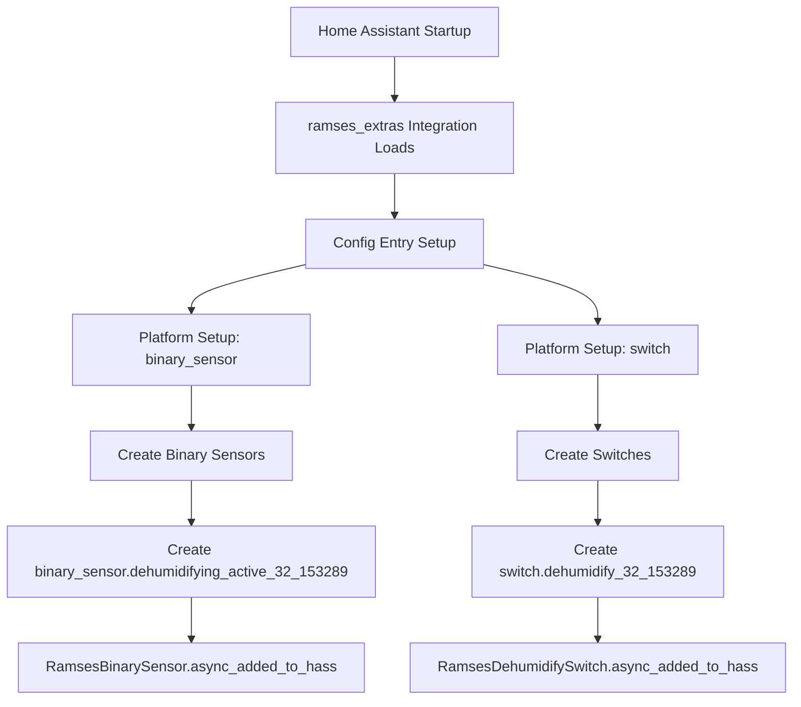
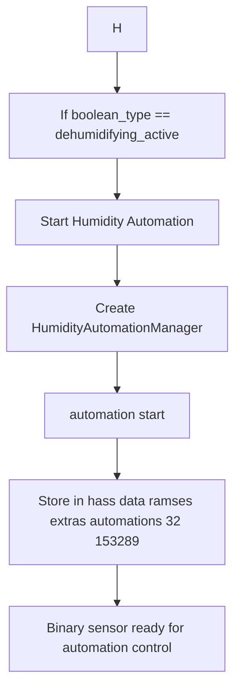
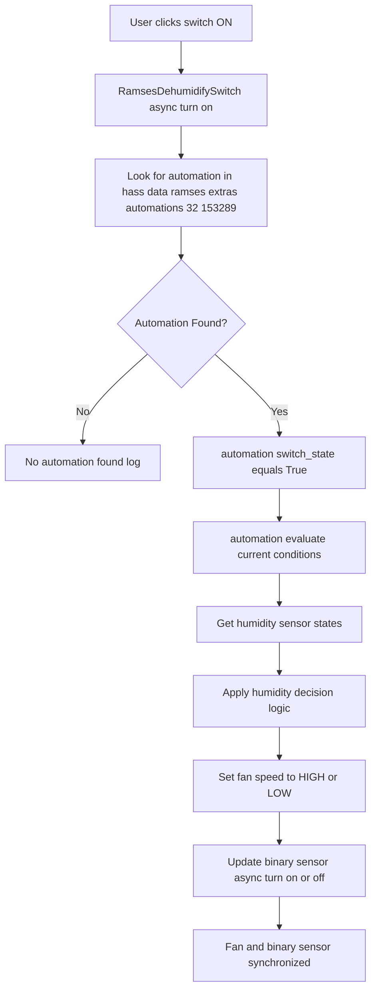
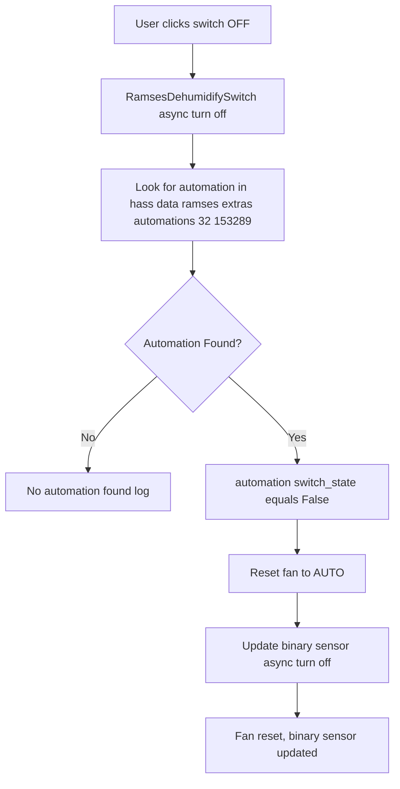
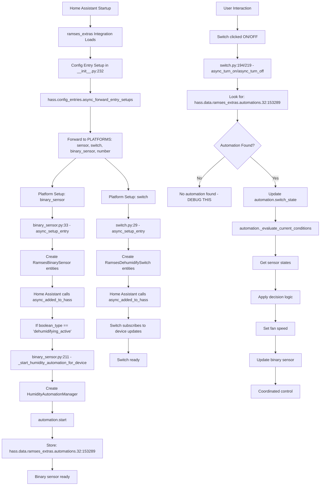

# Humidity Automation Flow

This document describes the exact flow from Home Assistant startup to switch interaction for the humidity automation feature.

## Overview

The humidity automation is coordinated between three main components:
1. **Binary Sensor** (binary_sensor.dehumidifying_active_32_153289) - Creates and controls the automation
2. **Switch** (switch.dehumidify_32_153289) - User interface to activate/deactivate automation
3. **Automation Manager** - Implements the humidity control logic

## Initialization Flow



## Binary Sensor Automation Creation



## Switch Interaction Flow



## Switch Deactivation Flow



## Complete End-to-End Flow



## Key File Locations

### Entry Point
- **File**: `ramses_extras/custom_components/ramses_extras/__init__.py`
- **Function**: `async def async_setup_entry` (line 232)
- **Key**: `await hass.config_entries.async_forward_entry_setups(entry, PLATFORMS)` (line 265)

### Platforms
- **Binary Sensor**: `ramses_extras/custom_components/ramses_extras/binary_sensor.py`
  - Setup: `async def async_setup_entry` (line 33)
  - Creation: `async def async_added_to_hass` (line 179)
  - Automation: `async def _start_humidity_automation_for_device` (line 211)

- **Switch**: `ramses_extras/custom_components/ramses_extras/switch.py`
  - Setup: `async def async_setup_entry` (line 29)
  - Creation: `async def async_added_to_hass` (line 171)
  - ON Action: `async def async_turn_on` (line 194)
  - OFF Action: `async def async_turn_off` (line 219)

### Automation
- **File**: `ramses_extras/custom_components/ramses_extras/automations/humidity_automation.py`
- **Class**: `HumidityAutomationManager`

## Data Flow Summary

### Storage Path
```
hass.data['ramses_extras']['automations']['32:153289'] = HumidityAutomationManager
```

### Lookup Path
```python
automation = (
    self.hass.data.get("ramses_extras", {})
    .get("automations", {})
    .get(self._device_id)  # "32:153289"
)
```

### Device ID Format
- **Format**: "32:153289" (colon, not underscore)
- **Binary sensor stores**: "32:153289"
- **Switch looks for**: "32:153289"

## Current Issue

The switch reports "No automation found" when trying to activate, suggesting:

1. **Binary sensor never runs** `async_added_to_hass` or `async_added_to_hass` fails
2. **Automation creation fails** in `_start_humidity_automation_for_device`
3. **Device ID mismatch** between storage and lookup
4. **Data path issue** in the nested dictionary access

## Debug Strategy

Added logging to both binary sensor and switch to identify the exact failure point:
- **Binary sensor logs**: When automation starts and stores
- **Switch logs**: What automations are actually available

This will show whether the issue is in creation, storage, or lookup phases.
