# Schema-as-Source-of-Truth Architecture — Mermaid Diagrams

Mermaid renderings of the ASCII diagrams in
[`schema_architecture.md`](./schema_architecture.md).

These are visual companions — the source-of-truth text and edge-case notes
remain in the original document.

> **Naming note:** There are two "Phase 3"s that are easy to confuse:
> - **ramses_cc Phase 3** — commands in schema, our work.
>   Split into **3a** (commands on REM, PR 811, DONE) and **3b**
>   (commands on FAN + strip+map pipeline, design stage).
>   See `phase3b_fan_commands_design.md`.
> - **ramses_rf issue 530 Phase 3** (PWhite-Eng) — Builder Pattern,
>   `supported_commands()`, dynamic strategies. NOT started. NOT a
>   dependency for our 3b.

## Chapters

- [1. Overview — the full pipeline](#1-overview--the-full-pipeline)
- [2. Two Parallel Paths: Observer vs Topology Builder](#2-two-parallel-paths-observer-vs-topology-builder)
- [3. PATH 1: The Observer (DiscoveryScan)](#3-path-1-the-observer-discoveryscan)
- [4. PATH 2: Topology Builder (known devices)](#4-path-2-topology-builder-known-devices)
- [5. The Two Paths Side by Side](#5-the-two-paths-side-by-side)
- [6. Lifecycle of a Device](#6-lifecycle-of-a-device)
- [7. Why Two Paths? (enforce_known_list)](#7-why-two-paths-enforce_known_list)
- [8. What Lives Where — Storage Layers](#8-what-lives-where--storage-layers)
- [9. Storage Relationships](#9-storage-relationships)
- [10. known_list: Today vs Endgoal](#10-known_list-today-vs-endgoal)
- [11. Precedence Rules — merge_schemas](#11-precedence-rules--merge_schemas)
- [12. Topology Changes — Current State & Gaps](#12-topology-changes--current-state--gaps)
- [13. What's Needed for True SSOT with Topology](#13-whats-needed-for-true-ssot-with-topology)
- [14. HVAC Schema — The Roundtrip Bug](#14-hvac-schema--the-roundtrip-bug)
- [15. FAN vs TCS — Class Hierarchy Gap](#15-fan-vs-tcs--class-hierarchy-gap)
- [16. HVAC Topology from Traffic](#16-hvac-topology-from-traffic)
- [17. 1FC9 Binding Handshake (HVAC)](#17-1fc9-binding-handshake-hvac)
- [18. bind_device Service — 4-Phase RF Handshake](#18-bind_device-service--4-phase-rf-handshake)
- [19. Crash Recovery — 5 Scenarios](#19-crash-recovery--5-scenarios)
- [20. Crash Recovery — Current State Summary](#20-crash-recovery--current-state-summary)
- [21. Migration Phases](#21-migration-phases)
- [22. Alignment with ramses_rf Roadmap](#22-alignment-with-ramses_rf-roadmap)
- [23. Four "Binding" Concepts — Don't Confuse Them](#23-four-binding-concepts--dont-confuse-them)
- [24. Class Mismatch Detection (DiscoveryManager)](#24-class-mismatch-detection-discoverymanager)
- [25. Verb-Sensitive Classification (31DA fix)](#25-verb-sensitive-classification-31da-fix)
- [26. Trait Status Summary](#26-trait-status-summary)
- [27. Workarounds — What to Remove When ramses_rf Lands](#27-workarounds--what-to-remove-when-ramses_rf-lands)

---

<a id="1-overview--the-full-pipeline"></a>
## 1. Overview — the full pipeline

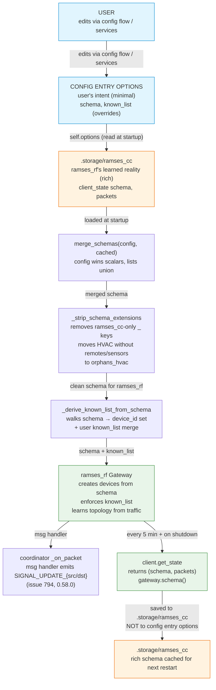

[top](#schema-as-source-of-truth-architecture--mermaid-diagrams)

---

<a id="2-two-parallel-paths-observer-vs-topology-builder"></a>
## 2. Two Parallel Paths: Observer vs Topology Builder

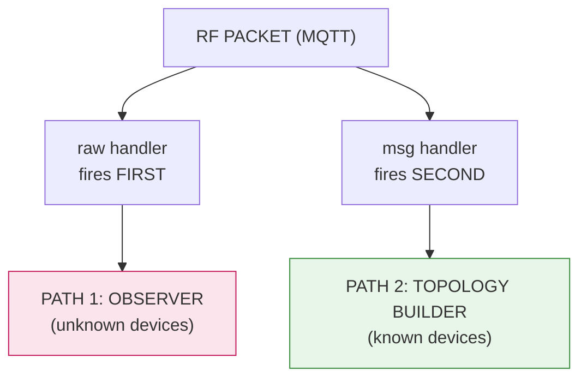

[top](#schema-as-source-of-truth-architecture--mermaid-diagrams)

---

<a id="3-path-1-the-observer-discoveryscan"></a>
## 3. PATH 1: The Observer (DiscoveryScan)

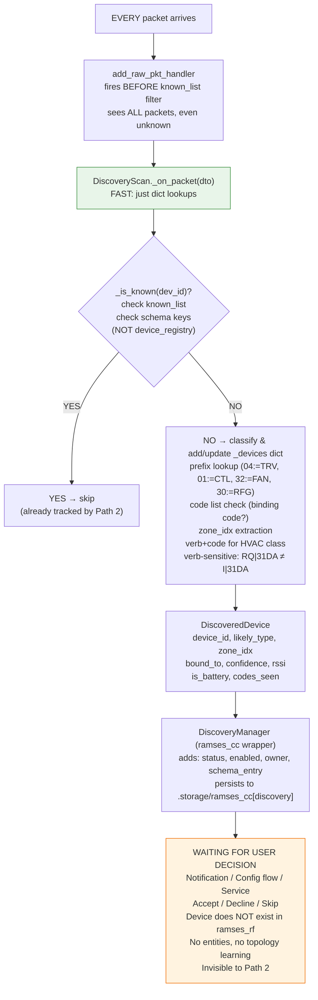

**Key point:** The observer path is READ-ONLY and FAST. It watches traffic,
classifies devices, and waits. It never creates devices in ramses_rf, never
creates HA entities, never learns topology.

[top](#schema-as-source-of-truth-architecture--mermaid-diagrams)

---

<a id="4-path-2-topology-builder-known-devices"></a>
## 4. PATH 2: Topology Builder (known devices)

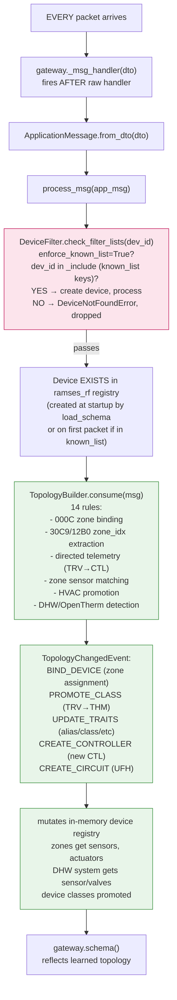

**Key point:** The topology builder only runs for devices already in the schema
(and thus in the derived known_list). It learns zone assignments, names, and
relationships from traffic. It mutates the in-memory registry, and the next
`get_state()` reflects the learned topology.

[top](#schema-as-source-of-truth-architecture--mermaid-diagrams)

---

<a id="5-the-two-paths-side-by-side"></a>
## 5. The Two Paths Side by Side

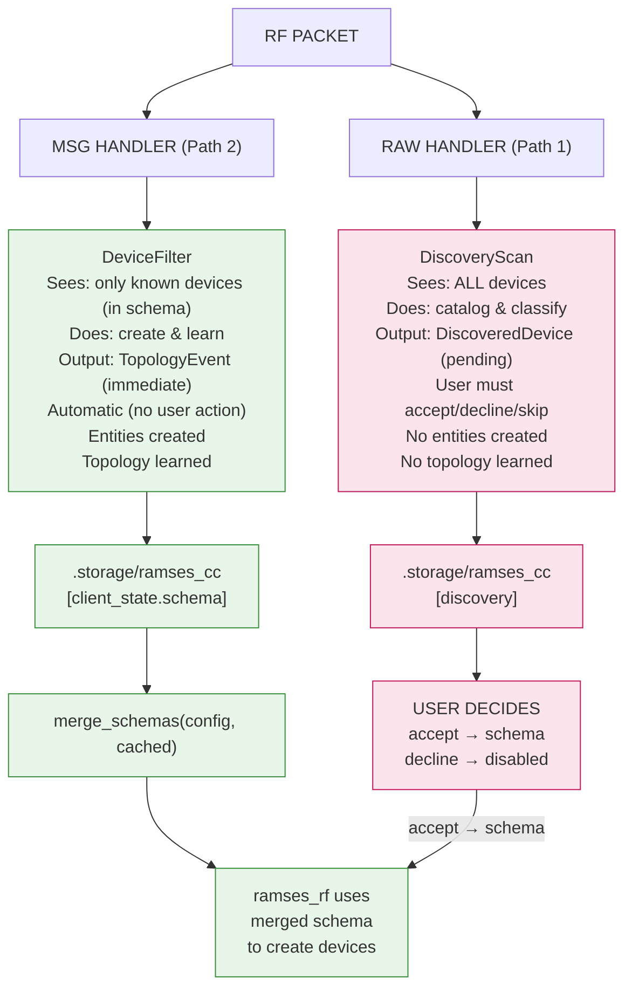

[top](#schema-as-source-of-truth-architecture--mermaid-diagrams)

---

<a id="6-lifecycle-of-a-device"></a>
## 6. Lifecycle of a Device

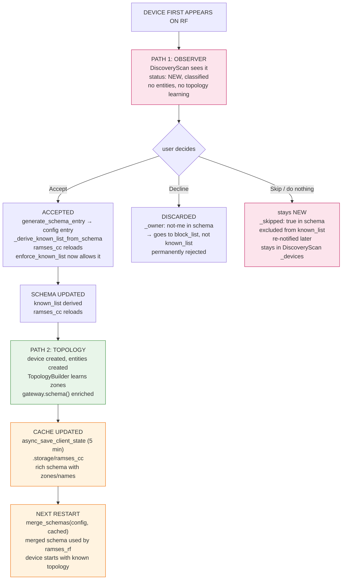

**The three user decisions:**

| Decision | In schema? | In known_list? | Mechanism | Re-notified? |
|----------|-----------|----------------|------------|--------------|
| **Accept** | YES (schema_entry merged) | YES (derived) | — | NO (status=ACCEPTED) |
| **Decline** | YES (`_owner: not-me`) | NO (goes to block_list) | `_owner` trait | NO (status=DISCARDED) |
| **Skip** | YES (`_skipped: true`) | NO (excluded) | `_skipped` trait | YES (stays NEW) |

[top](#schema-as-source-of-truth-architecture--mermaid-diagrams)

---

<a id="7-why-two-paths-enforce_known_list"></a>
## 7. Why Two Paths? (enforce_known_list)

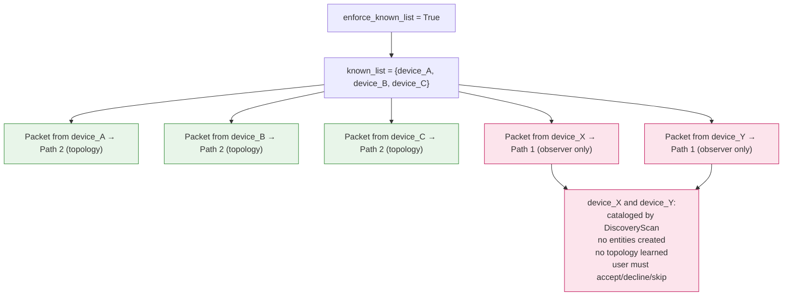

[top](#schema-as-source-of-truth-architecture--mermaid-diagrams)

---

<a id="8-what-lives-where--storage-layers"></a>
## 8. What Lives Where — Storage Layers

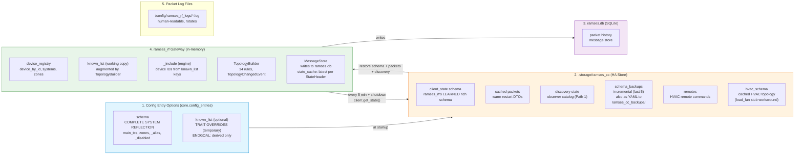

[top](#schema-as-source-of-truth-architecture--mermaid-diagrams)

---

<a id="9-storage-relationships"></a>
## 9. Storage Relationships

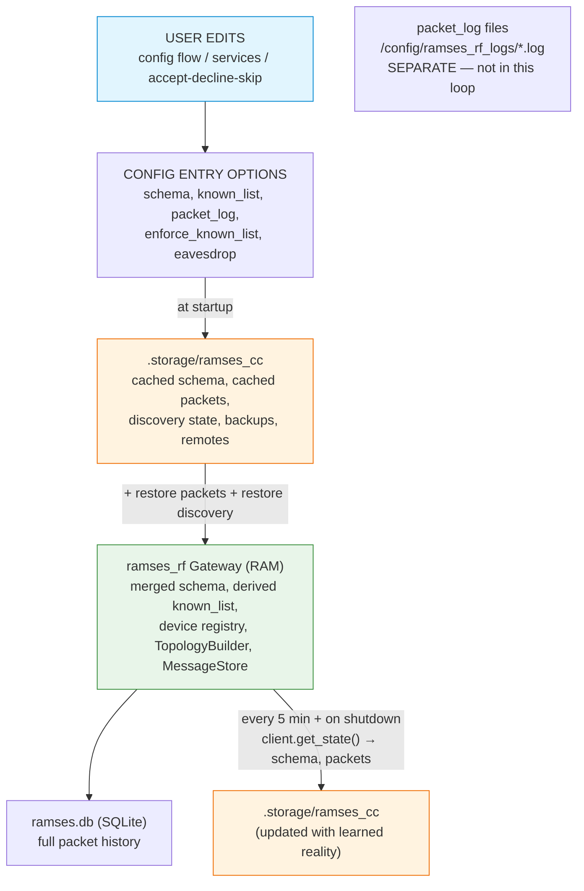

[top](#schema-as-source-of-truth-architecture--mermaid-diagrams)

---

<a id="10-known_list-today-vs-endgoal"></a>
## 10. known_list: Today vs Endgoal

```mermaid
flowchart LR
    subgraph TODAY["TODAY (Phase 1.5 + 2 — IMPLEMENTED)"]
        direction TB
        TCE["config entry:<br/>schema: {topology + _ traits}<br/>  01:150003: {_class: SEN, _alias: Lounge, _faked: false}<br/>  30:160000: {_scheme: itho, remotes: [...]}<br/>known_list: {device_id: {class, alias, faked}}<br/>(fallback container, traits also in schema)"]
    end

    subgraph END["ENDGOAL (Phase 4 — deferred)"]
        direction TB
        ECE["config entry:<br/>schema: {<br/>  01:150003: {_class: SEN, _alias: Lounge, _faked: false}<br/>  30:160000: {_scheme: itho, remotes: [...]}<br/>}<br/>known_list: REMOVED from config<br/>→ derived in-memory by<br/>  _derive_known_list_from_schema()"]
    end

    TODAY -->|"Phase 3 (commands in schema)<br/>→ Phase 4 (known_list removed)"| END

    classDef today fill:#e8f5e9,stroke:#388e3c
    classDef end fill:#fff3e0,stroke:#ef6c00
    class TODAY today
    class END end
```

**What's been done (Phase 2 — IMPLEMENTED in PR 764):**
1. ~~ramses_rf schema validators accept `_` prefixed keys~~ — **workaround**: `_strip_schema_extensions` strips `_` keys before ramses_rf sees them. **Phase 3a plan:** move strip+map to ramses_rf as a pipeline (stages 1+2 in ramses_rf, stage 3 in ramses_cc). Also fixes CLI (`ramses_cli -monitor` loads config.json directly, no stripping today).
2. `_derive_known_list_from_schema` reads `_` keys — **DONE** (extracts `_class`, `_alias`, `_faked`, `_scheme`, `_bound` into known_list format)
3. `_sync_known_list_traits_to_schema` copies traits from known_list into schema root entries — **DONE** (schema is authoritative, known_list fills gaps)
4. `generate_schema_entry` creates root entries for ALL device types — **DONE** (previously list-based devices got no root entry)

**What's been done (Phase 3a — IMPLEMENTED in PR 811):**
1. `_commands` on REM entries in schema (full packet strings)
2. Services write to schema (learn/add/delete_command)
3. Migration from `.storage[remotes]` + `known_list[commands]`
4. `SCH_TRAITS_HVAC` `bound` accepts `str | list[str]` (planned, needs ramses_rf PR)

**What's in design (Phase 3b — see `phase3b_fan_commands_design.md`):**
1. `_commands` moves from REM entries to FAN entries
2. Format: `{verb, code, payload}` dicts (not full packet strings)
3. `_bound` accepts `list[str]` (multi-REM)
4. `fan_handler` loops over bound REMs
5. `climate.set_fan_mode` reads from schema `_commands` on FAN
6. Does NOT depend on ramses_rf issue 530 (Builder Pattern)

**What remains (Phase 4 — deferred, needs ramses_rf issue 530 Phase 3):**
1. Config entry no longer stores `known_list` — only `schema`
2. `enforce_known_list` becomes always-on (option removed)
3. known_list fully derived from schema, not stored in config
4. `_commands` shrinks: 22F7/22B0 get native builders, move out of `_commands`

[top](#schema-as-source-of-truth-architecture--mermaid-diagrams)

---

<a id="11-precedence-rules--merge_schemas"></a>
## 11. Precedence Rules — merge_schemas

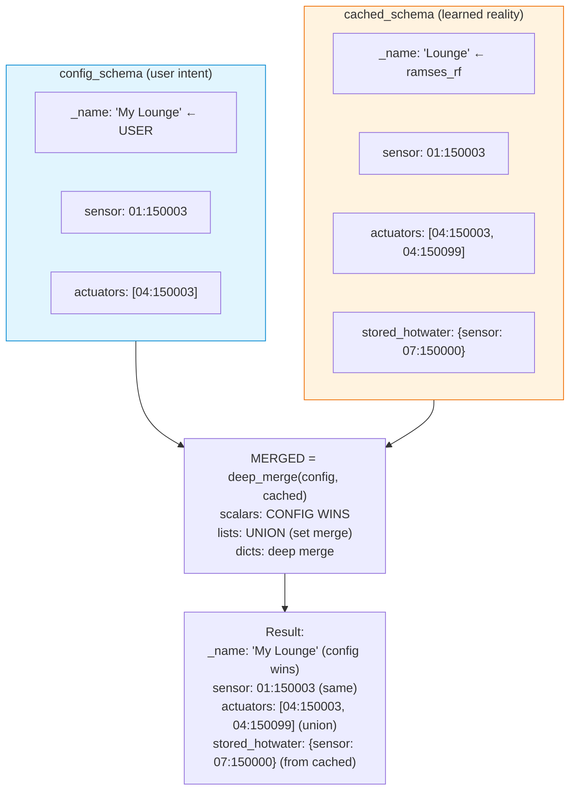

[top](#schema-as-source-of-truth-architecture--mermaid-diagrams)

---

<a id="12-topology-changes--current-state--gaps"></a>
## 12. Topology Changes — Current State & Gaps

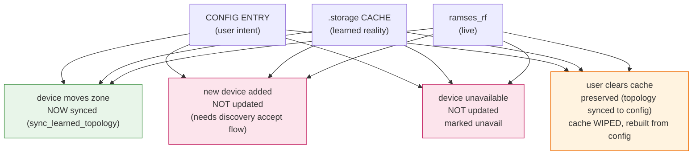

**PARTIALLY CLOSED in PR 764** — `sync_learned_topology()` writes learned
topology back to config entry. Problems 1 and 4 mitigated. Problems 2, 3, 5
remain. Entity-level `SIGNAL_UPDATE` is now emitted by the coordinator's
`_on_packet` handler (issue 794, shipped in 0.58.0), so the 5-min polling
loop upgrade is about topology sync only, not entity state updates.

[top](#schema-as-source-of-truth-architecture--mermaid-diagrams)

---

<a id="13-whats-needed-for-true-ssot-with-topology"></a>
## 13. What's Needed for True SSOT with Topology

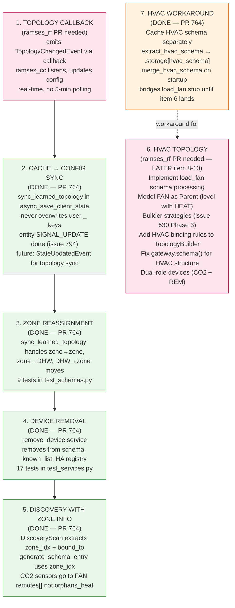

**Priority order (from arch doc):**

| Phase | Item | Status |
|-------|------|--------|
| NOW | Accept device → schema → entities | DONE |
| NOW | ramses_rf learns HEAT topology → cached | DONE |
| NOW | Restart: merged schema = config + cache | DONE |
| NOW | ramses_cc generates HVAC schema on accept | DONE |
| NOW | ramses_rf ignores HVAC schema (load_fan stub) | GAP (workaround: item 7) |
| NEXT 1 | Cache → config sync | DONE (PR 764) |
| NEXT 2 | remove_device service | DONE (PR 764) |
| NEXT 3 | Zone reassignment | DONE (PR 764) |
| NEXT 4 | Cache HVAC schema separately | DONE (PR 764) |
| NEXT 5 | CO2 sensor classification | DONE (PR 764) |
| NEXT 6 | Comprehensive test coverage | DONE (PR 764) |
| LATER 5 | TopologyChangedEvent callback | ramses_rf PR needed |
| LATER 6 | Query CTL for zone map on accept | ramses_rf PR needed |
| LATER 7 | Device health tracking | ramses_rf PR needed |
| LATER 8 | HVAC: implement load_fan, FAN as Parent | ramses_rf PR needed |
| LATER 9 | HVAC: fix gateway.schema() for HVAC | ramses_rf PR needed |
| LATER 10 | HVAC: dual-role devices (CO2 + REM) | ramses_rf PR needed |

[top](#schema-as-source-of-truth-architecture--mermaid-diagrams)

---

<a id="14-hvac-schema--the-roundtrip-bug"></a>
## 14. HVAC Schema — The Roundtrip Bug

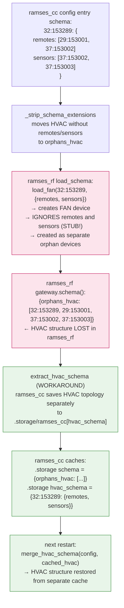

**Impact:** The `load_fan` stub in ramses_rf still ignores `remotes`/`sensors`
in the schema, and `gateway.schema()` still flattens HVAC to `orphans_hvac`.
However, ramses_cc now works around this by caching the HVAC topology
**separately** in `.storage/ramses_cc[hvac_schema]` via `extract_hvac_schema`,
and merging it back on startup via `merge_hvac_schema`. So HVAC topology
survives restarts despite the ramses_rf gap. The real fix remains
implementing `_update_schema` in the FAN class (ramses_rf PR needed).

[top](#schema-as-source-of-truth-architecture--mermaid-diagrams)

---

<a id="15-fan-vs-tcs--class-hierarchy-gap"></a>
## 15. FAN vs TCS — Class Hierarchy Gap

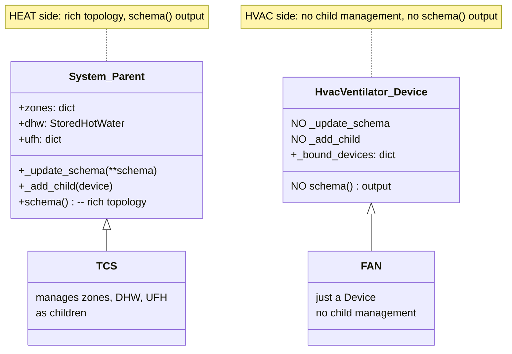

**The gap:** TCS is a `System`/`Parent` that manages zones, DHW, UFH as
children. FAN (`HvacVentilator`) is just a `Device` — no `_update_schema`, no
child management, no `schema()` output for remotes/sensors.

**ramses_cc workaround (implemented):** Since ramses_rf's `load_fan` is still a
stub (`_update_schema` commented out as TODO) and `gateway.schema()` flattens
HVAC to `orphans_hvac`, ramses_cc caches the HVAC topology separately in
`.storage/ramses_cc[hvac_schema]` via `extract_hvac_schema`, and merges it
back on startup via `merge_hvac_schema`. This means HVAC topology survives
restarts despite the ramses_rf class hierarchy gap. The real fix remains
implementing `_update_schema` / `_add_child` / `schema()` in the FAN class
(ramses_rf PR needed).

[top](#schema-as-source-of-truth-architecture--mermaid-diagrams)

---

<a id="16-hvac-topology-from-traffic"></a>
## 16. HVAC Topology from Traffic

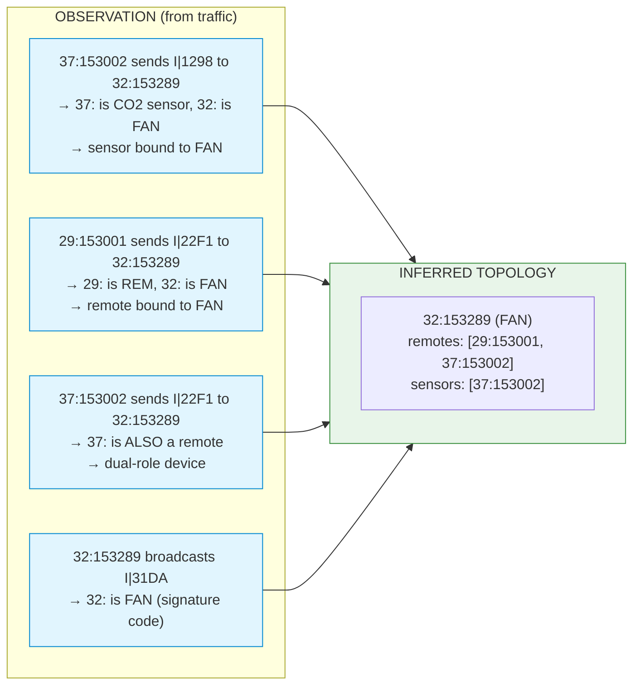

**Key insight:** The `dst` address of directed packets reveals the parent FAN.
This is the same principle as heat-side directed telemetry (TRV → CTL implies
binding), but no TopologyBuilder rule implements it for HVAC.

[top](#schema-as-source-of-truth-architecture--mermaid-diagrams)

---

<a id="17-1fc9-binding-handshake-hvac"></a>
## 17. 1FC9 Binding Handshake (HVAC)

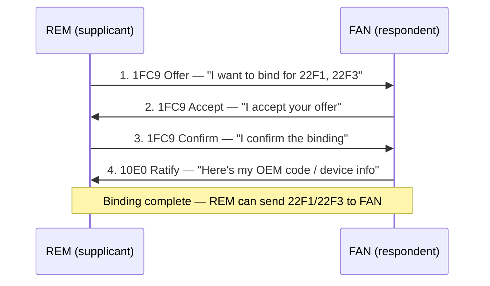

**Key difference from heat:** 000C is a broadcast (CTL tells everyone the zone
map). 1FC9 is a directed handshake (REM ↔ FAN, one-to-one). TopologyBuilder has
rules for 000C but NOT for 1FC9 binding events.

[top](#schema-as-source-of-truth-architecture--mermaid-diagrams)

---

<a id="18-bind_device-service--4-phase-rf-handshake"></a>
## 18. bind_device Service — 4-Phase RF Handshake

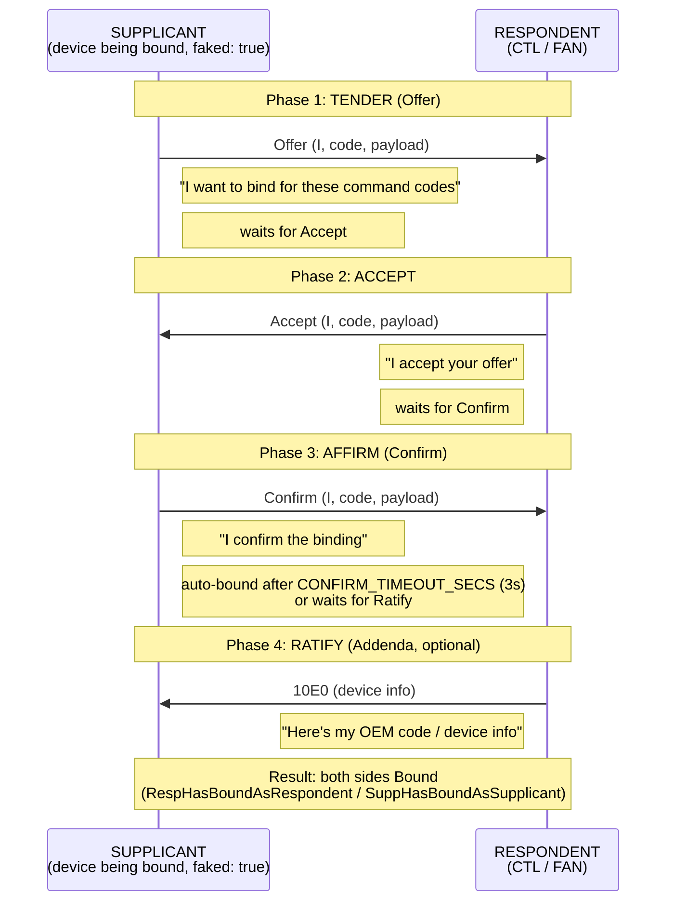

**This is a one-time RF-level operation, not a persistent trait.** After
binding, the devices remember each other at the RF level. The `bind_device`
service stays as a service — it's an action, not a trait.

[top](#schema-as-source-of-truth-architecture--mermaid-diagrams)

---

<a id="19-crash-recovery--5-scenarios"></a>
## 19. Crash Recovery — 5 Scenarios

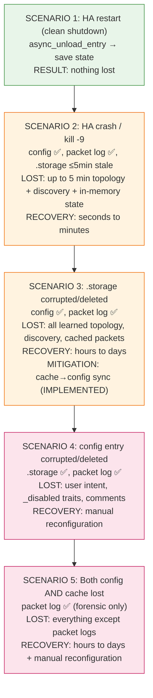

[top](#schema-as-source-of-truth-architecture--mermaid-diagrams)

---

<a id="20-crash-recovery--current-state-summary"></a>
## 20. Crash Recovery — Current State Summary

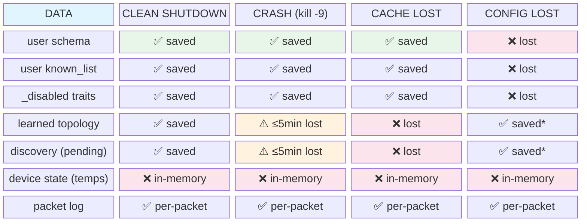

`*` = cache→config sync implemented (`sync_learned_topology`). Without it:
learned topology is only in cache, lost if cache lost.

[top](#schema-as-source-of-truth-architecture--mermaid-diagrams)

---

<a id="21-migration-phases"></a>
## 21. Migration Phases

```mermaid
flowchart LR
    P1["PHASE 1 (DONE)<br/>schema = topology only<br/>known_list = {class, alias, faked}<br/>_derive → {} + user overrides"]
    P15["PHASE 1.5 (IMPLEMENTED — PR 764)<br/>schema = topology + _ traits<br/>(stripped before ramses_rf)<br/>_disabled, _name, _alias, _class, _comment<br/>cache→config sync IMPLEMENTED"]
    P2["PHASE 2 (IMPLEMENTED — PR 764)<br/>_faked, _scheme, _bound, _owner traits<br/>_sync_known_list_traits_to_schema<br/>generate_schema_entry root entries for ALL<br/>strip_traits_for_validation<br/>order_schema for human-readable output<br/>YAML backups to ramses_cc_backups/"]
    P3A["PHASE 3a (DONE — PR 811)<br/>_commands on REM entries in schema<br/>full packet strings<br/>services write to schema<br/>migration from .storage + known_list"]
    P3B["PHASE 3b (DESIGN)<br/>_commands moves to FAN entries<br/>{verb, code, payload} dicts<br/>_bound accepts list[str]<br/>fan_handler loops<br/>strip+map pipeline → ramses_rf<br/>Does NOT need issue 530"]
    P4["PHASE 4 (deferred — needs ramses_rf issue 530 Phase 3)<br/>_remotes → Builder strategies<br/>commands per-device in ramses_rf config<br/>schema _commands = OVERRIDE<br/>known_list fully removed<br/>22F7/22B0 get native builders"]

    P1 --> P15 --> P2 --> P3A --> P3B --> P4

    classDef done fill:#e8f5e9,stroke:#388e3c
    classDef design fill:#fff3e0,stroke:#ef6c00
    classDef future fill:#e1f5fe,stroke:#0288d1
    class P1 done
    class P15 done
    class P2 done
    class P3A done
    class P3B design
    class P4 future
```

[top](#schema-as-source-of-truth-architecture--mermaid-diagrams)

---

<a id="22-alignment-with-ramses_rf-roadmap"></a>
## 22. Alignment with ramses_rf Roadmap

```mermaid
flowchart TD
    subgraph OUR["OUR PLAN (ramses_cc)"]
        O1["schema as SSOT"]
        O2["traits in schema<br/>(_class, _alias, _faked, _scheme, _bound)"]
        O3["_scheme trait"]
        O4["enforce_known_list always-on"]
        O5["eavesdrop obsolete"]
        O6["block_list obsolete"]
        O7["DiscoveryScan (observer)"]
        O8["cache → config sync"]
        O9["commands in schema"]
        O10["HVAC topology (load_fan, binding rules)"]
        O11["dual-role CO2+REM"]
        O12["migration v1→v2→v3→v4<br/>v1 stays (Phase 3a runtime)"]
    end

    subgraph RF["RAMSES_RF PLAN"]
        R1["#530 Phase 3.3:<br/>known_list seeding"]
        R2["#191: PWhite-Eng<br/>traits as strategy list"]
        R3["#87: need manufacturer<br/>in schema"]
        R4["Builder pattern<br/>may replace static FAN"]
        R5["#530 Phase 3.1:<br/>dynamic strategy"]
        R6["#530 own phases<br/>1→2→3→4"]
    end

    O1 -->|"ALIGNED<br/>derived known_list = their seed"| R1
    O2 -->|"PARTIAL ALIGNMENT<br/>different concept, same name"| R2
    O3 -->|"ALIGNED"| R3
    O10 -->|"ALIGNED — Builder strategies<br/>could handle HVAC parent/child"| R4
    O11 -->|"ALIGNED — dynamic strategies<br/>allow CO2+REM on same shell"| R5
    O12 -->|"NEEDS COORDINATION<br/>align timing"| R6

    classDef aligned fill:#e8f5e9,stroke:#388e3c
    classDef partial fill:#fff3e0,stroke:#ef6c00
    classDef coord fill:#fce4ec,stroke:#c2185b
```

[top](#schema-as-source-of-truth-architecture--mermaid-diagrams)

---

<a id="23-four-binding-concepts--dont-confuse-them"></a>
## 23. Four "Binding" Concepts — Don't Confuse Them

```mermaid
flowchart TD
    B1["1. bound trait<br/>(known_list/schema)<br/>which faked REM can send 2411<br/>params to a FAN<br/>authorization for parameter updates"]
    B2["2. bound_to in DiscoveryScan<br/>observed parent device from traffic<br/>discovery metadata, NOT persistent"]
    B3["3. bind_device service<br/>RF binding handshake using 1FC9<br/>offer/accept/confirm/ratify<br/>one-time action, pairs device<br/>with controller at RF protocol level"]
    B4["4. 000C zone binding (heat only)<br/>CTL broadcasts zone map<br/>TopologyBuilder links<br/>sensors/actuators to zones<br/>NO HVAC equivalent exists yet"]

    classDef trait fill:#e1f5fe,stroke:#0288d1
    classDef discovery fill:#fce4ec,stroke:#c2185b
    classDef service fill:#fff3e0,stroke:#ef6c00
    classDef heat fill:#e8f5e9,stroke:#388e3c
    class B1 trait
    class B2 discovery
    class B3 service
    class B4 heat
```

[top](#schema-as-source-of-truth-architecture--mermaid-diagrams)

---

<a id="24-class-mismatch-detection-discoverymanager"></a>
## 24. Class Mismatch Detection (DiscoveryManager)

When `sync_with_schema` runs (every 5-min checkpoint), the DiscoveryManager
compares each accepted device's `likely_type` (from the scan engine) with the
schema's `_class` (user-authoritative).

```mermaid
flowchart TD
    CHECKPOINT["5-min checkpoint<br/>sync_with_schema runs"]
    COMPARE["Compare likely_type vs _class<br/>for each accepted device"]
    MATCH{"Match?"}
    OK["YES → OK, no action"]
    MISMATCH["NO → MISMATCH detected"]
    WARN["WARNING logged (once, not every cycle)<br/>tracked in _warned_mismatches"]
    FLAG["class_mismatch flag set<br/>on DeviceMetadata"]
    REVIEW["review_discovered step<br/>shows it to the user"]
    RESOLVE{"User resolves?"}
    FIXED["Mismatch resolved<br/>INFO logged, warned set cleared"]
    STILL["Still mismatched<br/>subsequent checkpoints log at DEBUG"]

    CHECKPOINT --> COMPARE
    COMPARE --> MATCH
    MATCH -->|"YES"| OK
    MATCH -->|"NO"| MISMATCH
    MISMATCH --> WARN
    WARN --> FLAG
    FLAG --> REVIEW
    REVIEW --> RESOLVE
    RESOLVE -->|"YES — user fixes _class"| FIXED
    RESOLVE -->|"NO"| STILL

    classDef ok fill:#e8f5e9,stroke:#388e3c
    classDef warn fill:#fff3e0,stroke:#ef6c00
    classDef bad fill:#fce4ec,stroke:#c2185b
    class OK ok
    class MISMATCH,WARN,FLAG bad
    class STILL warn
```

**Key design decisions:**
- **Schema is authoritative.** The scan engine's classification is advisory —
  it never overwrites `_class`. The user decides.
- **Normalization.** Schema `_class` values are normalized before comparison
  (e.g., `ventilator` → `FAN`) so legacy slugs don't trigger false mismatches.
- **Warning frequency.** The top-level WARNING fires only once per mismatch
  (tracked in `_warned_mismatches`). Subsequent checkpoints log at DEBUG. When
  all mismatches resolve, an INFO message is logged and the warned set is cleared.
- **Why the scan engine can be wrong.** A DIS sending `RQ 31DA` (requesting fan
  status) can be misclassified as FAN because 31DA maps to FAN for `I` and `RP`
  verbs. The verb-sensitive classification fix (see next section) mitigates this.

[top](#schema-as-source-of-truth-architecture--mermaid-diagrams)

---

**Note on `_bound` and fan_handler.py:** The `fan_handler.py` reads `_bound`
from **both** sources — known_list first (user override wins), then falls back
to the schema `_bound` trait (SSOT). This is consistent with
`_derive_known_list_from_schema` where user overrides take precedence. The
arch doc note "follow-up needed to also check schema _bound" is outdated —
it already does.

[top](#schema-as-source-of-truth-architecture--mermaid-diagrams)

---

<a id="25-verb-sensitive-classification-31da-fix"></a>
## 25. Verb-Sensitive Classification (31DA fix)

The scan engine's `_classify` function checks the **current verb** when
classifying from accumulated codes. This matters for 31DA:

```mermaid
flowchart TD
    PKT["Packet arrives with 31DA"]
    VERB{"What verb?"}
    I["I (broadcast)<br/>→ FAN<br/>(FAN broadcasts its own status)"]
    RP["RP (response)<br/>→ FAN<br/>(FAN replies to a request)"]
    RQ["RQ (request)<br/>→ NOT FAN<br/>(a DIS asks the FAN for status)<br/>falls through to prefix fallback"]

    PKT --> VERB
    VERB -->|"I"| I
    VERB -->|"RP"| RP
    VERB -->|"RQ"| RQ

    classDef fan fill:#e8f5e9,stroke:#388e3c
    classDef notfan fill:#fff3e0,stroke:#ef6c00
    class I fan
    class RP fan
    class RQ notfan
```

**Without this distinction**, a DIS sending `RQ|31DA` to a FAN would be
misclassified as FAN, because the accumulated-codes check tried all verbs and
found `(I, 31DA) → FAN` even though the device never sent `I|31DA`.

**The fix:** only check the current verb, so `RQ|31DA` does not match any VC
pair and the device falls through to prefix fallback.

[top](#schema-as-source-of-truth-architecture--mermaid-diagrams)

---

<a id="26-trait-status-summary"></a>
## 26. Trait Status Summary

```mermaid
flowchart LR
    subgraph IMPL["IMPLEMENTED (PR 764)"]
        direction TB
        T1["_disabled<br/>exclude from entity creation<br/>(stays in known_list to avoid<br/>DeviceNotFoundError log spam)"]
        T2["_name<br/>human-friendly display name<br/>(maps to alias in known_list)"]
        T3["_alias<br/>alternate name for entities"]
        T4["_class<br/>override device class<br/>(CTL, TRV, DHW, ...)"]
        T5["_comment<br/>free-form per-device comment"]
        T6["_owner<br/>device ownership: me / not-me"]
        T7["_faked<br/>create virtual/fake device<br/>(no RF traffic needed)"]
        T8["_bound<br/>FAN: bound REM/DIS for 2411<br/>command routing<br/>Phase 3a: str | list[str]"]
        T9["_scheme<br/>FAN manufacturer scheme<br/>(orcon/itho/vasco/nuaire)"]
    end

    subgraph IMPL2["ALSO IMPLEMENTED"]
        direction TB
        T10["_skipped<br/>user deferred decision<br/>_skipped: true in schema<br/>excluded from known_list<br/>re-appears in discovery review"]
    end

    subgraph MIGR["PHASE 2 MIGRATION (IMPLEMENTED)"]
        direction TB
        M1["_sync_known_list_traits_to_schema<br/>copies class, faked, bound, scheme, alias<br/>from known_list into schema root entries<br/>(schema authoritative, known_list fills gaps)"]
        M2["generate_schema_entry<br/>creates root entries for ALL device types<br/>(previously list-based devices got no root)"]
        M3["sync_learned_topology backfill<br/>root entries for pre-existing list devices<br/>(one-time migration)"]
        M4["strip_traits_for_validation<br/>prevents duplicates when device is in<br/>both root entry and a list"]
        M5["order_schema<br/>human-readable key ordering<br/>(root traits, main_tcs, comments, orphans,<br/>devices sorted by _owner then ID)"]
    end

    classDef done fill:#e8f5e9,stroke:#388e3c
    class T1,T2,T3,T4,T5,T6,T7,T8,T9 done
    class T10 done
    class M1,M2,M3,M4,M5 done
```

[top](#schema-as-source-of-truth-architecture--mermaid-diagrams)

---

<a id="27-workarounds--what-to-remove-when-ramses_rf-lands"></a>
## 27. Workarounds — What to Remove When ramses_rf Lands

ramses_cc currently has several workarounds for ramses_rf gaps. Each one has
a clear "remove when" condition. This section maps them so that when a
planned ramses_rf PR lands, the corresponding workaround can be cleaned up.

```mermaid
flowchart TD
    subgraph W1["WORKAROUND 1: HVAC separate cache"]
        W1A["extract_hvac_schema<br/>merge_hvac_schema<br/>SZ_HVAC_SCHEMA in .storage"]
        W1B["coordinator.py:514-523, 1856-1861<br/>store.py:68, 84-89<br/>schemas.py:625-703<br/>const.py:59"]
    end

    subgraph W2["WORKAROUND 2: _strip_schema_extensions"]
        W2A["strips _-prefixed keys<br/>before ramses_rf sees schema<br/>(ramses_rf rejects unknown keys)<br/>Phase 3a: stages 1+2 move to ramses_rf<br/>ramses_cc keeps stage 3 (orchestration)"]
        W2B["coordinator.py:871-980"]
    end

    subgraph W3["WORKAROUND 3: _derive_known_list_from_schema"]
        W3A["extracts _ traits from schema<br/>into known_list format<br/>that ramses_rf reads as always"]
        W3B["coordinator.py:1102-1279"]
    end

    subgraph W4["WORKAROUND 4: _sync_known_list_traits_to_schema"]
        W4A["copies traits from known_list<br/>into schema root entries<br/>(schema authoritative, KL fills gaps)"]
        W4B["coordinator.py:1307-1394"]
    end

    subgraph W5["WORKAROUND 5: SIGNAL_UPDATE via asyncio.sleep(0)"]
        W5A["coordinator _on_packet msg handler<br/>yields then sends SIGNAL_UPDATE<br/>(deterministic but not event-driven)"]
        W5B["coordinator.py:628-642"]
    end

    subgraph W6["WORKAROUND 6: _disabled stays in known_list"]
        W6A["_disabled devices INCLUDED in known_list<br/>to avoid DeviceNotFoundError log spam<br/>entities suppressed in _discover_new_entities"]
        W6B["coordinator.py:1204 (comment)<br/>_discover_new_entities filter"]
    end

    subgraph W7["WORKAROUND 7: CO2+REM share a branch"]
        W7A["generate_schema_entry puts 37: CO2<br/>into remotes[] (same as REM)<br/>sensors[] vs remotes[] deferred"]
        W7B["discovery.py:672-676"]
    end

    subgraph W8["WORKAROUND 8: fan_handler reads _bound from both"]
        W8A["reads known_list first (user override)<br/>then falls back to schema _bound<br/>Phase 3a: loops over list[str]<br/>isinstance(str) check removed"]
        W8B["fan_handler.py:133-144"]
    end

    subgraph W9["WORKAROUND 9: 5-min polling for discovery + topology"]
        W9A["coordinator polls DiscoveryScan +<br/>gateway.schema() every 5 min<br/>no real-time callback from ramses_rf"]
        W9B["coordinator.py:697-698<br/>services.py:983-984"]
    end

    R1["LATER 8: implement load_fan<br/>LATER 9: fix gateway.schema() for HVAC"]
    R2["ramses_rf accepts _ keys in validators<br/>(may not be needed — clean separation)"]
    R3["Phase 4: known_list fully removed<br/>ramses_rf reads _ keys directly"]
    R4["Phase 4: known_list fully removed"]
    R5["ramses_rf #530 Phase 3:<br/>StateUpdatedEvent from CQRS StateProjector"]
    R6["ramses_rf handles disabled devices<br/>without DeviceNotFoundError<br/>(no PR planned yet)"]
    R7["LATER 10: dual-role devices<br/>Builder pattern distinguishes<br/>sensors[] vs remotes[]"]
    R8["Phase 4: known_list fully removed"]
    R9["LATER 5: TopologyChangedEvent callback<br/>+ on_new_device callback"]

    W1 -->|"remove when"| R1
    W2 -->|"remove when"| R2
    W3 -->|"remove when"| R3
    W4 -->|"remove when"| R4
    W5 -->|"replace with"| R5
    W6 -->|"remove when"| R6
    W7 -->|"remove when"| R7
    W8 -->|"simplify when"| R8
    W9 -->|"replace with"| R9

    classDef workaround fill:#fff3e0,stroke:#ef6c00
    classDef trigger fill:#fce4ec,stroke:#c2185b
    class W1A,W1B,W2A,W2B,W3A,W3B,W4A,W4B,W5A,W5B,W6A,W6B,W7A,W7B,W8A,W8B,W9A,W9B workaround
    class R1,R2,R3,R4,R5,R6,R7,R8,R9 trigger
```

### Detailed cleanup checklist

| # | Workaround | Files | Remove when | What to do |
|---|-----------|-------|-------------|------------|
| 1 | HVAC separate cache | `const.py:59`, `store.py:68,84-89`, `coordinator.py:514-523,1856-1861`, `schemas.py:625-703` | LATER 8+9: `load_fan` implemented + `gateway.schema()` outputs HVAC structure | Delete `extract_hvac_schema`, `merge_hvac_schema`, `SZ_HVAC_SCHEMA`. HVAC topology flows through normal schema cache. |
| 2 | `_strip_schema_extensions` | `coordinator.py:871-980` | ramses_rf accepts `_` keys in validators (may stay — clean separation) | If ramses_rf accepts `_` keys: delete the function, pass schema directly. If not: stays as-is. |
| 3 | `_derive_known_list_from_schema` | `coordinator.py:1102-1279` | Phase 4: known_list fully removed, ramses_rf reads `_` keys directly | Delete the function. ramses_rf reads traits from schema `_` keys natively. |
| 4 | `_sync_known_list_traits_to_schema` | `coordinator.py:1307-1394` | Phase 4: known_list fully removed | Delete the function. No more known_list to sync from. |
| 5 | SIGNAL_UPDATE via `asyncio.sleep(0)` | `coordinator.py:628-642` | ramses_rf #530 Phase 3: StateUpdatedEvent | Replace `asyncio.sleep(0)` + `async_dispatcher_send` with StateUpdatedEvent listener. |
| 6 | `_disabled` stays in known_list | `coordinator.py:1204` (comment), `_discover_new_entities` | ramses_rf handles disabled devices without `DeviceNotFoundError` (no PR planned) | Remove `_disabled` devices from known_list. ramses_rf should not log errors for devices it doesn't create. |
| 7 | CO2+REM share a branch | `discovery.py:672-676` | LATER 10: dual-role devices, Builder pattern | Distinguish `sensors[]` vs `remotes[]` properly. Scan engine needs to track which codes a 37: device sent (1298 → sensor, 22F1 → remote). |
| 8 | fan_handler reads `_bound` from both | `fan_handler.py:133-144` | Phase 4: known_list fully removed | Remove known_list read, keep only schema `_bound` read. |
| 9 | 5-min polling for discovery + topology | `coordinator.py:697-698`, `services.py:983-984` | LATER 5: TopologyChangedEvent callback + on_new_device callback | Replace `async_track_time_interval` with event listeners. Real-time entity creation and topology sync. |

### Dependency graph — what unblocks what

```mermaid
flowchart TD
    P4["Phase 4: known_list removed"]
    L5["LATER 5: TopologyChangedEvent callback"]
    L8["LATER 8: implement load_fan"]
    L9["LATER 9: fix gateway.schema() for HVAC"]
    L10["LATER 10: dual-role devices"]
    SUE["StateUpdatedEvent (#530 Phase 3)"]
    RFD["ramses_rf disabled-device handling"]

    W3["W3: _derive_known_list_from_schema"]
    W4["W4: _sync_known_list_traits_to_schema"]
    W8["W8: fan_handler reads both"]
    W1["W1: HVAC separate cache"]
    W7["W7: CO2+REM share branch"]
    W5["W5: SIGNAL_UPDATE sleep(0)"]
    W9["W9: 5-min polling"]
    W6["W6: _disabled in known_list"]

    P4 -->|"removes"| W3
    P4 -->|"removes"| W4
    P4 -->|"simplifies"| W8
    L8 -->|"removes"| W1
    L9 -->|"removes"| W1
    L10 -->|"removes"| W7
    SUE -->|"replaces"| W5
    L5 -->|"replaces"| W9
    RFD -->|"removes"| W6

    classDef phase fill:#e1f5fe,stroke:#0288d1
    classDef later fill:#fce4ec,stroke:#c2185b
    classDef workaround fill:#fff3e0,stroke:#ef6c00
    class P4 phase
    class L5,L8,L9,L10,SUE,RFD later
    class W1,W3,W4,W5,W6,W7,W8,W9 workaround
```

[top](#schema-as-source-of-truth-architecture--mermaid-diagrams)
