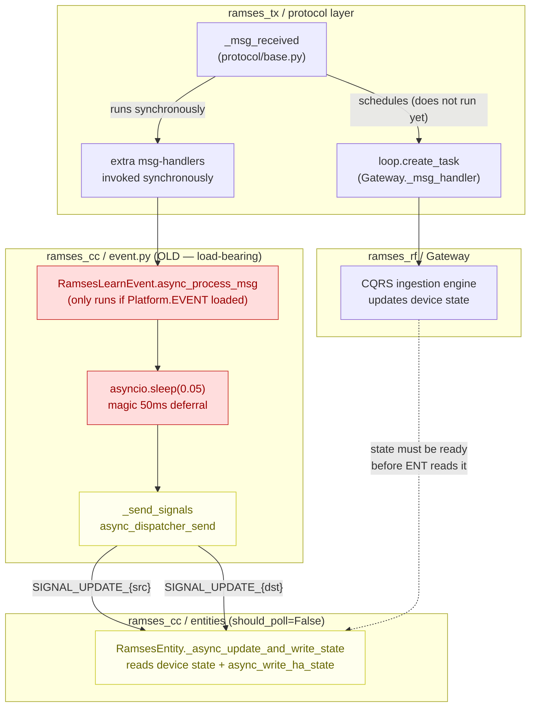
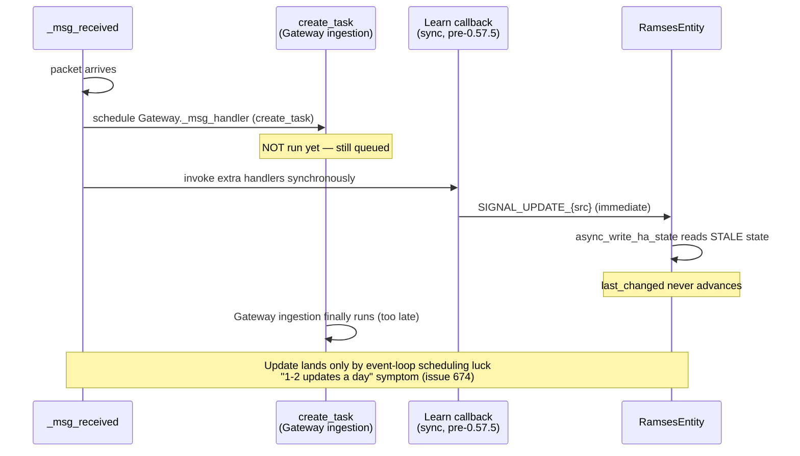
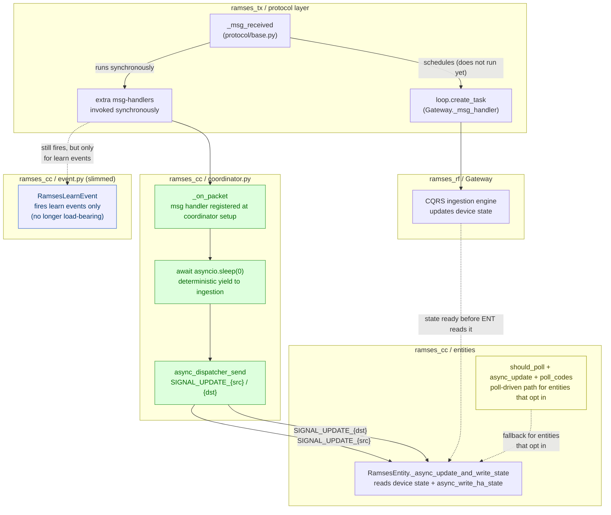
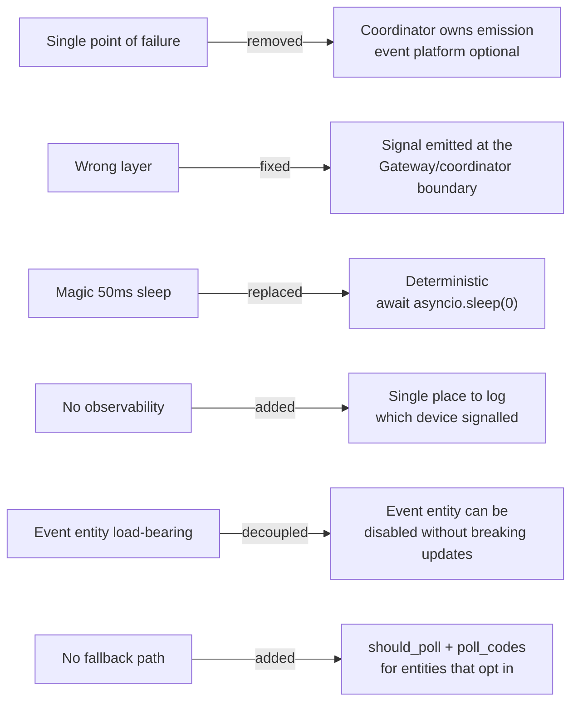
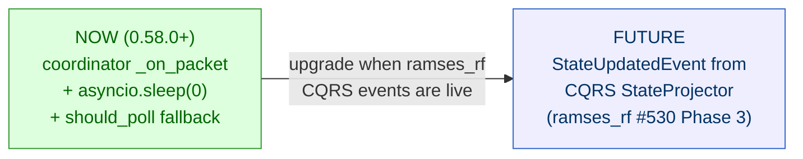

# SIGNAL_UPDATE architecture — history and current flow

Mermaid diagrams visualising the entity-refresh signal flow described in
[ramses_cc PR 764 comment 4905294337](https://github.com/ramses-rf/ramses_cc/pull/764#issuecomment-4905294337)
and the subsequent implementation in [issue 794](https://github.com/ramses-rf/ramses_cc/issues/794)
(shipped in 0.58.0).

## Chapters

- [1. Historical flow (0.57.5) — Learn event entity was the sole signal emitter](#1-historical-flow-0575--learn-event-entity-was-the-sole-signal-emitter)
- [2. The 0.56.7 bug — stale-state race](#2-the-0567-bug--stale-state-race)
- [3. Current flow (0.58.0+) — coordinator owns the signal emission](#3-current-flow-0580--coordinator-owns-the-signal-emission)
- [4. What changed and why](#4-what-changed-and-why)
- [5. Resolved questions](#5-resolved-questions)
- [6. Future upgrade — StateUpdatedEvent](#6-future-upgrade--stateupdatedevent)

---

<a id="1-historical-flow-0575--learn-event-entity-was-the-sole-signal-emitter"></a>
## 1. Historical flow (0.57.5) — Learn event entity was the sole signal emitter

This was the architecture before issue 794. It is kept for historical context.



### Why this was fragile

- **Single point of failure:** `LEARN` only ran if `Platform.EVENT` loaded and the
  entity was added to hass. If the event platform failed to load, was disabled, or the
  entity was removed, **all entity updates silently stopped**. No other emitter, no
  fallback polling (`_attr_should_poll = False`).
- **Wrong layer:** `SIGNAL_UPDATE_{id}` semantically means *"ramses_rf has finished
  ingesting a packet for device X"* — a statement about the Gateway/coordinator
  layer, not a HA event entity. A UI-facing feature was a hidden dependency of the
  core state pipeline.
- **Timing by sleep:** the 50ms `asyncio.sleep` was a heuristic. Under heavy load
  (issue 666 CPU ramp) it might not be enough; under idle it was unnecessary latency;
  and it was fragile against future ramses_rf refactors that add await points.

[top](#signal_update-architecture--history-and-current-flow)

---

<a id="2-the-0567-bug--stale-state-race"></a>
## 2. The 0.56.7 bug — stale-state race



PR 737 fixed the timing symptom by deferring the signal send via
`asyncio.sleep(0.05)` + `async_create_task`, released in **0.57.5**.
This addressed the symptom but not the structural fragility.

[top](#signal_update-architecture--history-and-current-flow)

---

<a id="3-current-flow-0580--coordinator-owns-the-signal-emission"></a>
## 3. Current flow (0.58.0+) — coordinator owns the signal emission

Implemented in [issue 794](https://github.com/ramses-rf/ramses_cc/issues/794),
shipped in 0.58.0. The coordinator registers a raw packet handler that
emits `SIGNAL_UPDATE` after a deterministic yield.



### Coordinator handler (implemented)

```python
# coordinator.py — _on_packet raw handler
@callback
def _on_packet(dto: PacketDTO) -> None:
    async def _signal_after_ingestion() -> None:
        await asyncio.sleep(0)  # yield to ramses_rf's create_task'd ingestion
        async_dispatcher_send(self.hass, f"{SIGNAL_UPDATE}_{dto.src.id}")
        if dto.dst and dto.dst.id != dto.src.id:
            async_dispatcher_send(self.hass, f"{SIGNAL_UPDATE}_{dto.dst.id}")
    self.hass.async_create_task(_signal_after_ingestion())

self.client.add_msg_handler(_on_packet)
```

The 50ms `asyncio.sleep` in `event.py` was deleted. The event entity is
no longer load-bearing for the state pipeline.

[top](#signal_update-architecture--history-and-current-flow)

---

<a id="4-what-changed-and-why"></a>
## 4. What changed and why



[top](#signal_update-architecture--history-and-current-flow)

---

<a id="5-resolved-questions"></a>
## 5. Resolved questions

The open questions from the original proposal have been resolved:

| Question | Resolution |
|----------|------------|
| **Yield strategy:** `asyncio.sleep(0)` vs explicit ramses_rf hook? | **`asyncio.sleep(0)` chosen** (interim). Works in practice — `create_task`'d ingestion runs on the next loop iteration. StateUpdatedEvent remains a future upgrade for deterministic ingestion-complete signalling. |
| **Fallback polling:** safety-net poll interval? | **Yes — `should_poll` + `async_update` + `poll_codes`** provide a poll-driven path for entities that opt in. Not all entities use this; most rely on the signal. |
| **Migration path:** both emitters during transition? | **Hard cutover.** The coordinator handler replaced the event entity's `_send_signals` block. The 50ms sleep in `event.py` was deleted. |
| **`SIGNAL_NEW_DEVICES` interaction?** | **No interaction.** The fan_handler / number-platform parameter entities use `SIGNAL_NEW_DEVICES`, not `SIGNAL_UPDATE`. Unaffected. |

[top](#signal_update-architecture--history-and-current-flow)

---

<a id="6-future-upgrade--stateupdatedevent"></a>
## 6. Future upgrade — StateUpdatedEvent

Step 4 is functionally done. The remaining future work is replacing
`asyncio.sleep(0)` with a deterministic ingestion-complete hook:



StateUpdatedEvent is no longer a **blocker** — it is a **future upgrade** to
replace the `asyncio.sleep(0)` yield with a deterministic ingestion-complete
hook. The current solution works correctly; the upgrade would make the timing
guarantee explicit rather than relying on event-loop scheduling.
